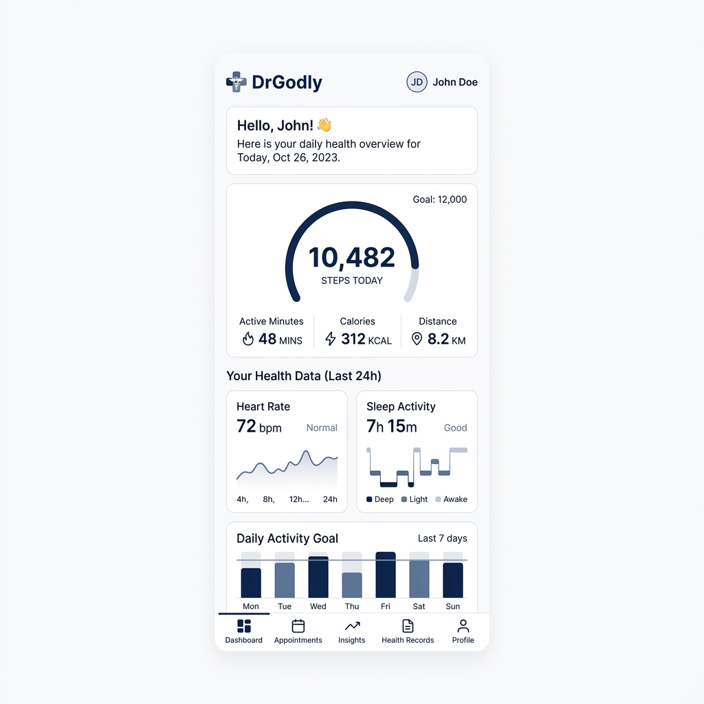
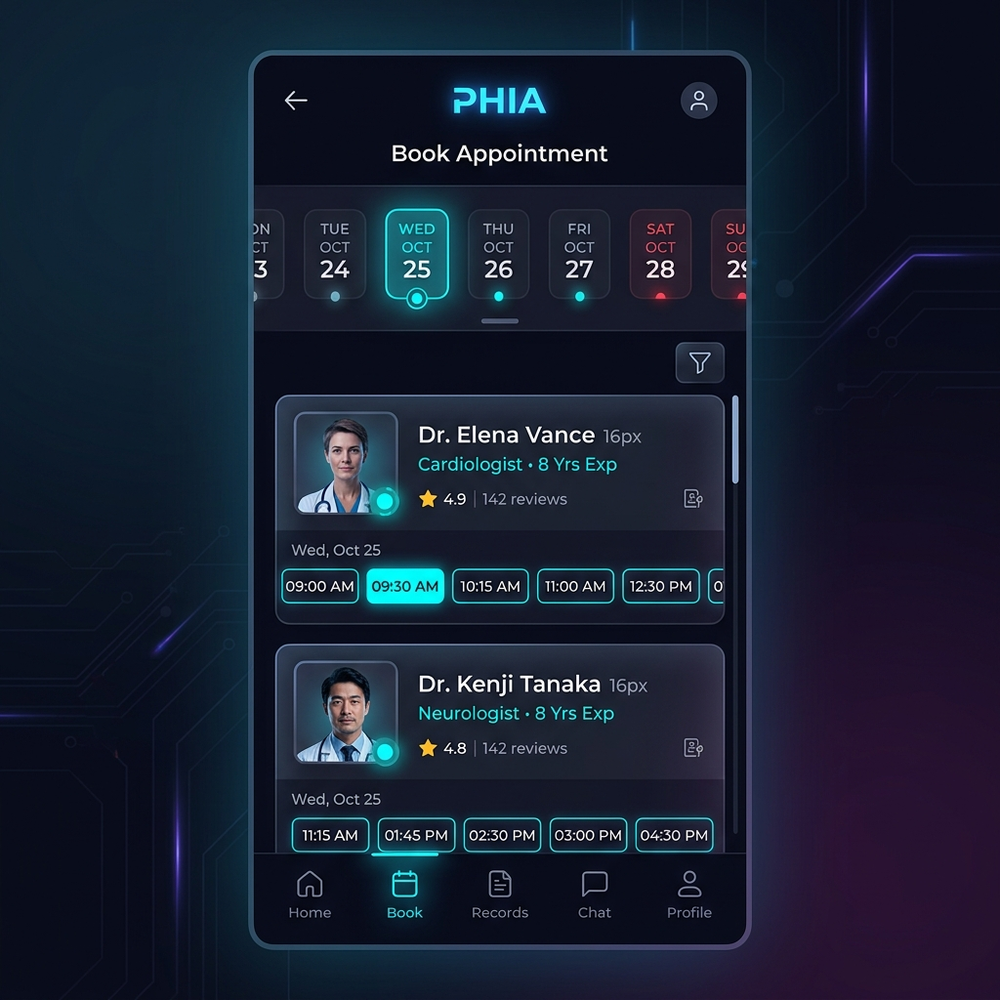
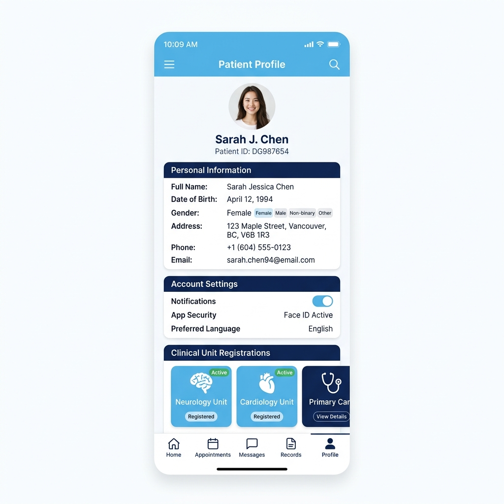

# DrGodly - Doctor Appointment Booking & Health Tracker

<div align="center">
  
  <h3>Doctor Appointment Booking & Personal Health Tracking Application</h3>
  <p>A high-performance, mobile-only Flutter application styled with a clean, professional blue and white medical aesthetic, integrated with native hardware sensors and synced live to a local FHIR Server.</p>
</div>

---

## 📸 App Screenshots

<div align="center">
  <table>
    <tr>
      <td align="center"><b>Dashboard (Metrics Tracker)</b></td>
      <td align="center"><b>Specialist Appointment Booking</b></td>
      <td align="center"><b>Patient Profile</b></td>
    </tr>
    <tr>
      <td></td>
      <td></td>
      <td></td>
    </tr>
  </table>
</div>

---

## 🚀 Key Features

### 👤 1. Patient Profile Sync
* **Local Baseline Setup:** Dynamic onboarding and demographic registration (Full Name, Gender, DOB, Address, Phone, Email).
* **FHIR Integration:** Automatically reads and writes `Patient` resource profiles from/to the local FHIR server using high-fidelity JSON payload transactions.

### 📈 2. Vitals & Sensor Tracking (No Mock Fallbacks)
* **Pedometer Step Counting:** Reads real physical step events using the device's native pedometer sensor.
* **Actigraphy Sleep Profiler:** Uses the phone's physical Accelerometer (`sensors_plus`) to track real-time sleep actigraphy. Placing the phone completely still (e.g. on a nightstand) starts recording sleep hours, pausing if the phone is picked up.
* **Metabolic Formula Calculations:** Automatically calculates active minutes and converts them to active calories: `(Steps * 0.04 kcal) + (Active Minutes * 5.0 kcal)`.
* **Sync to FHIR Server:** Automatically sends a live update payload (`VitalsRecord`) to the server as steps accumulate.

### 📅 3. Specialist Appointment Booking Flow
* **Clinician Catalog:** Dynamically reads active clinicians and their availability from the FHIR server's `Practitioner` registers.
* **24/7 Availability Selector:** Includes a rolling 30-day horizontal date list that activates all days (including weekends) with pre-filled default day shifts if no custom clinician overrides are specified.
* **Dual FHIR Transaction Checkout:** On appointment confirmation, executes a dual-resource write transaction:
  1. Creates a `planned` **FHIR Encounter** resource mapping patient, doctor, and class.
  2. Creates a `booked` **FHIR Appointment** resource bound directly to the new `encounter_id`.

---

## 🛠️ Technology Stack

* **Core Framework:** [Flutter (v3.5+)](https://flutter.dev) / Dart
* **State Management:** [Provider (v6.1.2)](https://pub.dev/packages/provider)
* **Native Plugins:**
  * `pedometer` (hardware step counting)
  * `sensors_plus` (device accelerometer actigraphy)
  * `geolocator` (GPS workout tracking)
  * `permission_handler` (native Android/iOS runtime permissions)
* **Local Database:** `sqflite` (SQLite database helper)
* **Networking Client:** `dio` (Dio HTTP client with token injection interceptors)
* **UI & Typography:** `google_fonts` (Bebas Neue / Inter theme typography)

---

## ⚙️ Installation & Configuration

### Prerequisites
1. Install [Flutter SDK](https://docs.flutter.dev/get-started/install) (Ensure `flutter doctor` passes).
2. Set up the Android SDK and emulator or a physical testing device.

### Step 1: Clone the Repository
```bash
git clone https://github.com/Saythu000/Doctor-appiontment-booking-app.git
cd Doctor-appiontment-booking-app
```

### Step 2: Install Dependencies
```bash
flutter pub get
```

### Step 3: Configure Local Server Connection
By default, the HTTP client points to the Android emulator-friendly host URL `http://10.0.2.2:8000`. 
If you are running the app on a physical device, update the FHIR base URL in `lib/data/service/fhir_api_client.dart` to match your local machine's IP address:
```dart
// lib/data/service/fhir_api_client.dart
final String fhirBaseUrl = "http://<YOUR_LOCAL_IP>:8000";
```

### Step 4: Run the Application
```bash
flutter run
```
*Note: Make sure to accept the native **Physical Activity** and **Location** permission prompts on startup to allow active hardware sensor tracking.*

---

## 🔒 Licenses & Guidelines
This project is built under modern, strict mobile-only guidelines. High-fidelity medical tracking interfaces are proprietary to DrGodly systems.
