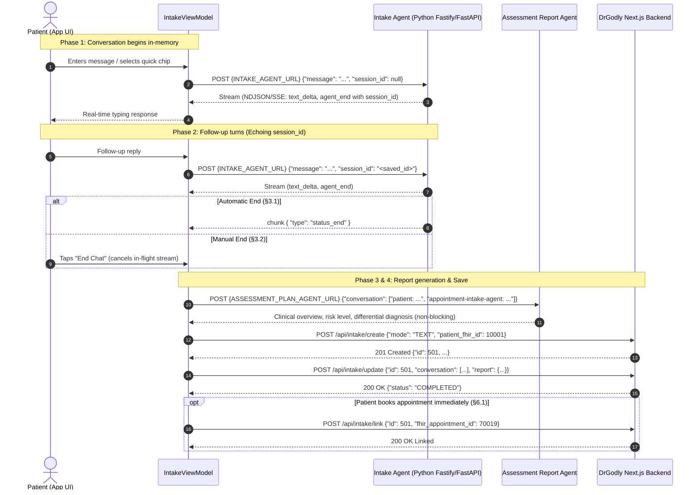

# AI Pre-Visit Intake (Text Chat) — Engineering & Testing Reference

This document provides a comprehensive overview of the **AI Pre-Visit Intake** implementation in the DrGodly Flutter application, following the production specifications of the backend and AI agent architecture.

---

## 1. Executive Summary & Architecture

The Pre-Visit Intake feature allows patients to have an interactive, free-form clinical dialogue with an intake agent before seeing a doctor. At the conclusion of the conversation, an assessment agent synthesizes a doctor-facing clinical note and treatment recommendation, which is saved to the DrGodly backend and made visible to the physician during the consultation.

---

## 2. Target Separation & Authorization

| Component | Target URL | Header Requirements | Body Constraints |
|---|---|---|---|
| **Intake Agent** | `{INTAKE_AGENT_URL}` | `Authorization: Bearer <token>` | `{"message": "...", "session_id": string \| null}`. **No `org_id`**. |
| **Assessment Agent** | `{ASSESSMENT_PLAN_AGENT_URL}` | `Authorization: Bearer <token>` | `{"conversation": ["patient: ...", "appointment-intake-agent: ..."]}`. **No `org_id`**. |
| **DrGodly Backend** | `{APP_BASE_URL}/api/intake/*` | `Authorization: Bearer <token>` | Do **not** send `user_id` or `org_id` in request body. Derived server-side from JWT claims. |

---

## 3. Detailed Phase Breakdown

### Phase 1: In-Memory Conversation Start (§1)
- The app maintains an in-memory chat transcript list: `List<IntakeChatMessage> _messages`.
- **Zero Database Records** are created during active conversation. If the patient abandons before sending messages or quits immediately, the database remains completely uncluttered.

### Phase 2: Chat Turns & Streaming Engine (§2)
- **Turn 1**: The client sends `{"message": "...", "session_id": null}`.
- **Session ID Acquisition (§2.1)**:
  - **Strategy 1**: Captured from the HTTP response header `X-Session-Id`.
  - **Strategy 2**: Captured from the stream's final `agent_end` chunk under `data.session_id`.
  - First valid ID wins and is preserved across all subsequent turns.
- **NDJSON / SSE Stream Parsing (§2.2)**:
  - Strips optional `data: ` prefixes from lines.
  - Recognizes `data: [DONE]` terminal marker.
  - Processes `text_delta` chunks for an immediate, token-by-token typewriter rendering.
  - Safely treats `text_complete` and unknown chunk types as forward-compatible no-ops.

### Phase 3: Ending Conversation (§3)
- **Automatic Path (§3.1)**: Triggered when a chunk with `type: "status_end"` is yielded. Commits current assistant reply and auto-triggers `finishIntake()`.
- **Manual Path (§3.2)**: "End Chat" button available in top AppBar:
  - Guards against empty chats: if 0 messages were sent, cleanly closes screen without making save calls.
  - Prompts confirmation dialog.
  - Immediately aborts in-flight stream HTTP connection (`_streamSubscription?.cancel()`).
  - Commits partial text and triggers `finishIntake()`.

### Phase 4: Clinical Report Generation (§4)
- Formats entire transcript into exact speaker-tagged lines:
  - Patient turns: `"patient: <message>"`
  - Assistant turns: `"appointment-intake-agent: <message>"`
- **Non-blocking Resiliency**: If the agent times out or returns non-200, the failure is silently absorbed and the intake immediately proceeds to Phase 5. No patient data is ever lost due to report agent downtime.

### Phase 5: Saving & Completion (§5)
- **5.1 Create Record**: Calls `POST /api/intake/create` with `{"mode": "TEXT", "patient_fhir_id": <id>}`. Retrieves the persistent record `id`.
- **5.2 Update Record**: Calls `POST /api/intake/update` sending `{"id": id, "conversation": [{"role": "user"|"assistant", "content": "..."}], "report": {...}}`. Marks status as `COMPLETED`.
- **5.3 Abandon Record**: Provides endpoint `POST /api/intake/abandon` with `{"id": id}` if pre-creation flow is activated.

### Phase 6: Post-Completion & Appointment Linking (§6)
- **Completion Screen**:
  - Displays doctor note summary, risk badges, and recommendations.
  - **"Book Doctor Appointment"**: Carries intake session into booking flow.
  - **"Return to Dashboard"**: Safely resets state and returns to dashboard.
- **6.1 Appointment Linking**:
  - Calls `POST /api/intake/link` with `{"id": id, "fhir_appointment_id": appointmentId}` upon booking confirmation.

---

## 4. Testing Team Verification Checklist

Use the following step-by-step test plan on the provided release APK:

| Test Case | Steps | Expected Result | Pass/Fail |
|---|---|---|---|
| **TC-01: Entry Point** | 1. Open app. 2. On Dashboard, locate "AI Clinical Intake" card. 3. Tap "Start Free-Form Intake". | Chat screen opens with welcome message and prompt suggestion chips. | [ ] |
| **TC-02: Suggested Chips** | Tap any chip (e.g., "Frequent headaches"). | Chip text is sent as user message; streaming reply begins immediately. | [ ] |
| **TC-03: Multi-turn Memory** | Reply to the bot with specific details (e.g. "Pain is throbbing on right side for 3 days"). | Bot asks follow-up questions referencing previous answers (session ID persistence). | [ ] |
| **TC-04: Manual End Chat** | Tap "End Chat" in AppBar during assistant response. | Confirmation dialog appears; upon confirming, stream cancels, loading indicator shows, and completion screen opens. | [ ] |
| **TC-05: Empty Chat Guard** | Tap "Start Free-Form Intake", then immediately tap "End Chat" before typing. | Closes cleanly without errors or unnecessary API calls. | [ ] |
| **TC-06: Completion Screen UI** | Review completion screen. | Shows "Clinical Intake Recorded", Intake ID badge, Risk level, and Clinical Overview note. | [ ] |
| **TC-07: Return to Dashboard** | Tap "Return to Dashboard". | Returns cleanly to Dashboard; dashboard vitals remain synchronized. | [ ] |

---

## 5. File Index

- `lib/core/constants/api_constants.dart`: Agent URLs & Next.js REST path definitions.
- `lib/domain/model/intake_models.dart`: Data models for chat, streaming chunks, and clinical reports.
- `lib/data/service/intake_service.dart`: Streaming HTTP client, SSE/NDJSON parser, report generator, and DrGodly REST endpoints.
- `lib/viewmodel/intake_viewmodel.dart`: State management, session persistence, automatic/manual termination logic.
- `lib/view/intake/intake_chat_screen.dart`: Chat UI with typing animation, suggestion chips, and abort handler.
- `lib/view/intake/intake_completion_screen.dart`: Doctor note review, appointment booking hook, and dashboard return.
