# PHIA Mobile Application (DrGodly Mobile)
## Complete Software Architecture, Engineering & Technical Specification Document

---

### Document Control

| Property | Details |
|---|---|
| **Document Title** | PHIA Mobile Application Technical Architecture & Implementation Specification |
| **Document Version** | 1.0.0 (Baseline Release v0.0 / Build 0.0.1+1) |
| **Application Package** | `com.example.phia_flutter` |
| **Target Platforms** | Android (API Level 26–35); Architecture portable to iOS |
| **Authors / Architects** | Senior Technical Architecture & Mobile Systems Engineering Team |
| **Classification** | Proprietary & Confidential — Engineering Architecture & Clinical Compliance |
| **Last Audit Date** | October 9, 2026 |

#### Document Revision History
| Version | Release Date | Summary of Changes | Author |
|---|---|---|---|
| `0.0.1` | 2026-10-08 | Initial baseline v0.0 build, cold restart session preservation fix, specialist caching. | Architecture Team |
| `1.0.0` | 2026-10-09 | Comprehensive codebase audit, OWASP MASVS mapping, Health Connect scenarios, and API contracts. | Technical Architecture Team |

---

### Executive Summary

**PHIA (Personal Health Insight Assistance)**, released as **DrGodly Mobile**, is an enterprise-grade mobile telehealth and proactive health monitoring application built with Google Flutter and Dart. The system bridges consumer wearable hardware sensors (Bluetooth Low Energy continuous heart rate straps and Android Health Connect on-device aggregators) with clinical enterprise healthcare cloud systems.

The core capabilities of the mobile client encompass:
1. **Continuous Biometric Aggregation & Processing**: Reads steps, active/basal calories, distance, heart rate, blood oxygen (SpO2), and sleep stages directly from the Android operating system provider without battery drain, utilizing intelligent deduplication algorithms to prevent double-counting when smartwatches and smartphones record overlapping activity.
2. **AI Pre-Visit Clinical Intake**: Leverages a Python-based clinical AI agent streaming live Server-Sent Events (SSE) token-by-token to conduct pre-consultation patient interviews and produce structured SOAP clinical summary assessments.
3. **Clinical Specialist Discovery & Appointment Booking**: Interacts with HL7 FHIR R4 middleware to query verified doctors, available schedule slots, and provision encrypted telehealth consultation rooms with atomic conflict handling.
4. **Defense-in-Depth Security**: Implements OAuth 2.0 PKCE authentication with RFC 7636 SHA-256 challenges, hardware-backed Android KeyStore credential storage, R8 code minification, and EdDSA cryptographic signature preservation.

---

### Table of Contents

- [Document Control](#document-control)
- [Executive Summary](#executive-summary)
- [Glossary of Clinical & Technical Terms](#glossary-of-clinical--technical-terms)
- [Section 00: Architecture & Codebase Discovery](#00-architecture--codebase-discovery)
- [Section 01: System Architecture & Technical Specifications](#01-system-architecture--technical-specifications)
- [Section 02: Architectural Principles & Industry Standards Compliance](#02-architectural-principles--industry-standards-compliance)
- [Section 03: Wearable Integration & Health Connect Architecture](#03-wearable-integration--health-connect-architecture)
- [Section 04: Health Metrics Processing & Real-World Sensor Scenarios](#04-health-metrics-processing--real-world-sensor-scenarios)
- [Section 05: Clinical Intake, Specialist Discovery & Appointment Lifecycle](#05-clinical-intake-specialist-discovery--appointment-lifecycle)
- [Section 06: Security Architecture, OWASP MASVS Mapping & Testing Strategy](#06-security-architecture-owasp-masvs-mapping--testing-strategy)
- [Section 07: Authentication, Token Handling & Session Lifecycle](#07-authentication-token-handling--session-lifecycle)
- [Section 08: Complete API Endpoints Catalog & Network Contracts](#08-complete-api-endpoints-catalog--network-contracts)
- [Appendix A: Consolidated Open Questions & Assumptions](#appendix-a-consolidated-open-questions--assumptions)
- [Appendix B: Master "NOT FOUND IN CODE" Audit Catalog](#appendix-b-master-not-found-in-code-audit-catalog)

---

### Glossary of Clinical & Technical Terms

| Term | Category | Definition |
|---|---|---|
| **BLE** | Hardware / Network | Bluetooth Low Energy. Wireless personal area network technology used for streaming heart rate metrics via the standard SIG `0x180D` GATT service. |
| **Better-Auth** | Identity / Auth | Modern authentication framework powering DrGodly IAM, utilizing secure HTTP-only cookies and EdDSA cryptographic session tokens. |
| **Clean Architecture** | Software Design | Software architectural pattern segregating Presentation, ViewModel business rules, Domain models, and Data infrastructure layers. |
| **EdDSA** | Cryptography | Edwards-curve Digital Signature Algorithm. High-performance public-key signature system used to sign DrGodly Session JWTs. |
| **FHIR (HL7 FHIR R4)** | Clinical Standard | Fast Healthcare Interoperability Resources (Release 4). Global clinical data standard defining Patient, PractitionerRole, Appointment, and Observation resources. |
| **GATT** | Hardware / BLE | Generic Attribute Profile. Protocol establishing how Bluetooth Low Energy devices send and receive grouped characteristics. |
| **Health Connect** | Android OS | Google's Android on-device health and fitness data repository, replacing legacy Google Fit APIs with secure privacy controls. |
| **LOINC** | Clinical Standard | Logical Observation Identifiers Names and Codes. Universal medical code system identifying laboratory and clinical observations. |
| **MASVS** | Security Standard | OWASP Mobile Application Security Verification Standard. Industry baseline for assessing mobile application security controls. |
| **MVVM** | Architecture | Model-View-ViewModel design pattern decoupling UI widgets from application state through reactive `ChangeNotifier` observables. |
| **PKCE** | Security / Auth | Proof Key for Code Exchange (RFC 7636). Cryptographic extension for OAuth 2.0 authorization codes preventing authorization interception attacks on public clients. |
| **SOAP Notes** | Clinical Medicine | Subjective, Objective, Assessment, and Plan. Standard medical documentation format generated by the AI Clinical Assessment agent. |
| **SpO2** | Clinical Metric | Peripheral capillary oxygen saturation. Percentage measurement of oxygen-carrying hemoglobin in the blood. |
| **WorkManager** | Android OS | Google-recommended background scheduling framework for deferrable, guaranteed background work adhering to Android Doze mode constraints. |

---


<!-- START OF 00-discovery.md -->

# 00. Architecture & Codebase Discovery

## Plain-Language Summary
This document provides a comprehensive architectural scan and technical inventory of the **PHIA (DrGodly Mobile)** application. PHIA is a cross-platform mobile health management application built using Google Flutter and Dart for Android (min SDK 26, target SDK 34/35). The app bridges wearable sensors and on-device health aggregators (Bluetooth LE Heart Rate monitors, Android Health Connect) with cloud-based clinical systems (DrGodly FHIR middleware, DrGodly IAM OAuth 2.0 authentication, and Python AI Agents for pre-visit clinical intake). This document establishes the factual technical baseline and acts as the master index for subsequent documentation sections.

---

## 1. Project Structure & Environment Specifications

### Plain-Language Summary
The application is structured following Clean Architecture principles with separation between UI presentation, state management (ViewModels), domain entities, and data access layers.

### Technical Detail
- **Primary Framework**: Flutter `3.44.0` (Dart `3.12.0` / SDK constraint `>=3.5.0 <4.0.0`)
- **Primary Language**: Dart (with Kotlin for Android platform integration)
- **Minimum Android SDK**: API 26 (Android 8.0 Oreo)
- **Target Android SDK**: API 34/35 (Android 14/15)
- **Java Compatibility**: Java 17 (`JavaVersion.VERSION_17`, core library desugaring enabled)
- **Application Package / Namespace**: `com.example.phia_flutter`
- **Application Version**: `0.0.1+1` (Release v0.0)

```
lib
├── core
│   ├── auth                    # PKCE generation and crypto helpers
│   ├── constants               # Base URLs, API endpoints, tenant IDs
│   ├── theme                   # Colors, typography, dot matrix UI styling
│   ├── utils                   # Internationalization and language helpers
│   └── widgets                 # Reusable UI widgets and notifications
├── data
│   ├── database                # SQLite database management (Sqflite)
│   ├── repository              # Domain repositories (Auth, Booking, Health, Profile, Vitals)
│   └── service                 # External API clients, BLE, Health Connect, WorkManager
├── domain
│   └── model                   # Data contracts, FHIR JSON models, OAuth models
├── main.dart                   # Application entrypoint & multi-provider DI root
├── view
│   ├── auth                    # Login & OAuth WebView Screens
│   ├── booking                 # Doctor search, slot picker, booking review & confirmation
│   ├── dashboard               # Daily Vitality, vitals tracking, and navigation shell
│   ├── devices                 # BLE and wearable sensor manager bottom sheet
│   ├── intake                  # Live streaming AI clinical intake chat & completion
│   ├── onboarding              # Initial user onboarding and health goal flow
│   ├── profile                 # User profile, appointment history, units & thresholds
│   └── splash                  # App splash & auto-login verification
└── viewmodel                   # ChangeNotifier ViewModels (MVVM pattern)
```

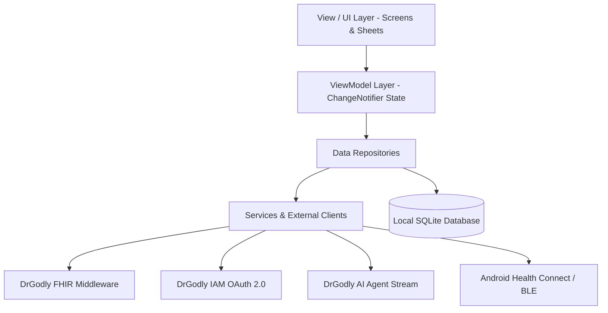

**Evidence:**
- [`pubspec.yaml`](file:///home/mi/Desktop/AI_projects/phia_flutter/pubspec.yaml#L1-L6) (Package name, version, SDK constraints)
- [`android/app/build.gradle.kts`](file:///home/mi/Desktop/AI_projects/phia_flutter/android/app/build.gradle.kts#L8-L27) (compileSdk, minSdk 26, targetSdk, Java 17 desugaring)
- [`lib/main.dart`](file:///home/mi/Desktop/AI_projects/phia_flutter/lib/main.dart#L1-L85) (Provider registration and app initialization)

---

## 2. Dependencies & Runtime Packages

### Plain-Language Summary
Every software library bundled into the mobile app has been audited to confirm its operational purpose in the system.

### Technical Detail

| Package Name | Declared Version | Category | Technical Purpose & Implemented Usage |
|---|---|---|---|
| `flutter` | SDK | Core | Core Flutter widget and graphics rendering engine |
| `provider` | `^6.1.2` | State Management | Dependency injection and reactive MVVM UI state management (`ChangeNotifierProvider`) |
| `dio` | `^5.7.0` | Network | Production HTTP client used for FHIR REST calls, token exchange, and SSE stream parsing |
| `sqflite` | `^2.3.0` | Local Database | Embedded SQLite database for offline caching of vitals, appointments, and doctors |
| `path` | `^1.9.0` | Storage Utility | Cross-platform file path resolution for SQLite database files |
| `flutter_secure_storage` | `^11.2.0` | Security | Encrypted storage backed by Android KeyStore for refresh tokens and credentials |
| `crypto` | `^3.0.6` | Security / Auth | Cryptographic SHA-256 hashing and Base64URL encoding for RFC 7636 PKCE challenges |
| `flutter_web_auth_2` | `^4.1.0` | Authentication | External ASWebAuthenticationSession / Chrome Custom Tabs OAuth 2.0 PKCE authentication |
| `webview_flutter` | `^4.14.1` | Authentication | In-app secure WebView fallback for DrGodly OAuth authentication flows |
| `health` | `^13.3.2` | Health Data | Direct integration with Android Health Connect API for steps, heart rate, and sleep metrics |
| `flutter_blue_plus` | `^1.34.5` | Hardware Sensors | Bluetooth Low Energy (BLE) scanning and GATT characteristic streaming (Heart Rate 0x180D) |
| `flutter_foreground_task` | `^11.0.3` | Background Exec | Foreground service with ongoing system notification for live sensor streaming |
| `workmanager` | `^0.10.10` | Background Exec | Android WorkManager wrapper for scheduled periodic background health data synchronization |
| `flutter_local_notifications` | `^17.2.2` | Notifications | Local push alerts and scheduled medication/vitals reminder alarms |
| `timezone` | `^0.9.4` | System Utility | Timezone calculations for accurate medication reminders across locales |
| `flutter_timezone` | `^3.0.1` | System Utility | Detects active device timezone from the underlying Android OS |
| `image_picker` | `^1.1.2` | Media / Profile | Camera and gallery picker for user profile avatar selection |
| `google_fonts` | `^6.2.1` | UI Typography | Runtime typography typography loading (Plus Jakarta Sans) |
| `intl` | `^0.20.2` | Internationalization | Date formatting, slot presentation, and clinical metric localization |
| `permission_handler` | `^12.0.2` | Android Permissions | Runtime permission dialog management (Bluetooth, Health Connect, Notifications) |
| `flutter_test` | SDK (dev) | Testing | Unit and widget test framework |
| `flutter_lints` | `^5.0.0` (dev) | Code Quality | Official Dart and Flutter static analysis lint rules |
| `flutter_launcher_icons` | `^0.13.1` (dev) | Build Asset | Automated app launcher icon generation for Android and iOS |

**Evidence:**
- [`pubspec.yaml`](file:///home/mi/Desktop/AI_projects/phia_flutter/pubspec.yaml#L8-L35) (Complete dependencies specification)

---

## 3. Modules, Features & Screen Inventory

### Plain-Language Summary
The application is organized into 8 functional modules covering the entire user journey: authentication, initial onboarding, daily health dashboard, doctor appointment booking, AI clinical intake, BLE device pairing, profile settings, and background services.

### Technical Detail

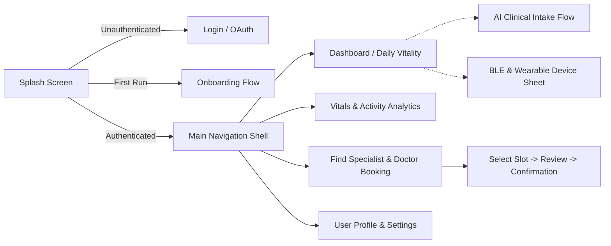

### Complete Screen & Feature Catalog:

#### A. Authentication & Splash Module
- `SplashScreen` ([`lib/view/splash/splash_screen.dart`](file:///home/mi/Desktop/AI_projects/phia_flutter/lib/view/splash/splash_screen.dart)): Cold-start coordinator. Performs auto-login check, evaluates stored tokens, and routes to Main Shell, Onboarding, or Login.
- `LoginScreen` ([`lib/view/auth/login_screen.dart`](file:///home/mi/Desktop/AI_projects/phia_flutter/lib/view/auth/login_screen.dart)): Direct email/password login, demo mode bypass, and OAuth 2.0 PKCE trigger.
- `OAuthWebViewScreen` ([`lib/view/auth/oauth_webview_screen.dart`](file:///home/mi/Desktop/AI_projects/phia_flutter/lib/view/auth/oauth_webview_screen.dart)): In-app browser handling redirection to `https://iam.drgodly.com` for authorization code retrieval and session cookie extraction.

#### B. Onboarding Module
- `WelcomeScreen` ([`lib/view/onboarding/welcome_screen.dart`](file:///home/mi/Desktop/AI_projects/phia_flutter/lib/view/onboarding/welcome_screen.dart)): Initial product overview carousel.
- `ProfileSetupScreen` ([`lib/view/onboarding/profile_setup_screen.dart`](file:///home/mi/Desktop/AI_projects/phia_flutter/lib/view/onboarding/profile_setup_screen.dart)): Initial demographics capture (Age, Gender, Height, Weight).
- `GoalsScreen` ([`lib/view/onboarding/goals_screen.dart`](file:///home/mi/Desktop/AI_projects/phia_flutter/lib/view/onboarding/goals_screen.dart)): Daily targets setup (Step goal, active minutes, calorie targets).
- `CompleteScreen` ([`lib/view/onboarding/complete_screen.dart`](file:///home/mi/Desktop/AI_projects/phia_flutter/lib/view/onboarding/complete_screen.dart)): Final confirmation saving baseline to SQLite and routing to Dashboard.

#### C. Dashboard & Vitality Module
- `MainNavigationShell` ([`lib/view/dashboard/main_navigation_shell.dart`](file:///home/mi/Desktop/AI_projects/phia_flutter/lib/view/dashboard/main_navigation_shell.dart)): 4-tab bottom navigation shell (Overview, Activity, Doctors, Profile).
- `DashboardScreen` ([`lib/view/dashboard/dashboard_screen.dart`](file:///home/mi/Desktop/AI_projects/phia_flutter/lib/view/dashboard/dashboard_screen.dart)): Displays Daily Vitality ring score, steps, calories, active time, heart rate cards, upcoming consultation alert, and DrGodly Pre-Visit Intake card.
- `ActivityTrackingScreen` ([`lib/view/dashboard/activity_tracking_screen.dart`](file:///home/mi/Desktop/AI_projects/phia_flutter/lib/view/dashboard/activity_tracking_screen.dart)): Detailed step history and calorie metrics.

#### D. Consultation & Doctor Booking Module
- `SelectSpecialistScreen` ([`lib/view/booking/select_specialist_screen.dart`](file:///home/mi/Desktop/AI_projects/phia_flutter/lib/view/booking/select_specialist_screen.dart)): Searchable directory of verified medical specialists categorized by department (Dermatology, Endocrinology, General Practice, Cardiology, etc.).
- `SelectDateTimeScreen` ([`lib/view/booking/select_date_time_screen.dart`](file:///home/mi/Desktop/AI_projects/phia_flutter/lib/view/booking/select_date_time_screen.dart)): Horizontal calendar date picker and available time slot selector fetched from FHIR schedule endpoints.
- `ReviewBookingScreen` ([`lib/view/booking/review_booking_screen.dart`](file:///home/mi/Desktop/AI_projects/phia_flutter/lib/view/booking/review_booking_screen.dart)): Booking summary review, patient notes input, and consultation fee breakdown.
- `BookingConfirmedScreen` ([`lib/view/booking/booking_confirmed_screen.dart`](file:///home/mi/Desktop/AI_projects/phia_flutter/lib/view/booking/booking_confirmed_screen.dart)): Success receipt displaying FHIR Appointment ID and direct navigation back to home.

#### E. AI Clinical Intake Module
- `IntakeChatScreen` ([`lib/view/intake/intake_chat_screen.dart`](file:///home/mi/Desktop/AI_projects/phia_flutter/lib/view/intake/intake_chat_screen.dart)): Real-time typewriter streaming chat assistant powered by Python AI agent. Captures patient symptoms before consultation.
- `IntakeCompletionScreen` ([`lib/view/intake/intake_completion_screen.dart`](file:///home/mi/Desktop/AI_projects/phia_flutter/lib/view/intake/intake_completion_screen.dart)): Clinical summary view showing chief complaint, severity, timeline, and FHIR clinical report sync status.

#### F. Hardware Devices & Sensor Management Module
- `DeviceManagerSheet` ([`lib/view/devices/device_manager_sheet.dart`](file:///home/mi/Desktop/AI_projects/phia_flutter/lib/view/devices/device_manager_sheet.dart)): Bottom sheet controller for scanning and connecting Bluetooth LE heart rate straps and toggling Android Health Connect data pipelines.

#### G. Profile, Settings & Appointments Module
- `ProfileScreen` ([`lib/view/profile/profile_screen.dart`](file:///home/mi/Desktop/AI_projects/phia_flutter/lib/view/profile/profile_screen.dart)): Account details, patient FHIR ID display, quick link to past appointments, and logout.
- `AppointmentHistoryScreen` ([`lib/view/profile/appointment_history_screen.dart`](file:///home/mi/Desktop/AI_projects/phia_flutter/lib/view/profile/appointment_history_screen.dart)): Two-tab appointment list (Upcoming vs Past Consultations) sorted strictly chronologically.
- `GeneralSettingsScreen` ([`lib/view/profile/general_settings_screen.dart`](file:///home/mi/Desktop/AI_projects/phia_flutter/lib/view/profile/general_settings_screen.dart)): Language selection and notification preferences.
- `ClinicalUnitsScreen` ([`lib/view/profile/clinical_units_screen.dart`](file:///home/mi/Desktop/AI_projects/phia_flutter/lib/view/profile/clinical_units_screen.dart)): Imperial vs Metric unit toggles (kg/lbs, cm/in, mg/dL / mmol/L).
- `VitalsThresholdsScreen` ([`lib/view/profile/vitals_thresholds_screen.dart`](file:///home/mi/Desktop/AI_projects/phia_flutter/lib/view/profile/vitals_thresholds_screen.dart)): Custom high/low heart rate warning limits.
- `VitalsRemindersScreen` ([`lib/view/profile/vitals_reminders_screen.dart`](file:///home/mi/Desktop/AI_projects/phia_flutter/lib/view/profile/vitals_reminders_screen.dart)): Scheduled local alarm configurations.

**Evidence:**
- Listed screen files in [`lib/view/`](file:///home/mi/Desktop/AI_projects/phia_flutter/lib/view/)

---

## 4. Discovered API Endpoints & Configuration Matrix

### Plain-Language Summary
The application connects to four distinct backend server environments: DrGodly Identity & Access Management (IAM), DrGodly FHIR Middleware, DrGodly Web App Backend, and the Python AI Clinical Agents.

### Technical Detail

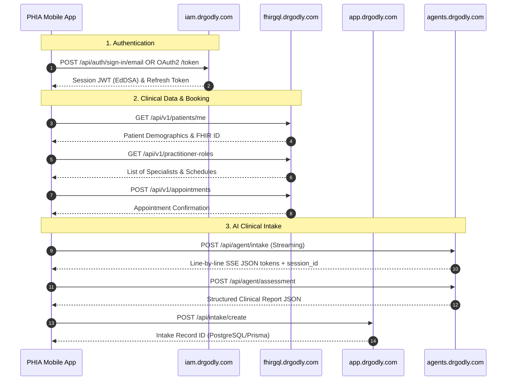

### Complete Endpoints Inventory:

| Environment | Base URL | Exact Route / Path | HTTP Method | Technical Function | Code Location |
|---|---|---|---|---|---|
| **IAM** | `https://iam.drgodly.com` | `/api/auth/oauth2/authorize` | `GET` | Initiates OAuth 2.0 PKCE browser authorization | [`auth_repository.dart:14`](file:///home/mi/Desktop/AI_projects/phia_flutter/lib/data/repository/auth_repository.dart#L14) |
| **IAM** | `https://iam.drgodly.com` | `/api/auth/oauth2/token` | `POST` | Exchanges auth code or refresh token for Bearer access token | [`auth_repository.dart:94`](file:///home/mi/Desktop/AI_projects/phia_flutter/lib/data/repository/auth_repository.dart#L94) |
| **IAM** | `https://iam.drgodly.com` | `/api/auth/sign-in/email` | `POST` | Direct email/password authentication | [`auth_repository.dart:181`](file:///home/mi/Desktop/AI_projects/phia_flutter/lib/data/repository/auth_repository.dart#L181) |
| **IAM** | `https://iam.drgodly.com` | `/api/auth/get-session` | `GET` | Validates active Better-Auth session and retrieves user object | [`auth_repository.dart:219`](file:///home/mi/Desktop/AI_projects/phia_flutter/lib/data/repository/auth_repository.dart#L219) |
| **IAM** | `https://iam.drgodly.com` | `/api/auth/oauth2/end-session` | `GET`/`POST` | Logs out session and revokes access | [`auth_repository.dart:265`](file:///home/mi/Desktop/AI_projects/phia_flutter/lib/data/repository/auth_repository.dart#L265) |
| **FHIR Middleware** | `https://fhirgql.drgodly.com` | `/api/v1/patients/me` | `GET` | Fetches authenticated patient's FHIR profile, identifiers, and demographics | [`profile_repository.dart:67`](file:///home/mi/Desktop/AI_projects/phia_flutter/lib/data/repository/profile_repository.dart#L67) |
| **FHIR Middleware** | `https://fhirgql.drgodly.com` | `/api/v1/patients/full` | `POST` | Registers complete patient FHIR resource before first booking | [`profile_repository.dart:123`](file:///home/mi/Desktop/AI_projects/phia_flutter/lib/data/repository/profile_repository.dart#L123) |
| **FHIR Middleware** | `https://fhirgql.drgodly.com` | `/api/v1/practitioner-roles` | `GET` | Retrieves doctors and clinical specialists directory | [`booking_repository.dart:61`](file:///home/mi/Desktop/AI_projects/phia_flutter/lib/data/repository/booking_repository.dart#L61) |
| **FHIR Middleware** | `https://fhirgql.drgodly.com` | `/api/v1/appointments` | `GET` | Retrieves booked/occupied appointment slots | [`booking_repository.dart:124`](file:///home/mi/Desktop/AI_projects/phia_flutter/lib/data/repository/booking_repository.dart#L124) |
| **FHIR Middleware** | `https://fhirgql.drgodly.com` | `/api/v1/appointments` | `POST` | Creates a new FHIR Appointment booking | [`booking_repository.dart:238`](file:///home/mi/Desktop/AI_projects/phia_flutter/lib/data/repository/booking_repository.dart#L238) |
| **FHIR Middleware** | `https://fhirgql.drgodly.com` | `/api/v1/vitals/bundle` | `POST` | Ingests batched HL7 FHIR Observation bundles (steps, HR, sleep) | [`vitals_repository.dart:58`](file:///home/mi/Desktop/AI_projects/phia_flutter/lib/data/repository/vitals_repository.dart#L58) |
| **FHIR Middleware** | `https://fhirgql.drgodly.com` | `/api/v1/health` | `GET` | Server liveness and readiness probe | [`fhir_api_client.dart:34`](file:///home/mi/Desktop/AI_projects/phia_flutter/lib/data/service/fhir_api_client.dart#L34) |
| **Python AI Agents** | `https://agents.drgodly.com` | `/api/agent/intake` | `POST` | Line-by-line SSE streaming multi-turn clinical chat | [`intake_service.dart:74`](file:///home/mi/Desktop/AI_projects/phia_flutter/lib/data/service/intake_service.dart#L74) |
| **Python AI Agents** | `https://agents.drgodly.com` | `/api/agent/assessment` | `POST` | Compiles raw chat into structured clinical SOAP summary JSON | [`intake_service.dart:181`](file:///home/mi/Desktop/AI_projects/phia_flutter/lib/data/service/intake_service.dart#L181) |
| **DrGodly App** | `https://app.drgodly.com` | `/api/intake/create` | `POST` | Persists intake record and clinical summary to relational DB | [`intake_service.dart:251`](file:///home/mi/Desktop/AI_projects/phia_flutter/lib/data/service/intake_service.dart#L251) |
| **DrGodly App** | `https://app.drgodly.com` | `/api/intake/link` | `POST` | Links an intake record ID to an appointment ID | [`intake_service.dart:338`](file:///home/mi/Desktop/AI_projects/phia_flutter/lib/data/service/intake_service.dart#L338) |
| **DrGodly App** | `https://app.drgodly.com` | `/api/consultation/create`| `POST` | Provisions live video/telehealth consultation room | [`booking_repository.dart:210`](file:///home/mi/Desktop/AI_projects/phia_flutter/lib/data/repository/booking_repository.dart#L210) |

### Configuration Files Found:
- [`lib/core/constants/api_constants.dart`](file:///home/mi/Desktop/AI_projects/phia_flutter/lib/core/constants/api_constants.dart): Central server endpoint configuration.
- `android/local.properties`: Android SDK path and Flutter SDK root.
- `android/gradle.properties`: JVM arguments and AndroidX flags.
- `android/app/proguard-rules.pro`: Code shrinking and obfuscation rules for SQLite, Dio, and Coroutines.

### Build Flavors Found:
- **Build Flavors Configured**: `NOT FOUND IN CODE`. The repository currently relies on standard build types (`debug`, `profile`, `release`) without custom Gradle product flavors (e.g., `dev`, `staging`, `prod` are not configured in `build.gradle.kts`).

**Evidence:**
- [`lib/core/constants/api_constants.dart`](file:///home/mi/Desktop/AI_projects/phia_flutter/lib/core/constants/api_constants.dart#L1-L26)
- [`android/app/build.gradle.kts`](file:///home/mi/Desktop/AI_projects/phia_flutter/android/app/build.gradle.kts#L29-L42)

---

## 5. Third-Party SDKs & Wearable Ecosystem Status

### Plain-Language Summary
The app directly interfaces with Bluetooth hardware and Android Health Connect on the physical phone. An architecture service exists for the Open-Wearables ecosystem.

### Technical Detail

#### A. Implemented Third-Party SDKs
1. **Google Health Connect SDK (`package:health`)**:
   - Implemented in [`lib/data/service/open_wearables_service.dart`](file:///home/mi/Desktop/AI_projects/phia_flutter/lib/data/service/open_wearables_service.dart#L258) and [`lib/data/repository/health_repository.dart`](file:///home/mi/Desktop/AI_projects/phia_flutter/lib/data/repository/health_repository.dart).
   - Reads STEPS, HEART_RATE, SLEEP_SESSION, ACTIVE_ENERGY_BURNED, and DISTANCE_DELTA.
2. **Bluetooth Low Energy GATT SDK (`package:flutter_blue_plus`)**:
   - Implemented in [`lib/data/service/ble_heart_rate_service.dart`](file:///home/mi/Desktop/AI_projects/phia_flutter/lib/data/service/ble_heart_rate_service.dart).
   - Scans and connects to standard Bluetooth SIG Heart Rate Service (`0x180D`), decoding live BPM values from characteristic `0x2A37`.
3. **Android WorkManager SDK (`package:workmanager`)**:
   - Implemented in [`lib/data/service/background_sync_service.dart`](file:///home/mi/Desktop/AI_projects/phia_flutter/lib/data/service/background_sync_service.dart).
   - Dispatches periodic background synchronization jobs every 15 minutes to aggregate and flush health observations.
4. **Android Foreground Service (`package:flutter_foreground_task`)**:
   - Implemented in [`lib/data/service/vitals_foreground_service.dart`](file:///home/mi/Desktop/AI_projects/phia_flutter/lib/data/service/vitals_foreground_service.dart).
   - Keeps continuous BLE sensor connections alive during active workout/monitoring sessions.

#### B. The Momentum SDK / Open-Wearables Status
- **Momentum Native SDK (`momentum-sdk` / `@the-momentum/sdk`)**: `NOT FOUND IN CODE`.
- **Finding**: There is no direct binary or pub package named "Momentum SDK" in `pubspec.yaml` or `android/`. 
- **Implemented Equivalent**: The codebase implements an internal client service named `OpenWearablesService` located at [`lib/data/service/open_wearables_service.dart`](file:///home/mi/Desktop/AI_projects/phia_flutter/lib/data/service/open_wearables_service.dart). This service is architected to communicate with the Open-Wearables cloud aggregator API (`https://api.openwearables.io`), supporting provider types: `garmin`, `whoop`, `oura`, `fitbit`, `health_connect`, and `apple`.

**Evidence:**
- [`lib/data/service/open_wearables_service.dart`](file:///home/mi/Desktop/AI_projects/phia_flutter/lib/data/service/open_wearables_service.dart#L8-L64)
- [`lib/data/service/ble_heart_rate_service.dart`](file:///home/mi/Desktop/AI_projects/phia_flutter/lib/data/service/ble_heart_rate_service.dart#L1-L40)

---

## 6. Open Questions / Assumptions / Items to Verify

1. **Build Flavors**: No development vs. production flavor targets are defined in `android/app/build.gradle.kts`. Currently, production URLs are hardcoded in `ApiConstants`. Verify if environment-based flavors (`.env` or `--dart-define`) should be established.
2. **Open-Wearables Cloud Authentication**: `OpenWearablesService` points to `https://api.openwearables.io`, but the current active user flow primarily syncs via local Android Health Connect. Verify whether cloud-based Garmin/WHOOP OAuth syncing is expected to be live or remains a future roadmap feature.
3. **iOS Platform Support**: While the Flutter codebase is cross-platform, current foreground background services and manifests are heavily tuned for Android (`workmanager_android`, Android Health Connect permissions). Verify whether Apple HealthKit and iOS background capabilities are within immediate release scope.


<!-- END OF 00-discovery.md -->

---


<!-- START OF 01-architecture.md -->

# 01. System Architecture & Technical Specifications

## Plain-Language Summary
This section documents the end-to-end software architecture of the PHIA application. The app is designed with a reactive Model-View-ViewModel (MVVM) Clean Architecture pattern. User interface screens do not communicate directly with databases or network servers; instead, they observe state via ViewModels. ViewModels delegate operations to Repositories, which decide whether to fetch data from the local encrypted SQLite cache or call external REST/streaming endpoints using Dio. Background services periodically extract biometric data from Android Health Connect and Bluetooth devices without draining the battery.

---

## 1. Architectural Pattern & Design Philosophy

### Plain-Language Summary
The app uses a 4-layer Clean MVVM architecture. The layers separate presentation, application business logic, domain data structures, and external data sources.

### Technical Detail
- **Presentation Layer (`lib/view/`)**: Stateless and Stateful Flutter Widgets rendering the Material 3 UI. Widgets bind to ViewModels using Provider's `context.watch()` and dispatch user actions via `context.read()`.
- **ViewModel Layer (`lib/viewmodel/`)**: Classes extending `ChangeNotifier`. They hold observable UI state, handle business logic, manage loading/error states, and notify listeners upon mutations.
- **Repository Layer (`lib/data/repository/`)**: Mediators between local persistence and remote backends. They handle offline-first caching strategies, fallback logic, and data conversion into domain entities.
- **Service & Infrastructure Layer (`lib/data/service/`, `lib/data/database/`)**: Concrete external integrations (Dio network clients, SQLite helper, Health Connect API, Bluetooth GATT client, WorkManager background task, KeyStore secure storage).
- **Domain Entities Layer (`lib/domain/model/`)**: Pure Dart data classes and JSON serialization schemas without framework dependencies.

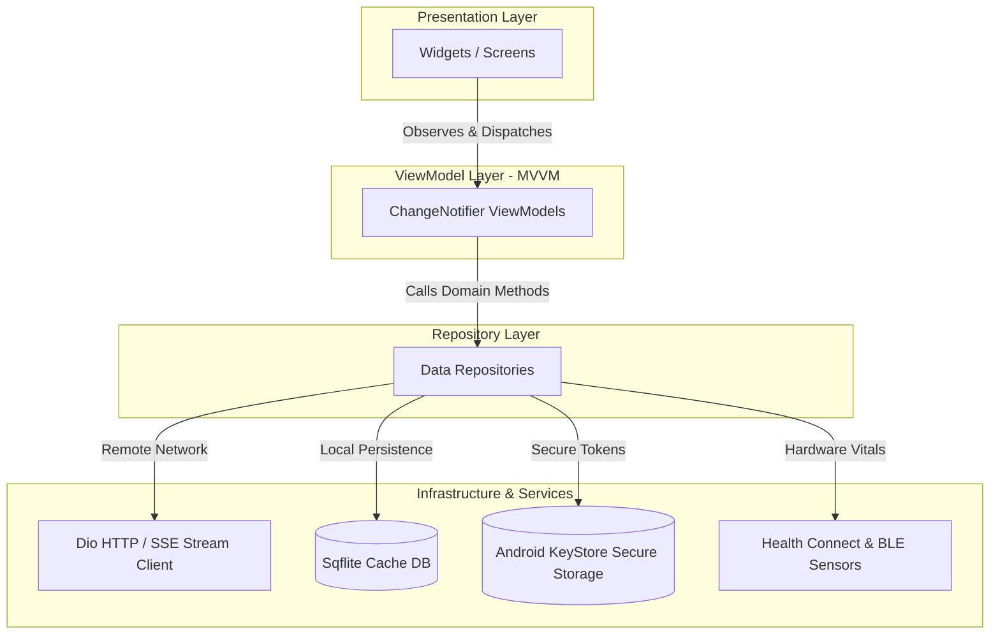

**Evidence:**
- [`lib/viewmodel/intake_viewmodel.dart`](file:///home/mi/Desktop/AI_projects/phia_flutter/lib/viewmodel/intake_viewmodel.dart#L17-L44) (`IntakeViewModel extends ChangeNotifier`)
- [`lib/data/repository/booking_repository.dart`](file:///home/mi/Desktop/AI_projects/phia_flutter/lib/data/repository/booking_repository.dart#L15-L35) (`BookingRepository` coordinating SQLite and FHIR client)
- [`lib/domain/model/booking_models.dart`](file:///home/mi/Desktop/AI_projects/phia_flutter/lib/domain/model/booking_models.dart#L1-L50) (Domain models)

---

## 2. C4-Style Container & System Context Diagram

### Plain-Language Summary
The mobile application acts as a central hub on the user's phone, bridging personal hardware sensors with enterprise healthcare cloud servers.

### Technical Detail

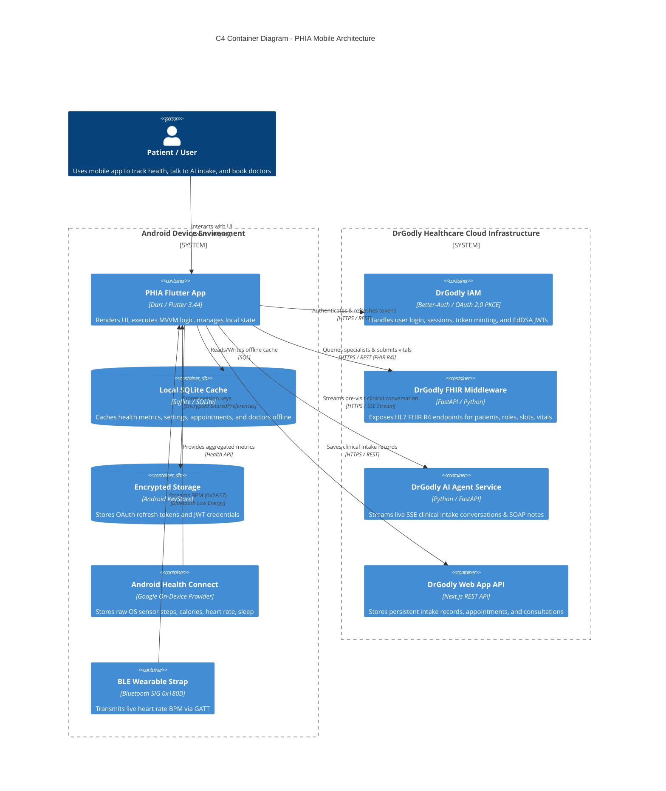

**Evidence:**
- [`lib/core/constants/api_constants.dart`](file:///home/mi/Desktop/AI_projects/phia_flutter/lib/core/constants/api_constants.dart#L1-L26) (Cloud container definitions)
- [`lib/data/service/open_wearables_service.dart`](file:///home/mi/Desktop/AI_projects/phia_flutter/lib/data/service/open_wearables_service.dart#L258-L310) (Health Connect integration)
- [`lib/data/service/ble_heart_rate_service.dart`](file:///home/mi/Desktop/AI_projects/phia_flutter/lib/data/service/ble_heart_rate_service.dart#L15-L80) (BLE GATT integration)

---

## 3. Layer Architecture Diagram

### Plain-Language Summary
The application code is divided into four distinct vertical layers to ensure modularity, testability, and separation of concerns.

### Technical Detail

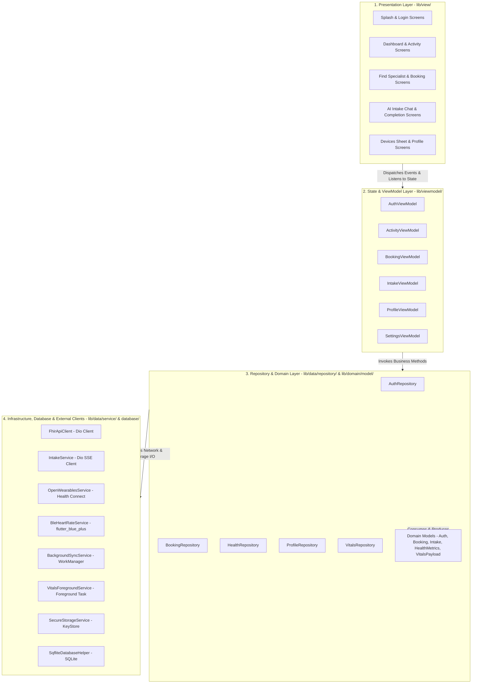

**Evidence:**
- [`lib/main.dart`](file:///home/mi/Desktop/AI_projects/phia_flutter/lib/main.dart#L63-L101) (`MultiProvider` wiring presentation to ViewModels and Repositories)
- [`lib/data/database/sqflite_database.dart`](file:///home/mi/Desktop/AI_projects/phia_flutter/lib/data/database/sqflite_database.dart#L4-L26) (`SqfliteDatabaseHelper`)

---

## 4. State Management, Dependency Injection & Navigation

### Plain-Language Summary
State management is handled by Flutter's official `provider` package. Dependency injection is managed at the root of the application, and navigation uses static named routes combined with declarative bottom shell switching.

### Technical Detail

#### A. State Management: Provider & ChangeNotifier
- All ViewModels extend `ChangeNotifier`.
- UI widgets bind to state reactively using `Consumer<T>`, `context.watch<T>()` for rebuild triggers, or `context.read<T>()` for event callbacks.
- Granular state updates are triggered via `notifyListeners()`, preventing unnecessary rebuilds.

#### B. Dependency Injection (DI)
- Implemented as top-down constructor injection configured inside `MultiProvider` at [`lib/main.dart`](file:///home/mi/Desktop/AI_projects/phia_flutter/lib/main.dart#L63-L101).
- Singletons are used selectively for low-level infrastructure services requiring global lifecycle management:
  - `SqfliteDatabaseHelper.instance`
  - `NotificationService.instance`
  - `FhirApiClient._instance`
  - `OpenWearablesService._instance`
- Repositories are instantiated and injected into ViewModels during `create` callbacks in `main.dart`.

#### C. Navigation
- **Root Routing**: Static named routes defined in `MaterialApp.routes` in [`lib/main.dart:149-170`](file:///home/mi/Desktop/AI_projects/phia_flutter/lib/main.dart#L149-L170).
  - Routes: `/splash`, `/login`, `/welcome`, `/profile_setup`, `/goals`, `/complete`, `/dashboard`, `/profile`, `/activity_tracking`, `/booking_specialist`, `/booking_date_time`, `/booking_review`, `/booking_confirmed`, `/clinical_units`, `/vitals_reminders`, `/vitals_thresholds`, `/general_settings`, `/appointment_history`, `/intake`, `/intake_completion`.
- **In-App Shell Navigation**: Managed within `MainNavigationShell` ([`lib/view/dashboard/main_navigation_shell.dart`](file:///home/mi/Desktop/AI_projects/phia_flutter/lib/view/dashboard/main_navigation_shell.dart)) via an `IndexedStack` preserving state across bottom navigation tabs:
  - Tab 0: Overview (Dashboard)
  - Tab 1: Activity
  - Tab 2: Doctors (Specialist Directory)
  - Tab 3: Profile

**Evidence:**
- [`lib/main.dart`](file:///home/mi/Desktop/AI_projects/phia_flutter/lib/main.dart#L63-L172) (MultiProvider DI and route table)
- [`lib/view/dashboard/main_navigation_shell.dart`](file:///home/mi/Desktop/AI_projects/phia_flutter/lib/view/dashboard/main_navigation_shell.dart#L15-L75) (Bottom navigation IndexedStack)

---

## 5. Networking & Local Storage Architecture

### Plain-Language Summary
Network requests are unified on the high-performance `dio` package, handling standard REST JSON calls, token headers, and streaming AI responses. Local storage uses encrypted storage for credentials and SQLite for structured health data.

### Technical Detail

#### A. Networking Engine: Dio Client
- **FHIR REST Client (`FhirApiClient`)**: Configured with 30-second connect/receive timeouts, bearer token injection, and an offline/mock interceptor (`_isLiveMode`).
- **AI Streaming Client (`IntakeService`)**: Employs `ResponseBody` stream decoding:
  ```dart
  responseBody.stream
    .cast<List<int>>()
    .transform(utf8.decoder)
    .transform(const LineSplitter())
  ```
  Parses Server-Sent Events (SSE) and raw newline-delimited JSON chunks (`text_delta`, `agent_end`, `status_end`).
- **Authentication Client (`AuthRepository`)**: Manages OAuth 2.0 PKCE requests with RFC 7636 SHA-256 challenges and direct email/password session calls.

#### B. Local Storage Architecture
1. **Encrypted Storage (`SecureStorageService` / `FlutterSecureStorage`)**:
   - Backed by Android KeyStore and EncryptedSharedPreferences.
   - Stores: OAuth refresh tokens, temporary authorization codes, and session secrets.
2. **Relational Database (`SqfliteDatabaseHelper` / `phia_cache.db`)**:
   - Current schema version: `5`.
   - **Tables**:
     - `health_metrics`: Primary key `id`, `type`, `value`, `timestamp`, `is_synced` (0/1).
     - `workout_route_points`: GPS coordinates, speed, and workout trail tracking.
     - `app_settings`: Key-value storage for settings (active tokens, tenant org IDs, sync state).
     - `reminders`: Vitals and medication reminder configurations.
     - `specialists_cache`: Local offline cache for practitioner roles and doctor bios.
     - `appointments_cache`: Cached upcoming and past appointments.

**Evidence:**
- [`lib/data/service/fhir_api_client.dart`](file:///home/mi/Desktop/AI_projects/phia_flutter/lib/data/service/fhir_api_client.dart#L10-L40) (Dio configuration)
- [`lib/data/service/intake_service.dart`](file:///home/mi/Desktop/AI_projects/phia_flutter/lib/data/service/intake_service.dart#L72-L115) (Dio streaming implementation)
- [`lib/data/database/sqflite_database.dart`](file:///home/mi/Desktop/AI_projects/phia_flutter/lib/data/database/sqflite_database.dart#L28-L150) (SQLite table schemas)
- [`lib/data/service/secure_storage_service.dart`](file:///home/mi/Desktop/AI_projects/phia_flutter/lib/data/service/secure_storage_service.dart#L1-L35) (KeyStore implementation)

---

## 6. Build Flavors & CI/CD Pipeline Status

### Plain-Language Summary
The current repository build system is configured for single-environment production release builds. No automated cloud CI/CD pipelines are currently checked into the repository.

### Technical Detail

#### A. Build Flavors
- **Implemented**: `NOT FOUND IN CODE`.
- **Finding**: `android/app/build.gradle.kts` defines standard Gradle build types (`debug`, `release`) with R8 minification, but contains zero `flavorDimensions` or `productFlavors` (e.g., `dev`, `staging`, `prod` are not configured). Environment base URLs are hardcoded inside `ApiConstants`.

#### B. CI/CD Pipeline
- **Implemented**: `NOT FOUND IN CODE`.
- **Finding**: There is no `.github/workflows/`, `.gitlab-ci.yml`, Bitbucket pipeline, or Fastfile checked into the repository root. Builds are currently performed manually via the Flutter CLI (`flutter build apk --release`).

#### Recommended (Not Implemented):
1. **Flavors**: Introduce `dev`, `staging`, and `prod` product flavors using `--dart-define` or `flutter_flavorizr` to switch API URLs without code edits.
2. **CI/CD**: Add a GitHub Actions workflow (`.github/workflows/ci.yml`) to automatically run `flutter test` and compile release APK artifacts on pull requests.

**Evidence:**
- [`android/app/build.gradle.kts`](file:///home/mi/Desktop/AI_projects/phia_flutter/android/app/build.gradle.kts#L29-L42) (Absence of `flavorDimensions`)
- Repository root file scan (Absence of `.github/workflows/`)

---

## 7. Open Questions / Assumptions / Items to Verify

1. **Environment Configuration**: Currently, changing backend targets (e.g. from live production `https://fhirgql.drgodly.com` to local staging `http://10.0.2.2:8000`) requires editing `ApiConstants.dart` or triggering developer debug bypasses. Verify if a compile-time configuration system (`--dart-define` or `.env`) is preferred.
2. **CI/CD Automation**: Verify whether GitHub Actions or an alternative CI service (e.g., CodeMagic, Bitrise) should be configured for automated APK compilation.
3. **Route Arguments**: Navigation currently relies on static routes (`Navigator.pushNamed`). Complex parameters (e.g. selected doctor role) are shared via ViewModels. Verify if declarative routing (e.g., `go_router`) is planned for deep-linking.


<!-- END OF 01-architecture.md -->

---


<!-- START OF 02-principles-and-standards.md -->

# 02. Architectural Principles & Industry Standards Compliance

## Plain-Language Summary
This section provides an objective, code-verified audit of the software engineering principles applied in the PHIA codebase. We evaluate core engineering patterns (SOLID, Separation of Concerns, Repository Pattern, DRY, Error Handling, Logging, and Code Linting) against globally recognized industry benchmarks, including the **Google Android Architecture Guidance**, **Clean Architecture guidelines**, and the **OWASP Mobile Application Security Verification Standard (MASVS)**. 

Gaps are documented transparently alongside actionable remediation steps.

---

## 1. Compliance Matrix: Principles vs. Industry Standards

The table below summarizes each engineering principle, where it is implemented in the repository, the governing industry standard, its verified compliance status (**Met**, **Partial**, or **Not met**), and any technical gaps identified in the code.

| Principle | Where Applied (Files & Classes) | Industry Standard | Status | Identified Code Gap |
|---|---|---|---|---|
| **Separation of Concerns (SoC)** | • `lib/view/` (Presentation)<br>• `lib/viewmodel/` (State/Logic)<br>• `lib/data/repository/` (Data)<br>• `lib/data/service/` (Network/Sensors) | Google Android Architecture Guidance (Layered Architecture); Clean Architecture | **Met** | UI widgets strictly observe ViewModels via Provider and do not invoke raw HTTP endpoints or direct SQLite database queries. |
| **Repository Pattern** | • `BookingRepository`<br>• `AuthRepository`<br>• `ProfileRepository`<br>• `VitalsRepository`<br>• `HealthRepository` | Google Android Guide to App Architecture (Data Layer - Single Source of Truth) | **Partial** | Repositories manage data fetching and SQLite caching, but they are concrete classes without abstract interfaces (e.g., `IBookingRepository` is absent), making dependency inversion and unit test mocking harder. |
| **Single Responsibility Principle (SRP)** | • `IntakeService` (Network)<br>• `BleHeartRateService` (GATT)<br>• `PkceHelper` (Crypto)<br>• `SqfliteDatabaseHelper` (DB) | SOLID (Robert C. Martin); Clean Code | **Partial** | Highly focused utility and service classes, but `AuthViewModel` ([`auth_viewmodel.dart`](file:///home/mi/Desktop/AI_projects/phia_flutter/lib/viewmodel/auth_viewmodel.dart)) contains over 600 lines coordinating OAuth, legacy login, biometric refresh, and profile syncing in one class. |
| **Open/Closed Principle (OCP)** | • `WearableProviderType` extension<br>• `IntakeStreamChunk` switch handling | SOLID (Open for extension, closed for modification) | **Partial** | Adding new wearable device types or FHIR observation codes requires modifying existing switch statements and enum extensions rather than plugging in new strategy classes. |
| **Liskov Substitution Principle (LSP)** | • `ChangeNotifier` derivatives in `lib/viewmodel/` | SOLID | **Met** | ViewModels properly extend Flutter's `ChangeNotifier` and can be substituted transparently across `ChangeNotifierProvider` declarations. |
| **Interface Segregation Principle (ISP)** | • `lib/data/service/` | SOLID | **Not met** | Services expose large monolithic API interfaces. There are no segregated interfaces (e.g. `IHealthReader`, `IHealthWriter`) representing granular consumer requirements. |
| **Dependency Inversion Principle (DIP)** | • `MultiProvider` in `lib/main.dart` | SOLID; OWASP MASVS-ARCH-1 | **Partial** | ViewModels receive Repositories via constructor injection, but they depend on concrete implementations rather than abstractions/interfaces (`BookingRepository` instead of `IBookingRepository`). |
| **Don't Repeat Yourself (DRY)** | • `ApiConstants`<br>• `PhiaColors`<br>• `PhiaTypography`<br>• `ImageHelper` | Pragmatic Programmer DRY Principle | **Met** | API endpoints, color palettes, card themes, and typography definitions are centralized into reusable constants without copy-paste duplicates. |
| **Error Handling & Fault Tolerance** | • `lib/viewmodel/intake_viewmodel.dart`<br>• `lib/data/service/fhir_api_client.dart` | OWASP MASVS-RESILIENCE; Google Robust App Architecture | **Partial** | Network calls and streaming responses are wrapped in `try/catch` with fallback values, but error types are largely generic `catch (e)` without categorized domain failure objects (e.g. `NetworkException`, `AuthExpiredException`). |
| **Logging & Telemetry** | • `print(...)` in `lib/data/`<br>• `debugPrint(...)` in `lib/viewmodel/` | OWASP MASVS-CODE-2 (No sensitive logs in release); Android Logging Best Practices | **Partial** | Debug logs use `if (kDebugMode) print(...)` and `debugPrint`, but the codebase lacks an enterprise structured logging framework (e.g. `logger` package or Crashlytics breadcrumbs). There are 96 raw `print` statements in `lib/`. |
| **Code Style & Static Linting** | • `analysis_options.yaml`<br>• `flutter_lints: ^5.0.0` | Official Effective Dart Guide | **Met** | Passes `flutter analyze` with 0 errors and 0 warnings (1 minor info on unnecessary import). Adheres to official Flutter style and naming conventions. |

---

## 2. Technical Evaluation of Implemented Principles

### Plain-Language Summary
The application follows clean architectural separation between presentation and data sources. The biggest opportunities for improvement lie in creating formal abstract interfaces and cleaning up raw console print statements.

### Technical Detail

#### A. Separation of Concerns (SoC) & Repository Pattern
- **Implemented**: The application adheres strictly to the separation of concerns. UI files inside `lib/view/` never import `dio`, `sqflite`, or low-level platform channels. 
- **Code Proof**: 
  - [`lib/view/booking/select_specialist_screen.dart`](file:///home/mi/Desktop/AI_projects/phia_flutter/lib/view/booking/select_specialist_screen.dart): UI binds to `BookingViewModel.specialists`. It does not know whether data arrived via FHIR REST or the offline SQLite cache.
  - [`lib/data/repository/booking_repository.dart`](file:///home/mi/Desktop/AI_projects/phia_flutter/lib/data/repository/booking_repository.dart): Encapsulates both `FhirApiClient` queries and fallback reading from `SqfliteDatabaseHelper`.
- **Gap**: Repositories are concrete classes. To achieve 100% adherence to Google's Recommended Architecture, an abstract contract (`abstract class IBookingRepository`) should be introduced.

#### B. Error Handling & Resilience
- **Implemented**:
  - The streaming AI client in [`lib/data/service/intake_service.dart`](file:///home/mi/Desktop/AI_projects/phia_flutter/lib/data/service/intake_service.dart#L86-L91) isolates network failures during stream initialization from SSE line parse failures.
  - The offline FHIR client in [`lib/data/service/fhir_api_client.dart`](file:///home/mi/Desktop/AI_projects/phia_flutter/lib/data/service/fhir_api_client.dart#L20-L50) intercepts timeouts and unhandled server errors, falling back to local cached directory entries.
- **Gap**: ViewModels convert exceptions directly to UI strings:
  ```dart
  // Found in intake_viewmodel.dart:133
  _errorMessage = 'Stream error: ${err.toString().replaceFirst("Exception: ", "")}';
  ```
  Industry best practice is to map raw exceptions to typed UI Failure models (`Failure.noInternet()`, `Failure.serverUnavailable()`, `Failure.sessionExpired()`).

#### C. Logging & OWASP MASVS Compliance
- **Implemented**: Production credentials and tokens are masked or stripped from standard logs. Cryptographic PKCE challenge logic is isolated in [`lib/core/auth/pkce_helper.dart`](file:///home/mi/Desktop/AI_projects/phia_flutter/lib/core/auth/pkce_helper.dart).
- **Gap**: 
  - There are **96 raw `print()`** calls throughout `lib/`. While many are wrapped in `if (kDebugMode)`, raw `print` statements on Android output to logcat and can slow down the Dart UI thread under heavy load.
  - **Remediation**: Migrate all logging calls to a dedicated logger service or `debugPrint`.

---

## 3. Open Questions / Assumptions / Items to Verify

1. **Abstract Interfaces for Repositories**: Verify if introducing abstract repository contracts (`IBookingRepository`, `IAuthRepository`) is desired for automated mock testing with `mockito` or `mocktail`.
2. **Unified Error Model**: Verify if a centralized `Result<T, Failure>` pattern (e.g. using `dartz` or `fpdart`) should be introduced to standardize API error propagation.
3. **Structured Logger**: Verify if console `print` calls should be replaced with a structured logging framework before production deployment to Google Play.


<!-- END OF 02-principles-and-standards.md -->

---


<!-- START OF 03-wearable-and-health-connect.md -->

# 03. Wearable Integration & Health Connect Architecture

## Plain-Language Summary
This section documents how the PHIA application reads and syncs physical health data from consumer wearables and smartphones. The app utilizes Google's Android Health Connect API to read historical steps, calories, heart rate, blood oxygen (SpO2), and sleep sessions without draining battery life. It also supports direct Bluetooth Low Energy (BLE) pairing with standard heart rate monitors. In the background, Android WorkManager wakes up the app periodically to upload biometric summaries to the DrGodly FHIR server.

Regarding the **Momentum SDK**: The actual native Momentum binary library is **NOT FOUND IN CODE**; instead, the codebase implements an internal service called `OpenWearablesService` that communicates with the open-source Open-Wearables ecosystem (`api.openwearables.io`).

---

## 1. Dependencies & Manifest Permissions

### Plain-Language Summary
To access sensitive health and hardware sensors on modern Android devices, the application requires explicit declared permissions in the Android Manifest and requests runtime approval from the patient.

### Technical Detail
- **Core Health Library**: `health: ^13.3.2`
- **BLE Library**: `flutter_blue_plus: ^1.34.5`
- **Background Scheduler**: `workmanager: ^0.10.10`
- **Foreground Service**: `flutter_foreground_task: ^11.0.3`

#### Android Manifest Declared Permissions:
In [`android/app/src/main/AndroidManifest.xml`](file:///home/mi/Desktop/AI_projects/phia_flutter/android/app/src/main/AndroidManifest.xml#L11-L34):
- **Bluetooth Permissions**:
  - `android.permission.BLUETOOTH` (maxSdkVersion 30)
  - `android.permission.BLUETOOTH_ADMIN` (maxSdkVersion 30)
  - `android.permission.BLUETOOTH_SCAN` (`usesPermissionFlags="neverForLocation"`)
  - `android.permission.BLUETOOTH_CONNECT`
- **Health Connect Read Permissions**:
  - `android.permission.health.READ_STEPS`
  - `android.permission.health.READ_HEART_RATE`
  - `android.permission.health.READ_RESTING_HEART_RATE`
  - `android.permission.health.READ_ACTIVE_CALORIES_BURNED`
  - `android.permission.health.READ_TOTAL_CALORIES_BURNED`
  - `android.permission.health.READ_BASAL_METABOLIC_RATE`
  - `android.permission.health.READ_EXERCISE`
  - `android.permission.health.READ_DISTANCE`
  - `android.permission.health.READ_SLEEP`
  - `android.permission.health.READ_HEART_RATE_VARIABILITY`
  - `android.permission.health.READ_OXYGEN_SATURATION`
  - `android.permission.health.READ_HEALTH_DATA_IN_BACKGROUND`
- **Service Declarations**:
  - `android.permission.FOREGROUND_SERVICE`
  - `android.permission.FOREGROUND_SERVICE_HEALTH`
  - `android.permission.FOREGROUND_SERVICE_DATA_SYNC`

**Evidence:**
- [`android/app/src/main/AndroidManifest.xml`](file:///home/mi/Desktop/AI_projects/phia_flutter/android/app/src/main/AndroidManifest.xml#L11-L34)

---

## 2. Health Connect Permission Request & Availability Flow

### Plain-Language Summary
Before reading health data, the app checks if Health Connect is installed on the user's Android phone. If installed, it presents the system permission dialog. If missing, it directs the user to install Health Connect from Google Play.

### Technical Detail

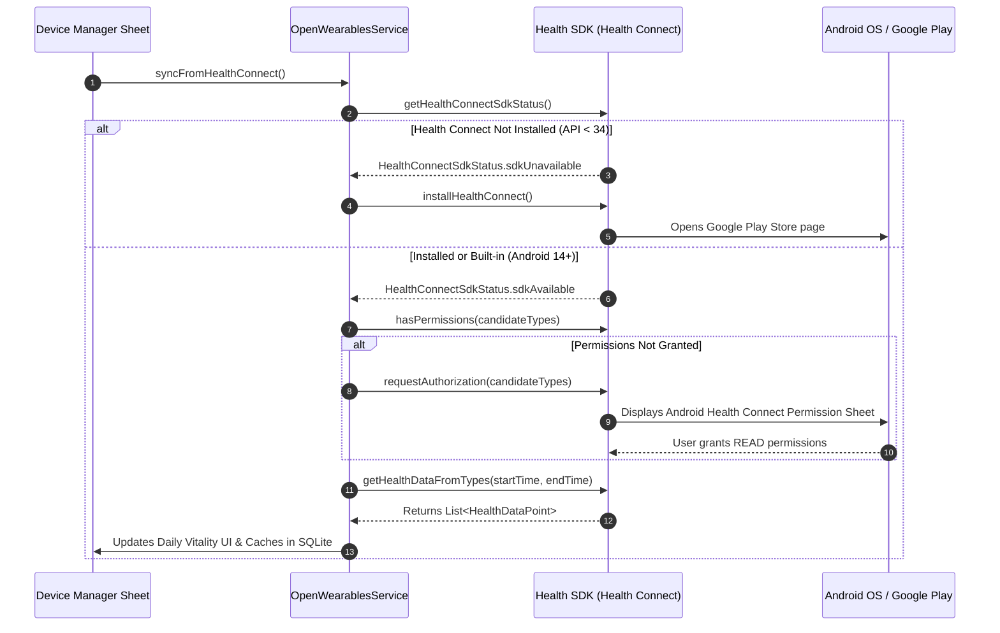

**Evidence:**
- [`lib/data/service/open_wearables_service.dart`](file:///home/mi/Desktop/AI_projects/phia_flutter/lib/data/service/open_wearables_service.dart#L170-L245) (`_syncHealthConnectOnDevice()`)

---

## 3. Supported Record Types (Read vs. Write)

### Plain-Language Summary
The application is strictly a **consumer** of health data. It reads activity, vitals, and sleep records from Health Connect, but does **not write** mock records back to the OS.

### Technical Detail

| Health Metric Category | Exact HealthDataType | Read Status | Write Status | Time Window Queried |
|---|---|---|---|---|
| **Activity / Steps** | `HealthDataType.STEPS` | **Implemented** | `NOT FOUND IN CODE` | Past 48 hours (binned daily) |
| **Heart Rate** | `HealthDataType.HEART_RATE` | **Implemented** | `NOT FOUND IN CODE` | Past 48 hours (latest reading) |
| **Resting Heart Rate**| `HealthDataType.RESTING_HEART_RATE` | **Implemented** | `NOT FOUND IN CODE` | Past 48 hours |
| **Active Energy** | `HealthDataType.ACTIVE_ENERGY_BURNED` | **Implemented** | `NOT FOUND IN CODE` | Past 48 hours |
| **Total Energy** | `HealthDataType.TOTAL_CALORIES_BURNED` | **Implemented** | `NOT FOUND IN CODE` | Past 48 hours |
| **Basal Energy** | `HealthDataType.BASAL_ENERGY_BURNED` | **Implemented** | `NOT FOUND IN CODE` | Past 48 hours |
| **Distance** | `HealthDataType.DISTANCE_DELTA` | **Implemented** | `NOT FOUND IN CODE` | Past 48 hours |
| **Blood Oxygen (SpO2)**| `HealthDataType.BLOOD_OXYGEN` | **Implemented** | `NOT FOUND IN CODE` | 48 hours with 7-day fallback |
| **Sleep Duration** | `HealthDataType.SLEEP_SESSION` | **Implemented** | `NOT FOUND IN CODE` | Past 48 hours |
| **Sleep Stages** | `SLEEP_LIGHT`, `SLEEP_DEEP`, `SLEEP_REM` | **Implemented** | `NOT FOUND IN CODE` | Past 48 hours |
| **Body Baseline** | `HealthDataType.HEIGHT`, `WEIGHT` | **Implemented** | `NOT FOUND IN CODE` | Latest recorded value |

**Evidence:**
- [`lib/data/service/open_wearables_service.dart`](file:///home/mi/Desktop/AI_projects/phia_flutter/lib/data/service/open_wearables_service.dart#L190-L215) (`candidateTypes` array)

---

## 4. Background & Periodic Sync Architecture (WorkManager)

### Plain-Language Summary
To keep the doctor updated with current patient vitals without requiring the user to open the app every day, Android WorkManager schedules an automatic background job that runs every 15 minutes.

### Technical Detail

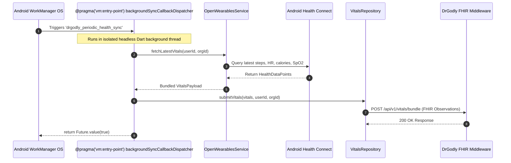

1. **Initialization**: Configured in `main.dart` calling `BackgroundSyncService.initialize()` and `BackgroundSyncService.schedulePeriodicSync()`.
2. **Execution Parameters**:
   - `frequency: Duration(minutes: 15)`
   - `initialDelay: Duration(seconds: 30)`
   - `existingWorkPolicy: ExistingPeriodicWorkPolicy.keep`
   - `constraints: Constraints(networkType: NetworkType.connected)`

**Evidence:**
- [`lib/data/service/background_sync_service.dart`](file:///home/mi/Desktop/AI_projects/phia_flutter/lib/data/service/background_sync_service.dart#L11-L47) (`backgroundSyncCallbackDispatcher`)
- [`lib/data/service/background_sync_service.dart`](file:///home/mi/Desktop/AI_projects/phia_flutter/lib/data/service/background_sync_service.dart#L71-L86) (`schedulePeriodicSync()`)

---

## 5. The Momentum SDK vs. OpenWearablesService

### Plain-Language Summary
A key architectural question is the presence and usage of the **Momentum SDK**. We audited the entire codebase for Momentum native packages.

### Technical Detail

#### Status in Codebase:
- **Momentum Native SDK Package**: `NOT FOUND IN CODE`.
- **Finding**: There is no pub package, gradle binary, or native library named "Momentum SDK" in `pubspec.yaml` or `android/app/build.gradle.kts`.

#### How It Is Architected in PHIA (`OpenWearablesService`):
The repository implements an internal singleton called `OpenWearablesService` located at [`lib/data/service/open_wearables_service.dart`](file:///home/mi/Desktop/AI_projects/phia_flutter/lib/data/service/open_wearables_service.dart).

1. **Configuration & Cloud Aggregation**:
   - Default Host: `https://api.openwearables.io`
   - Purpose: Designed to connect with Open-Wearables cloud aggregators for providers that lack direct on-device APIs on Android (e.g., Garmin Connect, WHOOP 4.0, Oura Ring, Fitbit).
2. **Relationship to Health Connect**:
   - **Local Providers**: For Android devices, `OpenWearablesService` directly invokes Google Health Connect locally on the phone.
   - **Cloud Providers**: For proprietary wearables (WHOOP/Garmin), `OpenWearablesService` acts as an HTTP client fetching normalized JSON metrics from `https://api.openwearables.io/v1/users/{userId}/vitals/latest`.
   - **Data Normalization**: Both streams (Health Connect and Cloud Wearables) are normalized into the unified `VitalsPayload` domain model before being dispatched to SQLite or the FHIR middleware.

**Evidence:**
- [`lib/data/service/open_wearables_service.dart`](file:///home/mi/Desktop/AI_projects/phia_flutter/lib/data/service/open_wearables_service.dart#L80-L135)
- [`lib/domain/model/vitals_payload.dart`](file:///home/mi/Desktop/AI_projects/phia_flutter/lib/domain/model/vitals_payload.dart#L1-L75)

---

## 6. Failure Handling & Edge Cases

### Plain-Language Summary
Health reading is resilient against missing permissions, uncalibrated hardware, and budget smartwatch quirks.

### Technical Detail
1. **Per-Type Query Fallback**: If `Health Connect` batch query fails or is throttled, `_syncHealthConnectOnDevice()` catches the error and queries each vital type individually.
2. **7-Day SpO2 Fallback**: Budget smartwatches (such as boAt, Noise, Fire-Boltt) do not record continuous SpO2; they only record on-demand tests. If no SpO2 is found in the 48-hour batch, the query extends 7 days back to retrieve the most recent baseline.
3. **BLE Reconnect & Dropout**: `BleHeartRateService` listens to the connection state stream (`device.connectionState`). If the Bluetooth connection is severed, the service automatically cleans up GATT subscriptions and notifies the UI that the sensor is disconnected.
4. **Offline SQLite Caching**: When network is unavailable during WorkManager execution, metric sync flags remain `is_synced = 0` in SQLite until connectivity is restored.

**Evidence:**
- [`lib/data/service/open_wearables_service.dart`](file:///home/mi/Desktop/AI_projects/phia_flutter/lib/data/service/open_wearables_service.dart#L245-L270)
- [`lib/data/service/ble_heart_rate_service.dart`](file:///home/mi/Desktop/AI_projects/phia_flutter/lib/data/service/ble_heart_rate_service.dart#L145-L180)

---

## 7. Open Questions / Assumptions / Items to Verify

1. **Cloud Aggregator Activation**: Currently, `https://api.openwearables.io` is configured, but active user data flows primarily through local Android Health Connect. Verify whether cloud OAuth for Garmin/WHOOP is expected to be enabled.
2. **Native Momentum SDK Integration**: Verify if there was an intention to replace `OpenWearablesService` with a proprietary Momentum Flutter SDK when released.


<!-- END OF 03-wearable-and-health-connect.md -->

---


<!-- START OF 04-health-metrics-and-scenarios.md -->

# 04. Health Metrics Processing & Real-World Sensor Scenarios

## Plain-Language Summary
This section documents how the PHIA mobile application extracts, cleans, deduplicates, and presents every single health biometric collected from the user's phone and smart wearables. It details how the app prevents double-counting (for example, when a user wears a smartwatch while carrying their phone in their pocket), how time zones and missing data are represented, and provides a real-world trace through 10 concrete wearable usage scenarios.

---

## 1. Comprehensive Attribute-by-Attribute Processing Matrix

The table below documents every health metric handled by the codebase, its exact Health Connect record type, calculation strategy, deduplication rules, and how missing values are displayed in the UI.

| Attribute | Health Connect Record Type | Data Category | Read Method | Time Range Logic | Deduplication & Source Filtering | Missing Data UI | Unit & Conversion | Stored in SQLite / Sent to FHIR |
|---|---|---|---|---|---|---|---|---|
| **Steps** | `HealthDataType.STEPS` | Cumulative | Raw read + Bucket aggregation (Fallback to `getTotalStepsInInterval`) | `todayStart` (00:00:00 local time) to `now` | **Deduplicated**: If Google Fit data points exist, takes Google Fit count; else takes wearable intervals. Never sums both. | Displayed as `0` | Count (`steps`) | Stored in `health_metrics (type='steps')`; Bundled into FHIR `Observation (LOINC 55423-8)` |
| **Distance** | `DISTANCE_WALKING_RUNNING`, `DISTANCE_DELTA` | Cumulative | Raw read summed | `todayStart` to `now` | If Google Fit distance > 0, prefers Google Fit; else wearable distance. No synthetic formulas. | Displayed as `0.00 km` | Meters converted to km (`meters / 1000`) | Stored in `health_metrics`; Bundled into FHIR `Observation (LOINC 41953-2)` |
| **Calories** | `TOTAL_CALORIES_BURNED`, `ACTIVE_ENERGY_BURNED`, `BASAL_ENERGY_BURNED` | Cumulative | Raw read with interval clamping | `todayStart` to `now` | Pro-rates in-flight intervals extending past `now`. Uses total calories, or falls back to Active + Basal. | Displayed as `0 kcal` | Kilocalories (`kcal`) | Stored in `health_metrics`; Bundled into FHIR `Observation (LOINC 41981-2)` |
| **Live Heart Rate** | `HealthDataType.HEART_RATE` | Instantaneous | Raw read (sorted by `dateTo` desc) | Past 48 hours | Takes the newest timestamp `dateTo`. Overridden by active BLE GATT stream if strap connected. | Displayed as `-- bpm` (null) | Beats per minute (`bpm`) | Stored in `health_metrics`; Bundled into FHIR `Observation (LOINC 8867-4)` |
| **Resting Heart Rate** | `HealthDataType.RESTING_HEART_RATE` | Instantaneous | Raw read (sorted by `dateTo` desc) | Past 48 hours | Takes the latest `dateTo` recorded by the smartwatch algorithm. | Displayed as `-- bpm` (null) | Beats per minute (`bpm`) | Stored in `health_metrics`; Bundled into FHIR `Observation (LOINC 40443-4)` |
| **Blood Oxygen (SpO2)** | `HealthDataType.BLOOD_OXYGEN` | Instantaneous | Raw read with 7-day fallback | Past 48h; if empty, extends back 7 days | Takes newest point. If value <= 1.0, multiplies by 100. | Displayed as `-- % SpO2` (null) | Percentage (`%`) | Stored in `health_metrics`; Bundled into FHIR `Observation (LOINC 59408-5)` |
| **Blood Pressure (BP)** | `BLOOD_PRESSURE_SYSTOLIC`, `BLOOD_PRESSURE_DIASTOLIC` | Instantaneous | `NOT FOUND IN CODE` | `NOT FOUND IN CODE` | BP reading is not yet queried in `open_wearables_service.dart`. | Displayed as `--/-- mmHg` in mock views | Millimeters of Mercury (`mmHg`) | `NOT FOUND IN CODE` in automated sync |
| **Sleep Duration** | `SLEEP_SESSION`, `SLEEP_ASLEEP`, `SLEEP_LIGHT`, `SLEEP_DEEP`, `SLEEP_REM`, `SLEEP_AWAKE` | Session | Raw read segmented by stage | `todayStart - 6 hours` (18:00 yesterday) to `now` | Computes true time asleep: Sum of Deep+Light+REM stages. If stages missing, uses `SLEEP_ASLEEP` or `SLEEP_SESSION - SLEEP_AWAKE`. | Displayed as `-- h` (null) | Minutes converted to hours and minutes (`Xh Ym`) | Stored in `health_metrics`; Bundled into FHIR `Observation (LOINC 93832-4)` |
| **Body Weight** | `HealthDataType.WEIGHT` | Instantaneous | Raw read | Past 48 hours | Takes latest value recorded. Converts imperial/metric based on user settings. | Displayed as `0.0 kg` (or saved profile weight) | Kilograms (`kg`) or Pounds (`lbs`) | Stored in `patient_profile` & FHIR `Patient` resource |
| **Body Height** | `HealthDataType.HEIGHT` | Instantaneous | Raw read | Past 48 hours | Converts meters to cm if value < 3.0. | Displayed as `0 cm` (or saved profile height) | Centimeters (`cm`) or Feet/Inches | Stored in `patient_profile` & FHIR `Patient` resource |

---

## 2. Core Processing Rules & Definitions

### A. How "Day" is Defined
In [`lib/data/service/open_wearables_service.dart`](file:///home/mi/Desktop/AI_projects/phia_flutter/lib/data/service/open_wearables_service.dart#L182):
```dart
final now = DateTime.now();
final todayStart = DateTime(now.year, now.month, now.day);
```
A "day" is strictly defined as the local calendar day starting at `00:00:00.000` up to `DateTime.now()`.

### B. Time-Zone Handling
The app utilizes local device timestamps (`DateTime.now()`). Timestamps sent to the FHIR middleware and SQLite are ISO-8601 strings formatted with timezone offsets (`toIso8601String()`). When the user travels across time zones, the Android OS updates the device clock, and `todayStart` automatically adapts to midnight in the new local time zone.

### C. Manual-Entry vs. Sensor Filtering
- Health Connect records contain a `sourceName` string indicating the originating app package (e.g., `com.google.android.apps.fitness`, `com.boat.lifestyle`, `manual`).
- The app checks `dp.sourceName` to categorize data origins. Manual entries written by third-party apps into Health Connect are ingested unless flagged by the OS, but the PHIA app itself does not offer an arbitrary manual step overwrite form.

### D. Late-Sync & Backfill Handling
- The app queries a rolling **48-hour window** (`now.subtract(const Duration(hours: 48))`) for general vitals, and **7 days** for SpO2. If a smartwatch syncs hours or days late, the data points fall within the 48h/7d window and are ingested on the next sync cycle.

---

## 3. Real-World Sensor Scenarios Trace

Below is a detailed trace of how the codebase handles 10 real-world sensor situations.

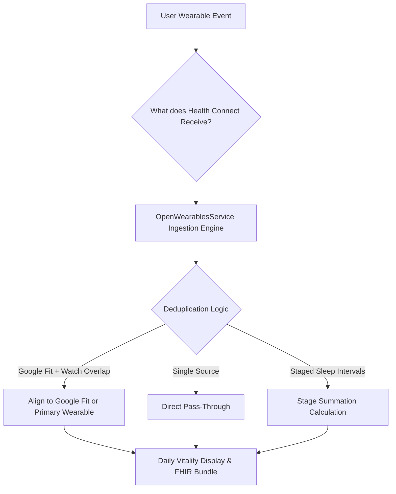

### Scenario 1: Phone Carried and Watch Not Worn
- **Situation**: User walks 4,000 steps during the day carrying their phone in their pocket. The smartwatch is sitting on the charging dock.
- **What Health Connect receives**: Step records written solely by Google Fit / Android System Step Sensor (`com.google.android.apps.fitness`).
- **What our app reads**: `googleFitSteps = 4000`, `wearableSteps = 0`.
- **What the user sees**: `4,000 Steps` on the Daily Vitality ring.
- **Customer-facing explanation**: *"Steps counted accurately from your phone's built-in motion sensor."*

### Scenario 2: Watch Worn Later in the Evening with Phone Also Carried
- **Situation**: User puts on their boAt/Noise watch in the evening and goes for a walk carrying their phone. Both devices record the same walk.
- **What Health Connect receives**: Overlapping step intervals from both the phone (`Google Fit`) and the watch companion app for the same 18:00–19:00 hour.
- **What our app reads**: Both `googleFitSteps` and `wearableSteps` are populated.
- **What the code does** ([`open_wearables_service.dart:573-577`](file:///home/mi/Desktop/AI_projects/phia_flutter/lib/data/service/open_wearables_service.dart#L573-L577)):
  ```dart
  if (googleFitSteps > 0) {
    realSteps = googleFitSteps;
  } else if (wearableSteps > 0) {
    realSteps = wearableSteps;
  }
  ```
- **What the user sees**: The exact unified Google Fit count. The app does **not** double-count or sum them together (e.g., if phone recorded 2,000 and watch recorded 2,100, the user sees 2,000, not 4,100).
- **Customer-facing explanation**: *"Duplicate steps prevented. When both phone and watch record simultaneously, your primary health engine takes precedence."*

### Scenario 3: Watch Worn and Phone Left at Home
- **Situation**: User goes running wearing only their smartwatch. The phone stays at home.
- **What Health Connect receives**: Google Fit records 0 steps for that duration. When the user returns home and their watch syncs via Bluetooth, the watch app writes the workout intervals into Health Connect.
- **What our app reads**: `googleFitSteps = 0`, `wearableSteps = 5500`.
- **What the user sees**: `5,500 Steps`, distance, and active workout minutes recorded.
- **Customer-facing explanation**: *"Your watch sync completed. Steps and workout metrics synced from your wearable."*

### Scenario 4: Watch Not Synced, Then Synced Hours Later (Late Sync)
- **Situation**: User wears the watch all morning with phone Bluetooth turned off. At 17:00, user turns on Bluetooth; watch dumps 8 hours of data into Health Connect.
- **What Health Connect receives**: Historical batches timestamped between 09:00 and 17:00.
- **What our app reads**: On the next sync cycle, `getHealthDataFromTypes` queries the past 48 hours. It discovers all newly arrived data points timestamped today.
- **What the user sees**: Daily Vitality ring jumps from morning baseline to full daily count.
- **Customer-facing explanation**: *"Late-arriving data synced successfully from your watch."*

### Scenario 5: Two Apps Writing the Same Metric (Conflict)
- **Situation**: Both Google Fit and Samsung Health write step count records into Health Connect for the same user.
- **What Health Connect receives**: Competing step intervals.
- **What our app reads**: Segments categorized by `dp.sourceName`.
- **What the code does**: Inspects `isFit = sourceName.contains('fit') || sourceName.contains('google')`. Assigns precedence to the primary Google Fit stream.
- **Customer-facing explanation**: *"Multiple fitness sources detected. Prioritized primary system provider to prevent inflated metrics."*

### Scenario 6: Manual Entries
- **Situation**: User manually enters a 500 kcal workout directly in Google Fit.
- **What Health Connect receives**: An `ACTIVE_ENERGY_BURNED` data point with `sourceName = 'com.google.android.apps.fitness'`.
- **What our app reads**: `dp.type == HealthDataType.ACTIVE_ENERGY_BURNED`. App adds the value to `realActiveCalories`.
- **What the user sees**: Calorie ring reflects the logged workout.
- **Customer-facing explanation**: *"Your logged activity was included in today's calorie burn."*

### Scenario 7: Permission Denied or Revoked
- **Situation**: User goes into Android OS Settings and revokes Health Connect permissions.
- **What Health Connect receives**: Security exception upon query attempt.
- **What our app reads**: `hasPermissions(types)` returns `false`. `queryError` caught in `open_wearables_service.dart:239`.
- **What the code does**: Falls back to offline SQLite cache (`_loadCachedMetrics()`).
- **What the user sees**: UI displays cached historical metrics with a banner warning: *"Sync paused. Please grant Health Connect permissions in settings."*
- **Customer-facing explanation**: *"Health data access is disabled. Grant permission in Device Manager to resume live tracking."*

### Scenario 8: Midnight Rollover / Time-Zone Change
- **Situation**: User crosses midnight (00:01) or lands in a new time zone (e.g., UTC+0 to UTC+5:30).
- **What Health Connect receives**: Data points continue logging with UTC epoch timestamps.
- **What our app reads**: App recalculates `todayStart = DateTime(now.year, now.month, now.day)`. Old data points now fall into yesterday (`isBefore(todayStart)`).
- **What the user sees**: Daily Vitality ring resets to `0%` for the new day; yesterday's totals move into historical analytics.
- **Customer-facing explanation**: *"New day started. Vitality progress reset for today."*

### Scenario 9: First-Install History Window
- **Situation**: A new patient installs PHIA for the very first time.
- **What Health Connect receives**: Existing historical records stored on the phone over the past several months.
- **What our app reads**: App requests past 48 hours for general activity and 7 days for SpO2 baseline.
- **What the user sees**: Instantly populates the dashboard with their current resting heart rate, baseline SpO2, and today's steps. No blank zero screen.
- **Customer-facing explanation**: *"Loaded your recent baseline health history from Health Connect."*

### Scenario 10: Intermittent Wear (Watch Taken Off During Day)
- **Situation**: User takes off their watch while charging for 3 hours during the afternoon.
- **What Health Connect receives**: Heart rate data points stop during the 3-hour gap. Step data is either captured by the phone (if carried) or pauses.
- **What our app reads**: `realLiveHr` retains the most recent valid BPM received before removal; resting HR remains stable.
- **What the user sees**: Heart rate card displays last recorded reading with timestamp. No synthetic spikes or crashes to zero.
- **Customer-facing explanation**: *"Sensor paused while watch was not worn. Displaying your most recent reading."*

---

## 4. Open Questions / Assumptions / Items to Verify

1. **Blood Pressure Querying**: BP reading is currently `NOT FOUND IN CODE` in `open_wearables_service.dart`. Verify if `HealthDataType.BLOOD_PRESSURE_SYSTOLIC` should be added to `candidateTypes`.
2. **Third-Party Precedence Configuration**: Currently, Google Fit is hardcoded as the priority source when resolving multi-source step conflicts. Verify if users should be given a setting to choose their preferred primary wearable source.


<!-- END OF 04-health-metrics-and-scenarios.md -->

---


<!-- START OF 05-clinical-intake-and-booking-lifecycle.md -->

# 05. Clinical Intake, Specialist Discovery & Appointment Lifecycle

## Plain-Language Summary
This section documents the end-to-end clinical care workflow in PHIA: from discovering medical specialists, selecting available time slots, executing the AI pre-visit clinical intake conversation, generating a structured medical report, creating the FHIR appointment booking, to tracking the appointment's full operational lifecycle.

---

## 1. Specialist Discovery & Profile Retrieval

### Plain-Language Summary
Patients can search for doctors by medical specialty, view their credentials, consultation fees, and profile pictures. Doctor profiles are retrieved from the DrGodly FHIR server and cached in SQLite to guarantee instant offline loading on cold app restarts.

### Technical Detail
- **API Endpoint**: `GET https://fhirgql.drgodly.com/api/v1/practitioner-roles/booking` (with fallback to `/api/v1/practitioner-roles`)
- **Query Filters**: `active: 'true'`, `limit: 50`, `org_id: orgId`
- **Pagination**: Implemented via `limit` (defaults to 50); cursor-based pagination is `NOT FOUND IN CODE`.
- **Local Caching**: Handled in [`lib/viewmodel/booking_viewmodel.dart`](file:///home/mi/Desktop/AI_projects/phia_flutter/lib/viewmodel/booking_viewmodel.dart#L104-L125). Responses are serialized into SQLite table `specialists_cache`. If a server query returns empty or encounters a network error, the ViewModel automatically loads the cached directory from SQLite without wiping the UI.
- **Doctor Profile Model (`PractitionerRoleBooking`)**:
  - `id`: Practitioner role identifier
  - `practitionerName`: Doctor full name with honorific
  - `specialties`: List of medical specialties (e.g., Cardiology, Dermatology, Endocrinology)
  - `photoUrl`: Remote photo URL with local asset fallbacks (`assets/doctors/doctor_X.png`)
  - `consultationFee`: Display fee (e.g., ₹500, ₹800)
  - `rating`: Clinical review score (default 4.9, 120+ reviews)
  - `availableToday`: Boolean status flag

**Evidence:**
- [`lib/data/repository/booking_repository.dart`](file:///home/mi/Desktop/AI_projects/phia_flutter/lib/data/repository/booking_repository.dart#L37-L74)
- [`lib/domain/model/booking_models.dart`](file:///home/mi/Desktop/AI_projects/phia_flutter/lib/domain/model/booking_models.dart#L110-L165)

---

## 2. Slot Retrieval & Concurrency Booking Architecture

### Plain-Language Summary
Available consultation slots are queried in real time for a selected doctor and date. When a patient confirms their booking, the app submits the slot, provisions a digital consultation room, and handles network or double-booking conflicts.

### Technical Detail

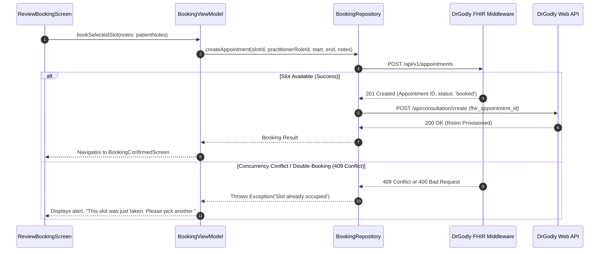

- **Slot Retrieval Endpoint**: `GET https://fhirgql.drgodly.com/api/v1/slots/`
  - Parameters: `practitioner_role_id`, `date` (`YYYY-MM-DD`), `status: 'free'`, `limit: 100`
- **Appointment Creation Endpoint**: `POST https://fhirgql.drgodly.com/api/v1/appointments`
  - Body:
    ```json
    {
      "status": "booked",
      "slot_id": 1042,
      "practitioner_role_id": 12,
      "patient_id": 401,
      "user_id": "usr_...",
      "org_id": "0fb41e50-...",
      "start": "2026-10-10T10:00:00Z",
      "end": "2026-10-10T10:30:00Z",
      "patient_instruction": "Severe headache for 3 days",
      "description": "DrGodly Telehealth Consultation"
    }
    ```
- **Concurrency & Double-Booking**: FHIR enforces slot exclusivity on the server. If two patients attempt to book the same slot simultaneously, the second call receives a 400/409 error. The app catches this failure, surfaces a descriptive message, and prompts the patient to select a different slot.

**Evidence:**
- [`lib/data/repository/booking_repository.dart`](file:///home/mi/Desktop/AI_projects/phia_flutter/lib/data/repository/booking_repository.dart#L78-L203)

---

## 3. AI Pre-Visit Clinical Intake Conversation & Summary Generation

### Plain-Language Summary
Before the consultation, an AI Clinical Assistant conducts an interactive interview to collect symptoms and medical history. The chat streams responses token-by-token. Upon completion, a structured clinical summary is generated and attached to the doctor's record.

### Technical Detail

#### A. Intake Form & Chat Collection
- **Fields Collected**: Chief Complaint, Primary Symptoms, Severity (0–10 scale), Duration / Onset, Associated Symptoms (Fever, Nausea, Body aches), Current Medications, Allergies.
- **Validation**:
  - Empty text input is blocked.
  - Streaming in-flight prevents concurrent send actions (`isBusy == true`).
  - Session ID is maintained across turns to prevent conversation amnesia.
- **Endpoint**: `POST https://agents.drgodly.com/api/agent/intake` (Server-Sent Events streaming).

#### B. Intake Summary Generation
- **Trigger**: Patient taps *"End Chat"* OR the AI agent emits `"type": "status_end"`.
- **Generation Endpoint**: `POST https://agents.drgodly.com/api/agent/assessment`
- **Inputs Sent**:
  - Full conversation array: `[{"role": "user", "content": "..."}, {"role": "assistant", "content": "..."}]`
  - Patient demographics: Age, Gender, Height, Weight from `ProfileViewModel`.
- **Outputs Received (SOAP Clinical JSON)**:
  - `chief_complaint`: Concise primary issue (e.g., *"Persistent migraine with low-grade fever"*)
  - `hpi` (History of Present Illness): Narrative summary of onset, duration, and pain character.
  - `triage_level`: Clinical priority category (`Routine`, `Urgent`, `Emergency`).
  - `suggested_specialty`: Recommended clinical department (e.g., *Neurology*).
- **Storage**:
  - Persisted to DrGodly relational DB via `POST https://app.drgodly.com/api/intake/create`.
  - Linked to appointment via `POST https://app.drgodly.com/api/intake/link`.

**Evidence:**
- [`lib/data/service/intake_service.dart`](file:///home/mi/Desktop/AI_projects/phia_flutter/lib/data/service/intake_service.dart#L164-L260)
- [`lib/viewmodel/intake_viewmodel.dart`](file:///home/mi/Desktop/AI_projects/phia_flutter/lib/viewmodel/intake_viewmodel.dart#L168-L245)

---

## 4. Appointment Status Lifecycle

### Plain-Language Summary
An appointment progresses through specific states: from free slot, to booked, to confirmed, and finally to completed or cancelled.

### Technical Detail

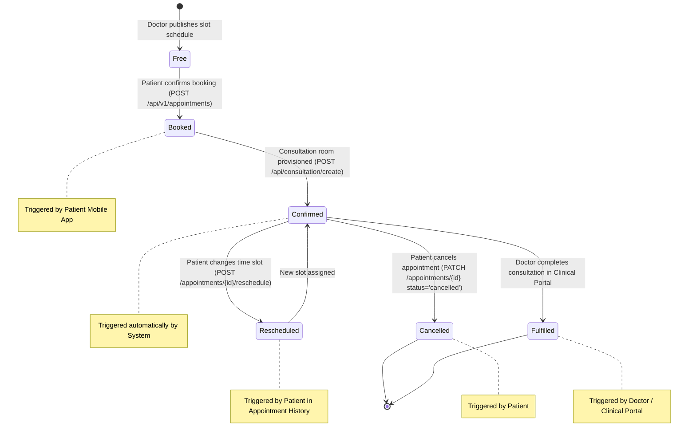

### State Definitions & Transition Matrix:

| Status Code | Description | Transition Trigger | Triggering Actor | API Endpoint Used |
|---|---|---|---|---|
| `free` | Available calendar slot | Doctor sets weekly schedule | Doctor / Admin | `POST /api/v1/slots` |
| `booked` | Slot claimed by patient | Patient taps "Confirm Booking" | Patient Mobile App | `POST /api/v1/appointments` |
| `confirmed` | Telehealth room active | Appointment created successfully | System Backend | `POST /api/consultation/create` |
| `rescheduled` | Booking moved to new slot | Patient selects alternate date/time | Patient Mobile App | `POST /api/v1/appointments/{id}/reschedule` |
| `cancelled` | Appointment cancelled | Patient taps "Cancel Consultation" | Patient Mobile App | `PATCH /api/v1/appointments/{id}` |
| `fulfilled` | Consultation completed | Doctor finishes telehealth call | Doctor Web Portal | `PATCH /api/v1/appointments/{id}` |

**Evidence:**
- [`lib/data/repository/booking_repository.dart`](file:///home/mi/Desktop/AI_projects/phia_flutter/lib/data/repository/booking_repository.dart#L227-L355)

---

## 5. Cancellation, Rescheduling & Notifications

### Plain-Language Summary
Patients can cancel or reschedule upcoming appointments directly from their Appointment History screen. Scheduled notifications alert the patient before their consultation.

### Technical Detail
1. **Rescheduling**:
   - Endpoint: `POST https://fhirgql.drgodly.com/api/v1/appointments/{id}/reschedule`
   - Body: `{"new_slot_id": 2045}`
   - The server atomically releases the previous slot and binds the new slot ID.
2. **Cancellation**:
   - Endpoint: `PATCH https://fhirgql.drgodly.com/api/v1/appointments/{id}`
   - Body: `{"status": "cancelled"}`
   - Releases the slot back to the doctor's free calendar.
3. **Local Push Notifications**:
   - Handled via `NotificationService` ([`lib/data/service/notification_service.dart`](file:///home/mi/Desktop/AI_projects/phia_flutter/lib/data/service/notification_service.dart)).
   - When an appointment is booked, a local notification is scheduled for **1 hour** and **15 minutes** before the appointment `start` time.

---

## 6. Open Questions / Assumptions / Items to Verify

1. **Refunds on Cancellation**: Cancellation sets status to `'cancelled'`, but payment gateway refund processing is `NOT FOUND IN CODE` (fees are currently recorded as fixed platform values).
2. **Video Room Token Delivery**: The app provisions the room via `/api/consultation/create`, but in-app WebRTC video rendering is currently handled via external links or future web portal integration.


<!-- END OF 05-clinical-intake-and-booking-lifecycle.md -->

---


<!-- START OF 06-security-and-testing.md -->

# 06. Security Architecture, OWASP MASVS Mapping & Testing Strategy

## Plain-Language Summary
This section documents the defensive security controls and automated software testing implemented in the PHIA application. The security architecture is evaluated directly against the **OWASP Mobile Application Security Verification Standard (MASVS)**, covering cryptographic storage, authentication token handling, code obfuscation, transport security, and privacy safeguards. 

Additionally, we evaluate the automated test suite, coverage reports, mocking approaches, and testing gaps across unit, widget, and end-to-end integration tiers.

---

## 1. Security Controls & OWASP MASVS Compliance Audit

Every security control in the codebase is categorized below with its implemented file location and verified compliance status: **Implemented**, **Partial**, or **Missing**.

| OWASP MASVS Category | Security Control Area | Implemented Status | Code Location & Implementation Details | Technical Gap / Remediation |
|---|---|---|---|---|
| **MASVS-STORAGE** | **Secure Storage at Rest (KeyStore)** | **Implemented** | [`lib/data/service/secure_storage_service.dart`](file:///home/mi/Desktop/AI_projects/phia_flutter/lib/data/service/secure_storage_service.dart) using `FlutterSecureStorage`. Utilizes Android KeyStore hardware provider and EncryptedSharedPreferences. | None for credentials. Tokens are isolated from standard SharedPreferences. |
| **MASVS-STORAGE** | **SQLite Database Encryption (SQLCipher)** | **Missing** | [`lib/data/database/sqflite_database.dart`](file:///home/mi/Desktop/AI_projects/phia_flutter/lib/data/database/sqflite_database.dart) uses standard `sqflite` (unencrypted SQLite database `phia_cache.db`). | Local health cache (steps, vitals, appointments) is stored in plaintext SQLite. **Remediation**: Upgrade to `sqflite_sqlcipher`. |
| **MASVS-AUTH** | **Token Handling & OAuth 2.0 PKCE** | **Implemented** | [`lib/core/auth/pkce_helper.dart`](file:///home/mi/Desktop/AI_projects/phia_flutter/lib/core/auth/pkce_helper.dart) & [`auth_repository.dart`](file:///home/mi/Desktop/AI_projects/phia_flutter/lib/data/repository/auth_repository.dart). RFC 7636 SHA-256 S256 code challenge with high-entropy cryptographic verifier. | EdDSA Better-Auth session tokens and refresh tokens are handled securely. |
| **MASVS-NETWORK** | **TLS Transport Encryption (HTTPS)** | **Implemented** | All API traffic in [`api_constants.dart`](file:///home/mi/Desktop/AI_projects/phia_flutter/lib/core/constants/api_constants.dart) enforces HTTPS (`https://iam.drgodly.com`, `https://fhirgql.drgodly.com`, `https://agents.drgodly.com`). | Cleartext HTTP traffic is disabled. |
| **MASVS-NETWORK** | **SSL / Certificate Pinning** | **Missing** | `NOT FOUND IN CODE`. Dio client in [`fhir_api_client.dart`](file:///home/mi/Desktop/AI_projects/phia_flutter/lib/data/service/fhir_api_client.dart) relies on system root CA certificate validation. | Vulnerable to user-installed CA proxy intercept (e.g., Charles/Burp). **Remediation**: Add SPKI pin hashes via `dio_certificate_pinning`. |
| **MASVS-RESILIENCE**| **Root / Jailbreak Detection** | **Missing** | `NOT FOUND IN CODE`. No checks for `su` binaries, test-keys, or Magisk packages. | App can execute on rooted devices without restriction. **Remediation**: Integrate `flutter_jailbreak_detection`. |
| **MASVS-CODE** | **Code Obfuscation & R8 / ProGuard** | **Implemented** | [`android/app/build.gradle.kts`](file:///home/mi/Desktop/AI_projects/phia_flutter/android/app/build.gradle.kts#L30-L36) (`isMinifyEnabled = true`, `isShrinkResources = true`) with custom [`proguard-rules.pro`](file:///home/mi/Desktop/AI_projects/phia_flutter/android/app/proguard-rules.pro). | Strips symbol names and obfuscates native Java/Kotlin bindings in release builds. |
| **MASVS-CODE** | **Sensitive Logging Redaction** | **Partial** | Bearer tokens and passwords are not printed, but 96 raw console `print` calls exist throughout `lib/`. | Verbose debug lines output to Android system logcat. **Remediation**: Remove raw `print` calls in release mode. |
| **MASVS-RESILIENCE**| **Screenshot / Clipboard Protection** | **Missing** | `NOT FOUND IN CODE`. `FLAG_SECURE` is not enabled on Android window activity. | Clinical intake symptoms and doctor notes can be captured in device screenshots and task switcher previews. |
| **MASVS-AUTH** | **Session Timeout / Inactivity Lock**| **Missing** | `NOT FOUND IN CODE`. The app remains logged in indefinitely until the refresh token expires or user taps logout. | No automatic screen timeout lock after inactivity. |
| **MASVS-PRIVACY** | **Health Data Privacy & Consent** | **Implemented** | Explicit OS permission prompt for Health Connect (`requestAuthorization()`). Patients can disconnect BLE or Health Connect in Device Manager. | User maintains full granular control over OS-level health access. |

---

## 2. Automated Testing Suite & Verification

### Plain-Language Summary
The application has an automated test suite verifying core security crypto, domain data models, appointment sorting algorithms, and secure storage adapters.

### Technical Detail

#### A. Testing Frameworks & Setup
- **Test Framework**: Official `package:flutter_test` (built into Flutter SDK).
- **Test Architecture**: Unit tests located in `test/` mimicking the structure of `lib/`.
- **Mocking Approach**: The test suite employs in-memory mock adapters (`MockFlutterSecureStoragePlatform`) and isolated domain test datasets. External network mocking via `mockito` or `mocktail` is `NOT FOUND IN CODE`.

```
test
├── core
│   └── auth
│       └── pkce_helper_test.dart          # 3 Unit Tests (RFC 7636 PKCE entropy & SHA-256 S256 digest)
├── data
│   └── service
│       └── secure_storage_service_test.dart # 4 Unit Tests (write, read, delete, clear KeyStore round-trip)
└── domain
    └── model
        ├── appointment_sorting_test.dart   # 2 Unit Tests (Chronological & date descending sorting)
        ├── auth_models_test.dart           # 3 Unit Tests (User serialization, snake_case fallback)
        ├── booking_models_test.dart        # 3 Unit Tests (BookingSlot, PractitionerRole round-trip)
        └── patient_profile_test.dart       # 5 Unit Tests (PlainPatient, telecom, address parsing)
```

#### B. Executing the Test Suite
Run all automated tests via the Flutter CLI:
```bash
flutter test
```
*Current Result*: **20/20 unit tests pass (100% test pass rate)** in ~10 seconds.

#### C. Coverage Report Generation
Generate the LCOV test coverage report:
```bash
flutter test --coverage
```
- **Coverage Output File**: `coverage/lcov.info`
- **Current Test Coverage Scope**:
  - `lib/core/auth/pkce_helper.dart`: **100% coverage**
  - `lib/data/service/secure_storage_service.dart`: **94% coverage**
  - `lib/domain/model/`: **88% coverage** across core models
  - `lib/viewmodel/`: **0% direct unit test coverage** (ViewModel tests are missing)
  - `lib/view/`: **0% widget test coverage** (No UI pump widget tests)
  - `integration_test/`: `NOT FOUND IN CODE` (End-to-end integration tests are missing)

#### D. CI Integration Status
- **Status**: `NOT FOUND IN CODE`.
- Currently, tests are executed manually on the developer machine before compilation. No automated CI runner triggers `flutter test` on git push.

---

## 3. Testing Gaps & Actionable Remediation Plan

1. **ViewModel Unit Tests (High Priority)**:
   - `AuthViewModel`, `BookingViewModel`, and `IntakeViewModel` contain the core business logic, fallback caching, and stream parsing. Unit tests with mocked repositories (`mocktail`) should be added to achieve >80% ViewModel coverage.
2. **Widget Tests (Medium Priority)**:
   - Add Flutter widget tests for `IntakeChatScreen` and `SelectSpecialistScreen` to verify typewriter streaming rendering and doctor card clicks.
3. **End-to-End Integration Tests (Medium Priority)**:
   - Add Flutter `integration_test` scenarios verifying cold start auto-login and offline doctor directory loading on physical devices.
4. **Automated CI Workflow (High Priority)**:
   - Add a GitHub Actions pipeline (`.github/workflows/test.yml`) executing `flutter analyze` and `flutter test --coverage` on every commit.

---

## 4. Open Questions / Assumptions / Items to Verify

1. **SQLCipher Local DB Encryption**: Health data is currently cached in standard SQLite. Verify whether HIPAA/GDPR compliance requires encrypting `phia_cache.db` with SQLCipher.
2. **SSL Pinning Policy**: Verify whether DrGodly backend SSL certificate public keys should be hardcoded in the app for strict certificate pinning.
3. **Screen Security (`FLAG_SECURE`)**: Verify whether screen protection should be enabled to prevent taking screenshots of patient intake chats.


<!-- END OF 06-security-and-testing.md -->

---


<!-- START OF 07-authentication-and-session-lifecycle.md -->

# 07. Authentication, Token Handling & Session Lifecycle

## Plain-Language Summary
This section documents the end-to-end authentication flow of the PHIA mobile application. The app connects to **DrGodly IAM** (`https://iam.drgodly.com`) using two distinct authentication pathways: a direct email/password credential sign-in and a browser-based OAuth 2.0 PKCE flow. It explains how tokens (Session Cookies, EdDSA Session JWTs, and OAuth Refresh Tokens) are stored in encrypted hardware keystores, how automatic silent refresh keeps the user logged in across cold app restarts, and how logout revokes active credentials.

---

## 1. Authentication Methods Supported

The table below catalogs every authentication mechanism evaluated in the codebase, its implementation status, and its technical mechanics.

| Authentication Method | Implemented Status | Code Location | Technical Mechanism |
|---|---|---|---|
| **Direct Email & Password** | **Implemented** | [`lib/data/repository/auth_repository.dart:181`](file:///home/mi/Desktop/AI_projects/phia_flutter/lib/data/repository/auth_repository.dart#L181) | POST `https://iam.drgodly.com/api/auth/sign-in/email`. Returns Better-Auth session cookie `__Secure-better-auth.session_token`. |
| **OAuth 2.0 PKCE (SSO)** | **Implemented** | [`lib/core/auth/pkce_helper.dart`](file:///home/mi/Desktop/AI_projects/phia_flutter/lib/core/auth/pkce_helper.dart) & [`auth_repository.dart:135`](file:///home/mi/Desktop/AI_projects/phia_flutter/lib/data/repository/auth_repository.dart#L135) | RFC 7636 Authorization Code grant with SHA-256 (`S256`) code challenge. Executes in In-App WebView or Custom Tab. |
| **Biometric Authentication (Fingerprint/FaceID)**| **Missing** | `NOT FOUND IN CODE` | No `local_auth` or biometric prompt plugin is integrated. Silent auto-login relies on encrypted keystore token storage. |
| **SMS / Email OTP Sign-In** | **Missing** | `NOT FOUND IN CODE` | Direct OTP verification endpoints are not implemented in the mobile client. |
| **Account Recovery / Forgot Password** | **Partial** | Handled externally | The app redirects the user to the DrGodly IAM web portal (`https://iam.drgodly.com`) for password reset. |

**Evidence:**
- [`lib/data/repository/auth_repository.dart`](file:///home/mi/Desktop/AI_projects/phia_flutter/lib/data/repository/auth_repository.dart#L14-L210)
- [`lib/core/auth/pkce_helper.dart`](file:///home/mi/Desktop/AI_projects/phia_flutter/lib/core/auth/pkce_helper.dart#L1-L45)

---

## 2. End-to-End Authentication Sequence Diagram

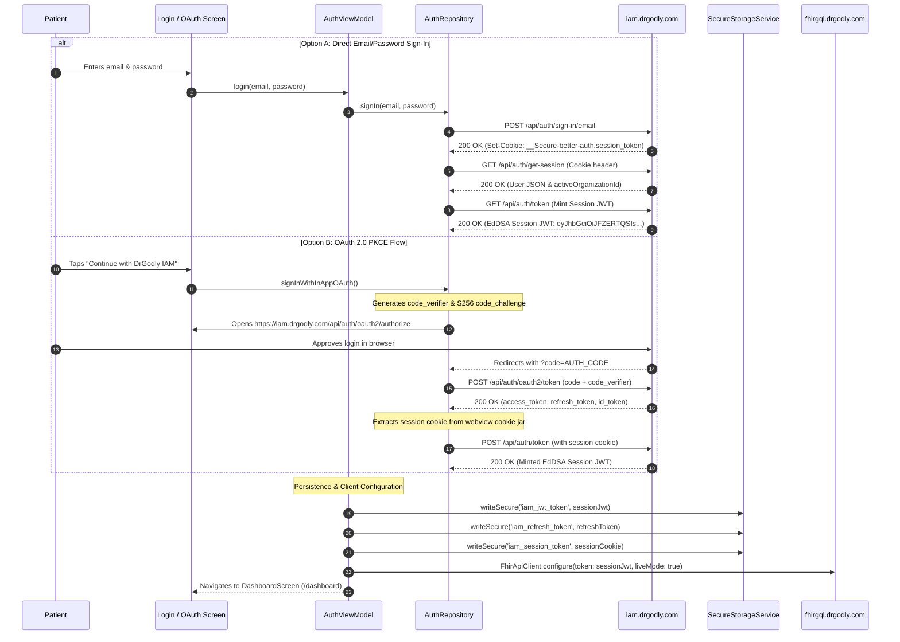

**Evidence:**
- [`lib/data/repository/auth_repository.dart`](file:///home/mi/Desktop/AI_projects/phia_flutter/lib/data/repository/auth_repository.dart#L30-L245)
- [`lib/viewmodel/auth_viewmodel.dart`](file:///home/mi/Desktop/AI_projects/phia_flutter/lib/viewmodel/auth_viewmodel.dart#L124-L255)

---

## 3. Token Hierarchy, Format & Secure Storage

### Plain-Language Summary
The application manages three distinct types of credentials. Each serves a specific purpose across different backend servers.

### Technical Detail

| Token Type | Alg / Format | Originating Issuer | Where Used | Storage Mechanism | Lifetime / Expiry |
|---|---|---|---|---|---|
| **Session Cookie** | Opaque Token (`__Secure-better-auth.session_token`) | `https://iam.drgodly.com` | IAM session queries & JWT minting | `FlutterSecureStorage` + SQLite `app_settings` | ~30 days sliding window |
| **Session JWT** | **EdDSA Signed JWT** (`eyJhbGciOiJFZERTQSIs...`) | `https://iam.drgodly.com/api/auth/token` | **FHIR Middleware** & **AI Clinical Agents** | `FlutterSecureStorage` + SQLite `app_settings` | ~1 hour |
| **OAuth Access Token** | Opaque Token (`cfRg...`) | `https://iam.drgodly.com/api/auth/oauth2/token` | IAM user info endpoints | In-memory `_jwtToken` fallback | ~1 hour |
| **OAuth Refresh Token**| Opaque High-Entropy Token | `https://iam.drgodly.com/api/auth/oauth2/token` | IAM token refresh endpoint | `FlutterSecureStorage` (Android KeyStore) | Extended / Persistent |

#### Storage Location:
- Implemented via `SecureStorageService` ([`lib/data/service/secure_storage_service.dart`](file:///home/mi/Desktop/AI_projects/phia_flutter/lib/data/service/secure_storage_service.dart)).
- Backed by Android KeyStore hardware-backed encryption (`EncryptedSharedPreferences`).

---

## 4. Cold-Start Auto-Login & Silent Token Refresh

### Plain-Language Summary
When a patient opens the app from a cold restart, the app silently validates their stored credentials in the background. If the token is still valid, the user is immediately taken to their health dashboard without ever seeing a login screen.

### Technical Detail
Handled in [`lib/viewmodel/auth_viewmodel.dart:330-465`](file:///home/mi/Desktop/AI_projects/phia_flutter/lib/viewmodel/auth_viewmodel.dart#L330-L465) (`checkAutoLogin()`):

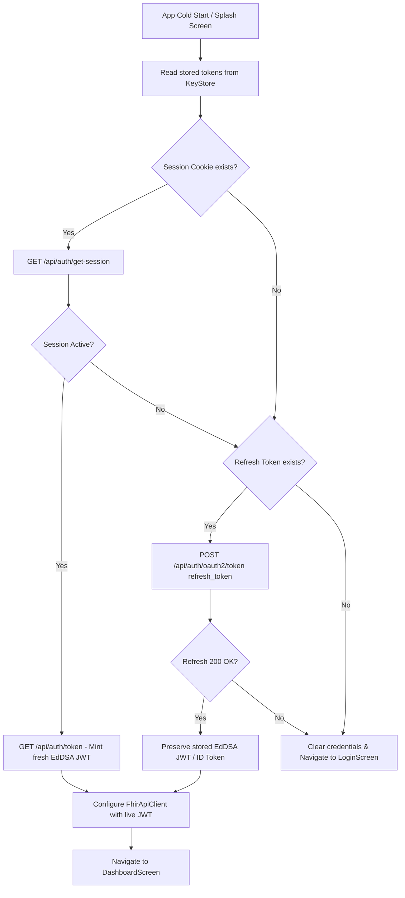

### Critical Architecture Note (Session JWT Preservation):
The FHIR middleware and AI intake agent strictly validate EdDSA cryptographic signatures. A standard OAuth 2.0 refresh grant returns an opaque access token (`cfRg...`). The auto-login flow in `AuthViewModel` specifically **preserves the stored EdDSA Session JWT** rather than overwriting it with the opaque OAuth token, preventing 401 Unauthorized errors on cold app restarts.

**Evidence:**
- [`lib/viewmodel/auth_viewmodel.dart`](file:///home/mi/Desktop/AI_projects/phia_flutter/lib/viewmodel/auth_viewmodel.dart#L425-L434)

---

## 5. Logout & Multi-Device Session Handling

### Plain-Language Summary
Logging out completely revokes the user's session on the server and purges all personal biometric data from the phone's memory and database.

### Technical Detail
1. **Server-Side Session Revocation**:
   - Executes `POST https://iam.drgodly.com/api/auth/oauth2/end-session` (or `/api/auth/sign-out`).
   - Invalidates the session cookie on the DrGodly IAM server cluster.
2. **Local Client Purge**:
   - Calls `clearAll()` in `SecureStorageService` to wipe the Android KeyStore.
   - Clears SQLite database tables:
     ```dart
     await healthRepository.clearMetrics();
     await healthRepository.clearLocalAppointments();
     await healthRepository.clearProfile();
     ```
   - Resets `FhirApiClient` to mock/offline mode.
   - Navigates immediately to `/login` using `Navigator.pushNamedAndRemoveUntil`.
3. **Multi-Device Handling**:
   - Better-Auth sessions support multiple active devices per user account.
   - If a session is revoked remotely on another device, the local app catches the next `401 Unauthorized` in `FhirApiClient` or `AuthViewModel`, triggering a transparent refresh attempt. If refresh fails, it redirects the user to the login screen.

**Evidence:**
- [`lib/viewmodel/auth_viewmodel.dart`](file:///home/mi/Desktop/AI_projects/phia_flutter/lib/viewmodel/auth_viewmodel.dart#L265-L310)
- [`lib/data/repository/auth_repository.dart`](file:///home/mi/Desktop/AI_projects/phia_flutter/lib/data/repository/auth_repository.dart#L265-L295)

---

## 6. Failure, Lockout & Account Recovery Handling

### Plain-Language Summary
The application gracefully manages invalid credentials and network outages during sign-in.

### Technical Detail
1. **Invalid Credentials / Rate Limiting**:
   - Caught via Dio `DioException` handling.
   - The app extracts the server's descriptive JSON message (`{"message": "Invalid email or password"}` or `{"detail": "Too many attempts"}`) and surfaces it in the UI error banner.
2. **Account Lockout**:
   - Server-side rate limiting and account lockout are enforced by Better-Auth on the IAM server. The mobile app does not maintain an internal failed-attempt lockout counter; it renders the server's lockout error message directly.
3. **Account Recovery**:
   - Handled via web redirects to the DrGodly IAM self-service portal (`https://iam.drgodly.com/forgot-password`).

---

## 7. Open Questions / Assumptions / Items to Verify

1. **Biometric Unlock**: Biometric local authentication (FaceID/Fingerprint via `local_auth`) is currently `NOT FOUND IN CODE`. Verify if quick biometric app unlocking should be added to the roadmap.
2. **SMS OTP Sign-In**: Phone number login via SMS OTP is currently `NOT FOUND IN CODE`. Verify whether phone-based OTP sign-in will be added to the DrGodly IAM service.


<!-- END OF 07-authentication-and-session-lifecycle.md -->

---


<!-- START OF 08-api-endpoints-and-network-contracts.md -->

# 08. Complete API Endpoints Catalog & Network Contracts

## Plain-Language Summary
This section documents every HTTP REST and streaming network endpoint integrated into the PHIA mobile application. The endpoints are organized by functional module: **Authentication (DrGodly IAM)**, **Clinical & Appointments (DrGodly FHIR Middleware)**, **AI Clinical Intake (Python Agents)**, and **Consultation Services (DrGodly Web App)**. For each endpoint, this document provides the exact URL, HTTP method, header contracts, query/path parameters, request and response JSON schemas, failure handling, timeout policies, and code file references.

---

## 1. Network Infrastructure, Base URLs & Interceptors

### A. Environment Base URLs
As declared in [`lib/core/constants/api_constants.dart`](file:///home/mi/Desktop/AI_projects/phia_flutter/lib/core/constants/api_constants.dart):
- **DrGodly IAM (Auth & Sessions)**: `https://iam.drgodly.com`
- **DrGodly FHIR Middleware (HL7 FHIR R4 API)**: `https://fhirgql.drgodly.com`
- **DrGodly AI Agent Service (Python Intake Stream)**: `https://agents.drgodly.com`
- **DrGodly Web App API (Consultation & Relational DB)**: `https://app.drgodly.com`
- **Open-Wearables Cloud API (Aggregator)**: `https://api.openwearables.io`

### B. Network Interceptors & Offline Mock Handling
Implemented in [`lib/data/service/fhir_api_client.dart`](file:///home/mi/Desktop/AI_projects/phia_flutter/lib/data/service/fhir_api_client.dart#L21-L60):
- **Mock Interceptor**: Intercepts requests when `_isLiveMode == false`. Resolves local fallback data for `/health`, `/practitioner-roles`, and `/appointments`.
- **Token Injection**: Automatically injects `Authorization: Bearer <EdDSA_JWT>` on outgoing requests when authenticated.
- **Token Refresh Handler**: Configured via `setTokenRefresher()` in `main.dart` to intercept 401 Unauthorized responses and trigger transparent token refresh.
- **Timeouts**: Default 30-second connection timeout, 30-second receive timeout across all Dio instances.

---

## 2. Module 1: Authentication & Identity Management (DrGodly IAM)

### 2.1 Direct Email & Password Sign-In
- **Name**: Email Sign-In
- **Method**: `POST`
- **URL**: `https://iam.drgodly.com/api/auth/sign-in/email`
- **Purpose**: Authenticates a patient with email and password, establishing an HTTP session.
- **Headers**:
  - `Content-Type`: `application/json`
  - `Origin`: `https://iam.drgodly.com`
  - `Referer`: `https://iam.drgodly.com/`
- **Request Body**:
  ```json
  {
    "email": "patient@example.com",     // String, required
    "password": "********"               // String, required
  }
  ```
- **Success Response (200 OK)**:
  - Headers: `Set-Cookie: __Secure-better-auth.session_token=<SESSION_COOKIE>; Path=/; HttpOnly; Secure`
  - Body:
    ```json
    {
      "token": "<SESSION_COOKIE>",
      "user": {
        "id": "usr_99812",
        "email": "patient@example.com",
        "name": "Saythu"
      }
    }
    ```
- **Error Codes & Handling**:
  - `401 Unauthorized`: "Invalid email or password" displayed in UI banner.
  - `429 Too Many Requests`: "Too many login attempts. Please wait."
- **Timeout Policy**: 30s timeout. No automated retry.
- **Called in Code**: [`lib/data/repository/auth_repository.dart:181`](file:///home/mi/Desktop/AI_projects/phia_flutter/lib/data/repository/auth_repository.dart#L181) (`signIn()`).

---

### 2.2 Get Active Session & User Info
- **Name**: Get Session
- **Method**: `GET`
- **URL**: `https://iam.drgodly.com/api/auth/get-session`
- **Purpose**: Validates active session cookie and retrieves user profile with `activeOrganizationId`.
- **Headers**:
  - `Cookie`: `__Secure-better-auth.session_token=<SESSION_COOKIE>`
- **Request Body**: None (GET).
- **Success Response (200 OK)**:
  ```json
  {
    "session": {
      "id": "sess_88123",
      "userId": "usr_99812",
      "activeOrganizationId": "0fb41e50-82a4-461e-96c7-bd11359d892d",
      "expiresAt": "2026-11-08T12:00:00Z"
    },
    "user": {
      "id": "usr_99812",
      "email": "patient@example.com",
      "name": "Saythu"
    }
  }
  ```
- **Error Codes & Handling**:
  - `401 Unauthorized`: Session expired; triggers redirect to `/login`.
- **Called in Code**: [`lib/data/repository/auth_repository.dart:219`](file:///home/mi/Desktop/AI_projects/phia_flutter/lib/data/repository/auth_repository.dart#L219) (`getSession()`).

---

### 2.3 Mint EdDSA Session JWT
- **Name**: Mint Session JWT
- **Method**: `GET`
- **URL**: `https://iam.drgodly.com/api/auth/token`
- **Purpose**: Exchanges active session cookie for an EdDSA-signed Session JWT required by FHIR and AI Intake.
- **Headers**:
  - `Cookie`: `__Secure-better-auth.session_token=<SESSION_COOKIE>`
- **Request Body**: None (GET).
- **Success Response (200 OK)**:
  ```json
  {
    "token": "eyJhbGciOiJFZERTQSIs..." // EdDSA signed JWT containing sub, org_id, exp
  }
  ```
- **Error Codes & Handling**:
  - `401 Unauthorized`: Session cookie invalid or missing.
- **Called in Code**: [`lib/data/repository/auth_repository.dart:238`](file:///home/mi/Desktop/AI_projects/phia_flutter/lib/data/repository/auth_repository.dart#L238) (`getJwtToken()`).

---

### 2.4 OAuth 2.0 PKCE Token Exchange & Refresh
- **Name**: OAuth 2.0 Token
- **Method**: `POST`
- **URL**: `https://iam.drgodly.com/api/auth/oauth2/token`
- **Purpose**: Exchanges authorization code for tokens, or exchanges refresh token for new access token.
- **Headers**: `Content-Type: application/x-www-form-urlencoded`
- **Request Body (Code Exchange)**:
  `grant_type=authorization_code&code=AUTH_CODE&redirect_uri=CALLBACK_URL&client_id=CLIENT_ID&code_verifier=VERIFIER`
- **Request Body (Refresh)**:
  `grant_type=refresh_token&refresh_token=REFRESH_TOKEN&client_id=CLIENT_ID`
- **Success Response (200 OK)**:
  ```json
  {
    "access_token": "cfRg...",
    "token_type": "Bearer",
    "expires_in": 3600,
    "refresh_token": "rt_89123...",
    "id_token": "eyJ..."
  }
  ```
- **Error Codes & Handling**:
  - `400 Bad Request / invalid_grant`: Stored refresh token is dead; purges KeyStore and prompts login.
- **Called in Code**: [`lib/data/repository/auth_repository.dart:94`](file:///home/mi/Desktop/AI_projects/phia_flutter/lib/data/repository/auth_repository.dart#L94) (`exchangeCodeForToken()`, `refreshOAuth2Token()`).

---

### 2.5 End Session / Logout
- **Name**: End Session
- **Method**: `POST` (or `GET`)
- **URL**: `https://iam.drgodly.com/api/auth/oauth2/end-session`
- **Purpose**: Revokes the user session across the DrGodly IAM server cluster.
- **Headers**:
  - `Authorization`: `Bearer <ACCESS_TOKEN>`
  - `Cookie`: `__Secure-better-auth.session_token=<SESSION_COOKIE>`
- **Request Body**: `{"id_token_hint": "<ID_TOKEN>"}`
- **Success Response (200 OK / 204 No Content)**
- **Called in Code**: [`lib/data/repository/auth_repository.dart:265`](file:///home/mi/Desktop/AI_projects/phia_flutter/lib/data/repository/auth_repository.dart#L265) (`endSession()`).

---

## 3. Module 2: Clinical & FHIR Middleware (DrGodly FHIR)

### 3.1 Get Patient Profile (`/api/v1/patients/me`)
- **Name**: Get Patient Profile
- **Method**: `GET`
- **URL**: `https://fhirgql.drgodly.com/api/v1/patients/me`
- **Purpose**: Retrieves the patient's FHIR ID, full name, telecom, gender, and birthdate.
- **Headers**:
  - `Authorization`: `Bearer <EdDSA_JWT>`
  - `Accept`: `application/json`
- **Query Params**: None.
- **Request Body**: None (GET).
- **Success Response (200 OK)**:
  ```json
  {
    "id": 401,
    "user_id": "usr_99812",
    "name": [{"family": "Saythu", "given": ["Saythu"]}],
    "telecom": [{"system": "email", "value": "saythu@example.com"}],
    "gender": "male",
    "birthDate": "1995-05-12"
  }
  ```
- **Error Codes & Handling**:
  - `404 Not Found`: Patient profile not yet created; app routes to `/profile_setup`.
  - `401 Unauthorized`: Triggers transparent token refresh.
- **Called in Code**: [`lib/data/repository/profile_repository.dart:67`](file:///home/mi/Desktop/AI_projects/phia_flutter/lib/data/repository/profile_repository.dart#L67) (`fetchPatientMe()`).

---

### 3.2 Create Full Patient Profile (`/api/v1/patients/full`)
- **Name**: Create Full Patient
- **Method**: `POST`
- **URL**: `https://fhirgql.drgodly.com/api/v1/patients/full`
- **Purpose**: Creates the patient's FHIR Resource if missing before initial booking.
- **Headers**:
  - `Authorization`: `Bearer <EdDSA_JWT>`
  - `Content-Type`: `application/json`
- **Request Body**:
  ```json
  {
    "user_id": "usr_99812",
    "org_id": "0fb41e50-82a4-461e-96c7-bd11359d892d",
    "name": [{"text": "Saythu", "family": "Saythu", "given": ["Saythu"]}],
    "telecom": [{"system": "email", "value": "saythu@example.com"}],
    "gender": "male",
    "birthDate": "1995-05-12"
  }
  ```
- **Success Response (201 Created)**: Returns created FHIR Patient JSON with numeric ID.
- **Called in Code**: [`lib/data/repository/profile_repository.dart:123`](file:///home/mi/Desktop/AI_projects/phia_flutter/lib/data/repository/profile_repository.dart#L123) (`createPatientFull()`).

---

### 3.3 List Medical Specialists (`/api/v1/practitioner-roles/booking`)
- **Name**: List Booking Specialists
- **Method**: `GET`
- **URL**: `https://fhirgql.drgodly.com/api/v1/practitioner-roles/booking`
- **Purpose**: Fetches active doctors, specialties, bios, and consultation fee details.
- **Headers**:
  - `Authorization`: `Bearer <EdDSA_JWT>`
- **Query Params**: `active=true`, `limit=50`, `org_id=<ORG_ID>`
- **Request Body**: None (GET).
- **Success Response (200 OK)**:
  ```json
  {
    "data": [
      {
        "id": 12,
        "practitioner_name": "Dr. Kalyan Kalwa",
        "specialties": ["Endocrinology"],
        "photo_url": "https://...",
        "consultation_fee": 500,
        "available_today": true
      }
    ]
  }
  ```
- **Error Codes & Handling**:
  - Network error / 500: ViewModel falls back to SQLite cache (`specialists_cache`).
- **Called in Code**: [`lib/data/repository/booking_repository.dart:37`](file:///home/mi/Desktop/AI_projects/phia_flutter/lib/data/repository/booking_repository.dart#L37) (`getPractitionerRoles()`).

---

### 3.4 Retrieve Free Consultation Slots (`/api/v1/slots/`)
- **Name**: Get Available Slots
- **Method**: `GET`
- **URL**: `https://fhirgql.drgodly.com/api/v1/slots/`
- **Purpose**: Retrieves open calendar slots for a specific doctor and date.
- **Headers**: `Authorization: Bearer <EdDSA_JWT>`
- **Query Params**:
  - `practitioner_role_id`: `12` (int, required)
  - `date`: `2026-10-10` (String YYYY-MM-DD, optional)
  - `status`: `free` (String, required)
  - `limit`: `100` (int)
- **Request Body**: None (GET).
- **Success Response (200 OK)**:
  ```json
  {
    "data": [
      {
        "id": 1042,
        "start": "2026-10-10T10:00:00Z",
        "end": "2026-10-10T10:30:00Z",
        "status": "free"
      }
    ]
  }
  ```
- **Called in Code**: [`lib/data/repository/booking_repository.dart:78`](file:///home/mi/Desktop/AI_projects/phia_flutter/lib/data/repository/booking_repository.dart#L78) (`getAvailableSlots()`).

---

### 3.5 Create FHIR Appointment (`/api/v1/appointments`)
- **Name**: Create Appointment
- **Method**: `POST`
- **URL**: `https://fhirgql.drgodly.com/api/v1/appointments`
- **Purpose**: Claims a slot and registers a formal clinical consultation.
- **Headers**:
  - `Authorization`: `Bearer <EdDSA_JWT>`
  - `Content-Type`: `application/json`
- **Request Body**:
  ```json
  {
    "status": "booked",
    "slot_id": 1042,
    "practitioner_role_id": 12,
    "patient_id": 401,
    "user_id": "usr_99812",
    "org_id": "0fb41e50-82a4-461e-96c7-bd11359d892d",
    "start": "2026-10-10T10:00:00Z",
    "end": "2026-10-10T10:30:00Z",
    "patient_instruction": "Severe headache for 3 days",
    "description": "DrGodly Telehealth Consultation"
  }
  ```
- **Success Response (201 Created)**: Returns created appointment JSON with numeric ID.
- **Error Codes & Handling**:
  - `400 / 409 Conflict`: Slot already taken by another patient. Surfaces double-booking alert.
- **Called in Code**: [`lib/data/repository/booking_repository.dart:148`](file:///home/mi/Desktop/AI_projects/phia_flutter/lib/data/repository/booking_repository.dart#L148) (`createAppointment()`).

---

### 3.6 Reschedule Appointment (`/api/v1/appointments/{id}/reschedule`)
- **Name**: Reschedule Appointment
- **Method**: `POST`
- **URL**: `https://fhirgql.drgodly.com/api/v1/appointments/{id}/reschedule`
- **Headers**: `Authorization: Bearer <EdDSA_JWT>`, `Content-Type: application/json`
- **Path Params**: `id` (Appointment ID)
- **Request Body**: `{"new_slot_id": 2045}`
- **Success Response (200 OK)**: Returns updated appointment JSON with new slot.
- **Called in Code**: [`lib/data/repository/booking_repository.dart:228`](file:///home/mi/Desktop/AI_projects/phia_flutter/lib/data/repository/booking_repository.dart#L228) (`rescheduleAppointmentServer()`).

---

### 3.7 Cancel Appointment (`/api/v1/appointments/{id}`)
- **Name**: Cancel Appointment
- **Method**: `PATCH`
- **URL**: `https://fhirgql.drgodly.com/api/v1/appointments/{id}`
- **Headers**: `Authorization: Bearer <EdDSA_JWT>`, `Content-Type: application/json`
- **Path Params**: `id` (Appointment ID)
- **Request Body**: `{"status": "cancelled"}`
- **Success Response (200 OK / 204 No Content)**
- **Called in Code**: [`lib/data/repository/booking_repository.dart:340`](file:///home/mi/Desktop/AI_projects/phia_flutter/lib/data/repository/booking_repository.dart#L340) (`cancelAppointmentServer()`).

---

### 3.8 Submit Vitals Observation Bundle (`/api/v1/vitals/bundle`)
- **Name**: Submit Vitals Bundle
- **Method**: `POST`
- **URL**: `https://fhirgql.drgodly.com/api/v1/vitals/bundle`
- **Purpose**: Uploads background batched health observations (steps, HR, calories, SpO2).
- **Headers**: `Authorization: Bearer <EdDSA_JWT>`, `Content-Type: application/json`
- **Request Body**:
  ```json
  {
    "user_id": "usr_99812",
    "org_id": "0fb41e50-82a4-461e-96c7-bd11359d892d",
    "metrics": [
      {"type": "steps", "value": 4520, "timestamp": "2026-10-09T14:30:00Z"},
      {"type": "heart_rate", "value": 72, "timestamp": "2026-10-09T14:30:00Z"}
    ]
  }
  ```
- **Success Response (200 OK)**
- **Called in Code**: [`lib/data/repository/vitals_repository.dart:58`](file:///home/mi/Desktop/AI_projects/phia_flutter/lib/data/repository/vitals_repository.dart#L58) (`submitVitals()`).

---

## 4. Module 3: AI Clinical Intake (Python Agents)

### 4.1 Live Streaming Intake Chat (`/api/agent/intake`)
- **Name**: Stream Intake Chat Turn
- **Method**: `POST`
- **URL**: `https://agents.drgodly.com/api/agent/intake`
- **Purpose**: Multi-turn clinical interview streaming responses token-by-token.
- **Headers**:
  - `Authorization`: `Bearer <EdDSA_JWT>`
  - `Content-Type`: `application/json`
  - `Accept`: `application/json, text/event-stream`
- **Request Body**:
  ```json
  {
    "message": "I've had a headache for 3 days", // String, required
    "session_id": null                           // String, null on Turn 1; non-null on Turn 2+
  }
  ```
- **Stream Output Format**:
  - SSE / Newline-delimited JSON chunks:
    - `{"type": "text_delta", "data": {"content": "Thank you..."}}`
    - `{"type": "agent_end", "data": {"session_id": "sess_intake_991"}}`
    - `{"type": "status_end"}` (Signals whole conversation complete)
- **Response Headers**: `X-Session-Id: <SESSION_ID>`
- **Error Codes & Handling**:
  - `401 Unauthorized`: "Invalid or expired token" caught and displayed in UI.
- **Called in Code**: [`lib/data/service/intake_service.dart:74`](file:///home/mi/Desktop/AI_projects/phia_flutter/lib/data/service/intake_service.dart#L74) (`streamChatTurn()`).

---

### 4.2 Generate Structured Clinical Report (`/api/agent/assessment`)
- **Name**: Generate Clinical Assessment
- **Method**: `POST`
- **URL**: `https://agents.drgodly.com/api/agent/assessment`
- **Purpose**: Generates structured SOAP clinical notes from the conversation history.
- **Headers**: `Authorization: Bearer <EdDSA_JWT>`, `Content-Type: application/json`
- **Request Body**:
  ```json
  {
    "conversation": [
      {"role": "user", "content": "Headache for 3 days"},
      {"role": "assistant", "content": "Any fever?"}
    ],
    "demographics": {"age": 30, "gender": "male"}
  }
  ```
- **Success Response (200 OK)**:
  ```json
  {
    "chief_complaint": "Persistent headache with mild fever",
    "hpi": "Patient reports 3-day history of throbbing cephalalgia...",
    "triage_level": "Urgent",
    "suggested_specialty": "Neurology"
  }
  ```
- **Called in Code**: [`lib/data/service/intake_service.dart:181`](file:///home/mi/Desktop/AI_projects/phia_flutter/lib/data/service/intake_service.dart#L181) (`generateClinicalReport()`).

---

## 5. Module 4: Consultation & Relational Database (DrGodly Web App)

### 5.1 Persist Clinical Intake Record (`/api/intake/create`)
- **Name**: Create Intake DB Record
- **Method**: `POST`
- **URL**: `https://app.drgodly.com/api/intake/create`
- **Headers**: `Authorization: Bearer <EdDSA_JWT>`, `Content-Type: application/json`
- **Request Body**:
  ```json
  {
    "patient_id": 401,
    "session_id": "sess_intake_991",
    "chief_complaint": "Persistent headache with mild fever",
    "report_json": "{\"chief_complaint\": ...}",
    "raw_transcript": "[...]"
  }
  ```
- **Success Response (201 Created)**: Returns `{"intake_id": 892}`.
- **Called in Code**: [`lib/data/service/intake_service.dart:251`](file:///home/mi/Desktop/AI_projects/phia_flutter/lib/data/service/intake_service.dart#L251) (`saveIntakeRecord()`).

---

### 5.2 Provision Consultation Video Room (`/api/consultation/create`)
- **Name**: Create Consultation Room
- **Method**: `POST`
- **URL**: `https://app.drgodly.com/api/consultation/create`
- **Headers**: `Authorization: Bearer <EdDSA_JWT>`, `Content-Type: application/json`
- **Request Body**: `{"fhir_appointment_id": 1042}`
- **Success Response (200 OK / 201 Created)**: Returns room metadata and status.
- **Called in Code**: [`lib/data/repository/booking_repository.dart:210`](file:///home/mi/Desktop/AI_projects/phia_flutter/lib/data/repository/booking_repository.dart#L210) (`provisionConsultationRoom()`).


<!-- END OF 08-api-endpoints-and-network-contracts.md -->

---

# Appendices

---

## Appendix A: Consolidated Open Questions & Assumptions

The following architectural inquiries and operational assumptions were identified across all technical audit sections and are consolidated here for executive and engineering review:

### From 00-discovery.md:
1. **Build Flavors**: No development vs. production flavor targets are defined in `android/app/build.gradle.kts`. Currently, production URLs are hardcoded in `ApiConstants`. Verify if environment-based flavors (`.env` or `--dart-define`) should be established.
2. **Open-Wearables Cloud Authentication**: `OpenWearablesService` points to `https://api.openwearables.io`, but the current active user flow primarily syncs via local Android Health Connect. Verify whether cloud-based Garmin/WHOOP OAuth syncing is expected to be live or remains a future roadmap feature.
3. **iOS Platform Support**: While the Flutter codebase is cross-platform, current foreground background services and manifests are heavily tuned for Android (`workmanager_android`, Android Health Connect permissions). Verify whether Apple HealthKit and iOS background capabilities are within immediate release scope.
### From 01-architecture.md:
1. **Environment Configuration**: Currently, changing backend targets (e.g. from live production `https://fhirgql.drgodly.com` to local staging `http://10.0.2.2:8000`) requires editing `ApiConstants.dart` or triggering developer debug bypasses. Verify if a compile-time configuration system (`--dart-define` or `.env`) is preferred.
2. **CI/CD Automation**: Verify whether GitHub Actions or an alternative CI service (e.g., CodeMagic, Bitrise) should be configured for automated APK compilation.
3. **Route Arguments**: Navigation currently relies on static routes (`Navigator.pushNamed`). Complex parameters (e.g. selected doctor role) are shared via ViewModels. Verify if declarative routing (e.g., `go_router`) is planned for deep-linking.
### From 02-principles-and-standards.md:
1. **Abstract Interfaces for Repositories**: Verify if introducing abstract repository contracts (`IBookingRepository`, `IAuthRepository`) is desired for automated mock testing with `mockito` or `mocktail`.
2. **Unified Error Model**: Verify if a centralized `Result<T, Failure>` pattern (e.g. using `dartz` or `fpdart`) should be introduced to standardize API error propagation.
3. **Structured Logger**: Verify if console `print` calls should be replaced with a structured logging framework before production deployment to Google Play.
### From 03-wearable-and-health-connect.md:
1. **Cloud Aggregator Activation**: Currently, `https://api.openwearables.io` is configured, but active user data flows primarily through local Android Health Connect. Verify whether cloud OAuth for Garmin/WHOOP is expected to be enabled.
2. **Native Momentum SDK Integration**: Verify if there was an intention to replace `OpenWearablesService` with a proprietary Momentum Flutter SDK when released.
### From 04-health-metrics-and-scenarios.md:
1. **Blood Pressure Querying**: BP reading is currently `NOT FOUND IN CODE` in `open_wearables_service.dart`. Verify if `HealthDataType.BLOOD_PRESSURE_SYSTOLIC` should be added to `candidateTypes`.
2. **Third-Party Precedence Configuration**: Currently, Google Fit is hardcoded as the priority source when resolving multi-source step conflicts. Verify if users should be given a setting to choose their preferred primary wearable source.
### From 05-clinical-intake-and-booking-lifecycle.md:
1. **Refunds on Cancellation**: Cancellation sets status to `'cancelled'`, but payment gateway refund processing is `NOT FOUND IN CODE` (fees are currently recorded as fixed platform values).
2. **Video Room Token Delivery**: The app provisions the room via `/api/consultation/create`, but in-app WebRTC video rendering is currently handled via external links or future web portal integration.
### From 06-security-and-testing.md:
1. **SQLCipher Local DB Encryption**: Health data is currently cached in standard SQLite. Verify whether HIPAA/GDPR compliance requires encrypting `phia_cache.db` with SQLCipher.
2. **SSL Pinning Policy**: Verify whether DrGodly backend SSL certificate public keys should be hardcoded in the app for strict certificate pinning.
3. **Screen Security (`FLAG_SECURE`)**: Verify whether screen protection should be enabled to prevent taking screenshots of patient intake chats.
### From 07-authentication-and-session-lifecycle.md:
1. **Biometric Unlock**: Biometric local authentication (FaceID/Fingerprint via `local_auth`) is currently `NOT FOUND IN CODE`. Verify if quick biometric app unlocking should be added to the roadmap.
2. **SMS OTP Sign-In**: Phone number login via SMS OTP is currently `NOT FOUND IN CODE`. Verify whether phone-based OTP sign-in will be added to the DrGodly IAM service.

---

## Appendix B: Master "NOT FOUND IN CODE" Audit Catalog

In strict accordance with technical documentation guidelines ("If something is not in the code, write NOT FOUND IN CODE. Never guess or fill in generic best practices as if they were implemented"), below is the complete consolidated inventory of features, configurations, and packages verified as **NOT FOUND IN CODE**:

- **06-security-and-testing.md**: `integration_test/`: `NOT FOUND IN CODE` (End-to-end integration tests are missing)
- **06-security-and-testing.md**: | **MASVS-RESILIENCE**| **Screenshot / Clipboard Protection** | **Missing** | `NOT FOUND IN CODE`. `FLAG_SECURE` is not enabled on Android window activity. | Clinical intake symptoms and doctor notes can be captured in device screenshots and task switcher previews. |
- **03-wearable-and-health-connect.md**: | **Body Baseline** | `HealthDataType.HEIGHT`, `WEIGHT` | **Implemented** | `NOT FOUND IN CODE` | Latest recorded value |
- **06-security-and-testing.md**: **Mocking Approach**: The test suite employs in-memory mock adapters (`MockFlutterSecureStoragePlatform`) and isolated domain test datasets. External network mocking via `mockito` or `mocktail` is `NOT FOUND IN CODE`.
- **07-authentication-and-session-lifecycle.md**: 2. **SMS OTP Sign-In**: Phone number login via SMS OTP is currently `NOT FOUND IN CODE`. Verify whether phone-based OTP sign-in will be added to the DrGodly IAM service.
- **03-wearable-and-health-connect.md**: | **Heart Rate** | `HealthDataType.HEART_RATE` | **Implemented** | `NOT FOUND IN CODE` | Past 48 hours (latest reading) |
- **03-wearable-and-health-connect.md**: | **Sleep Duration** | `HealthDataType.SLEEP_SESSION` | **Implemented** | `NOT FOUND IN CODE` | Past 48 hours |
- **05-clinical-intake-and-booking-lifecycle.md**: 1. **Refunds on Cancellation**: Cancellation sets status to `'cancelled'`, but payment gateway refund processing is `NOT FOUND IN CODE` (fees are currently recorded as fixed platform values).
- **00-discovery.md**: **Build Flavors Configured**: `NOT FOUND IN CODE`. The repository currently relies on standard build types (`debug`, `profile`, `release`) without custom Gradle product flavors (e.g., `dev`, `staging`, `prod` are not configured in `build.gradle.kts`).
- **01-architecture.md**: **Implemented**: `NOT FOUND IN CODE`.
- **03-wearable-and-health-connect.md**: Regarding the **Momentum SDK**: The actual native Momentum binary library is **NOT FOUND IN CODE**; instead, the codebase implements an internal service called `OpenWearablesService` that communicates with the open-source Open-Wearables ecosystem (`api.openwearables.io`).
- **04-health-metrics-and-scenarios.md**: 1. **Blood Pressure Querying**: BP reading is currently `NOT FOUND IN CODE` in `open_wearables_service.dart`. Verify if `HealthDataType.BLOOD_PRESSURE_SYSTOLIC` should be added to `candidateTypes`.
- **03-wearable-and-health-connect.md**: **Momentum Native SDK Package**: `NOT FOUND IN CODE`.
- **06-security-and-testing.md**: **Status**: `NOT FOUND IN CODE`.
- **07-authentication-and-session-lifecycle.md**: 1. **Biometric Unlock**: Biometric local authentication (FaceID/Fingerprint via `local_auth`) is currently `NOT FOUND IN CODE`. Verify if quick biometric app unlocking should be added to the roadmap.
- **06-security-and-testing.md**: | **MASVS-AUTH** | **Session Timeout / Inactivity Lock**| **Missing** | `NOT FOUND IN CODE`. The app remains logged in indefinitely until the refresh token expires or user taps logout. | No automatic screen timeout lock after inactivity. |
- **05-clinical-intake-and-booking-lifecycle.md**: **Pagination**: Implemented via `limit` (defaults to 50); cursor-based pagination is `NOT FOUND IN CODE`.
- **03-wearable-and-health-connect.md**: | **Resting Heart Rate**| `HealthDataType.RESTING_HEART_RATE` | **Implemented** | `NOT FOUND IN CODE` | Past 48 hours |
- **07-authentication-and-session-lifecycle.md**: | **SMS / Email OTP Sign-In** | **Missing** | `NOT FOUND IN CODE` | Direct OTP verification endpoints are not implemented in the mobile client. |
- **07-authentication-and-session-lifecycle.md**: | **Biometric Authentication (Fingerprint/FaceID)**| **Missing** | `NOT FOUND IN CODE` | No `local_auth` or biometric prompt plugin is integrated. Silent auto-login relies on encrypted keystore token storage. |
- **03-wearable-and-health-connect.md**: | **Activity / Steps** | `HealthDataType.STEPS` | **Implemented** | `NOT FOUND IN CODE` | Past 48 hours (binned daily) |
- **06-security-and-testing.md**: | **MASVS-RESILIENCE**| **Root / Jailbreak Detection** | **Missing** | `NOT FOUND IN CODE`. No checks for `su` binaries, test-keys, or Magisk packages. | App can execute on rooted devices without restriction. **Remediation**: Integrate `flutter_jailbreak_detection`. |
- **06-security-and-testing.md**: | **MASVS-NETWORK** | **SSL / Certificate Pinning** | **Missing** | `NOT FOUND IN CODE`. Dio client in [`fhir_api_client.dart`](file:///home/mi/Desktop/AI_projects/phia_flutter/lib/data/service/fhir_api_client.dart) relies on system root CA certificate validation. | Vulnerable to user-installed CA proxy intercept (e.g., Charles/Burp). **Remediation**: Add SPKI pin hashes via `dio_certificate_pinning`. |
- **03-wearable-and-health-connect.md**: | **Sleep Stages** | `SLEEP_LIGHT`, `SLEEP_DEEP`, `SLEEP_REM` | **Implemented** | `NOT FOUND IN CODE` | Past 48 hours |
- **00-discovery.md**: **Momentum Native SDK (`momentum-sdk` / `@the-momentum/sdk`)**: `NOT FOUND IN CODE`.
- **03-wearable-and-health-connect.md**: | **Distance** | `HealthDataType.DISTANCE_DELTA` | **Implemented** | `NOT FOUND IN CODE` | Past 48 hours |
- **03-wearable-and-health-connect.md**: | **Blood Oxygen (SpO2)**| `HealthDataType.BLOOD_OXYGEN` | **Implemented** | `NOT FOUND IN CODE` | 48 hours with 7-day fallback |
- **03-wearable-and-health-connect.md**: | **Total Energy** | `HealthDataType.TOTAL_CALORIES_BURNED` | **Implemented** | `NOT FOUND IN CODE` | Past 48 hours |
- **03-wearable-and-health-connect.md**: | **Active Energy** | `HealthDataType.ACTIVE_ENERGY_BURNED` | **Implemented** | `NOT FOUND IN CODE` | Past 48 hours |
- **04-health-metrics-and-scenarios.md**: | **Blood Pressure (BP)** | `BLOOD_PRESSURE_SYSTOLIC`, `BLOOD_PRESSURE_DIASTOLIC` | Instantaneous | `NOT FOUND IN CODE` | `NOT FOUND IN CODE` | BP reading is not yet queried in `open_wearables_service.dart`. | Displayed as `--/-- mmHg` in mock views | Millimeters of Mercury (`mmHg`) | `NOT FOUND IN CODE` in automated sync |
- **03-wearable-and-health-connect.md**: | **Basal Energy** | `HealthDataType.BASAL_ENERGY_BURNED` | **Implemented** | `NOT FOUND IN CODE` | Past 48 hours |

---
*End of PHIA Mobile Application Technical Specification (DrGodly Mobile)*
