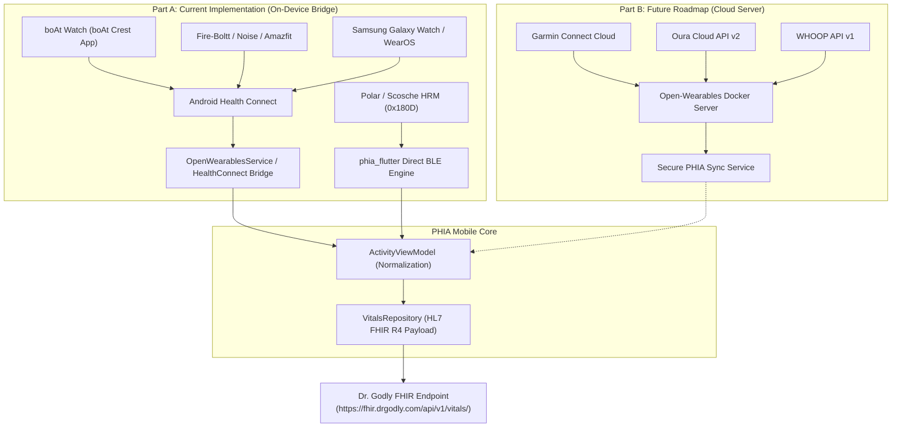

# PHIA Wearable Architecture & Device Compatibility Matrix
**Document Version:** 1.0.0  
**Project:** PHIA Mobile (Personal Health Intelligence Assistant)  
**System Target:** HL7 FHIR R4 Vitals Pipeline (`https://fhir.drgodly.com/api/v1/vitals/`)

---

## 1. Executive Summary & Strategy

PHIA integrates consumer smartwatches, medical sensors, and fitness rings to stream real-time physiological biometrics (Resting Heart Rate, HRV, Sleep Stages, Steps, SpO2, and Active Minutes) into the Dr. Godly FHIR clinical cloud.

To deliver immediate value for client demonstrations and user testing without upfront backend server deployment, the wearable integration strategy is divided into two distinct architectural phases:

1. **Part A (Current Implementation - Demo / On-Device Bridge):**
   - Direct integration using **Android Health Connect** and direct standard Bluetooth LE.
   - Requires **zero external cloud servers or Docker infrastructure**.
   - Bridges popular consumer watches (boAt, Fire-Boltt, Noise, Samsung Galaxy Watch, Amazfit, Xiaomi) via their companion smartphone apps directly into PHIA.
2. **Part B (Future Roadmap - Production Cloud Integration):**
   - Integration using a dedicated **Open-Wearables Server** container.
   - Connects cloud-exclusive ecosystems (Garmin, WHOOP, Oura Ring, Withings) using OAuth 2.0 Webhook ingestion and asynchronous data synchronization.

---

## 2. Part A vs. Part B Architecture Comparison

| Dimension | Part A: On-Device Bridge (Implemented Now) | Part B: Open-Wearables Cloud Server (Future Roadmap) |
| :--- | :--- | :--- |
| **Status** | **Active & Demo-Ready** | **Planned Future Phase** |
| **Backend Infrastructure** | **Zero server requirement** (100% on-device) | Docker container + PostgreSQL/Redis |
| **Primary Mechanism** | Android Health Connect SDK + Direct BLE (0x180D) | Provider Cloud OAuth 2.0 + Inbound Webhooks |
| **Data Latency** | Instant local sync on demand / background polling | Near real-time webhooks or batch sync (15-60 min) |
| **User Onboarding** | Tap "Sync Now" in PHIA app; permissions via OS | Web browser OAuth2 login per provider |
| **Target Hardware** | boAt, Fire-Boltt, Noise, Samsung, Amazfit, Pixel Watch | Garmin, WHOOP, Oura Ring, Withings |
| **Privacy & Security** | Data remains on phone until sent to PHIA FHIR | Encrypted token storage on Open-Wearables server |
| **Server Maintenance Cost** | **$0 / month** | Cloud VM hosting + SSL maintenance |

---

## 3. Comprehensive Device Compatibility Matrix

This matrix specifies which devices PHIA can collect data from today under **Part A**, which devices require **Part B**, and which devices are restricted by proprietary platform locks.

### Group 1: Accessible Devices Today (Part A — On-Device Bridge)

These devices sync their recorded biometrics (Resting Heart Rate, Daily Steps, Sleep Architecture, Calories, Distance) to their manufacturer app, which continuously syncs to Android Health Connect. PHIA reads these metrics directly.

| Device Family / Brand | Models Supported | Companion App | Sync Method | Accessible Vitals |
| :--- | :--- | :--- | :--- | :--- |
| **boAt** | Wave, Storm, Xtend, Lunar, Ultima, Primia, Matrix | **boAt Crest** | Health Connect / Google Fit | Resting HR, Daily Steps, Sleep Duration, Calories |
| **Noise** | ColorFit Pro 3/4/5, Pulse, Icon, Halo, Ultra | **NoiseFit** | Health Connect | Resting HR, Steps, Sleep Stages, Distance |
| **Fire-Boltt** | Ninja, Phoenix, Ring, Gladiator, Invincible | **Da Fit / Fire-Boltt Health** | Health Connect | Heart Rate, Steps, Sleep duration, Calories |
| **Samsung Galaxy Watch** | Watch 4, 5, 6, 7, Galaxy Watch Ultra | **Samsung Health** | Health Connect / WearOS | Continuous HR, Resting HR, SpO2, Sleep Stages, Steps |
| **Google Pixel Watch** | Pixel Watch 1, Pixel Watch 2, Pixel Watch 3 | **Fitbit App** | Health Connect | Continuous HR, Resting HR, Sleep Stages, HRV, Steps |
| **Amazfit / Zepp** | GTR, GTS, Bip series, T-Rex, Balance | **Zepp App** | Health Connect | Continuous HR, Resting HR, PAI, Sleep Stages, Steps |
| **Xiaomi / Redmi** | Smart Band 7/8/9, Redmi Watch series | **Mi Fitness** | Health Connect | Heart Rate, Sleep, Steps, Active Calories |
| **Standard BLE Monitors** | Polar H10, Garmin HRM-Pro, Scosche Rhythm+ | *Direct Bluetooth LE* | BLE Service `0x180D` | Real-time live BPM (streamed every second) |

---

### Group 2: Future Accessible Devices (Part B — Cloud Server Required)

These devices do not expose an open on-device sync API on Android, or their companion apps do not write high-resolution metrics (like nocturnal HRV or sleep micro-stages) to Health Connect. They require cloud-to-cloud OAuth2 integration via the Open-Wearables Docker server.

| Brand / Platform | Device Target | Required Cloud API | Part B Capability | Expected Vitals |
| :--- | :--- | :--- | :--- | :--- |
| **Garmin** | Forerunner, Fenix, Epix, Venu, Vivoactive | Garmin Health API / Garmin Connect | Enterprise Partner OAuth2 Webhooks | Second-by-second HR, Body Battery, Nocturnal HRV, Sleep Stages |
| **Oura** | Oura Ring Gen 3, Oura Ring Gen 4 | Oura Cloud API v2 | Personal / Partner Token OAuth2 | Ultra-high precision rMSSD HRV, Sleep Architecture, Readiness |
| **WHOOP** | WHOOP 4.0, WHOOP 5.0 | WHOOP Developer Platform v1 | OAuth 2.0 Webhook Subscription | Strain score, Recovery %, Resting HR, Detailed Sleep Cycles |
| **Withings** | ScanWatch 2, Horizon, Body Smart Scales | Withings Health Mate API | Webhook Subscription API | Medical-grade ECG, Resting HR, Weight, Vascular Age |

---

### Group 3: Inaccessible / Restricted Devices (Closed Ecosystems)

These devices cannot be integrated into the Android PHIA app due to manufacturer platform restrictions:

| Device / Brand | Reason for Restriction | Workaround / Recommendation |
| :--- | :--- | :--- |
| **Apple Watch (on Android)** | **Hardware locked to iOS:** Apple Watch requires an iPhone to pair, set up, and transfer data. It has no Android app and cannot write to Android Health Connect. | For Android users, recommend Samsung Galaxy Watch, Pixel Watch, or boAt. For iOS builds of PHIA, Apple HealthKit will be used. |
| **Legacy White-Label Smartbands** (Non-branded Chinese bands using generic 'FitPro' / 'Lefun') | Generic apps do not integrate with Android Health Connect and do not support standard Bluetooth SIG GATT profiles. | Use supported consumer brands (boAt, Fire-Boltt, Noise) whose companion apps support Health Connect. |
| **Huawei Band / Watch (Global / US restricted models)** | Huawei Health was removed from the Google Play Store and restricts Health Connect background synchronization on non-Huawei handsets. | Can sync manually via Google Fit intermediate bridge, but native sync is not guaranteed. |

---

## 4. How Part A (On-Device Bridge) Works Step-by-Step

When a user uses a boAt smartwatch with PHIA:

1. **Measurement on Watch:** The user completes a heart rate measurement or wears the watch during sleep.
2. **Sync to Companion App:** The watch connects via its proprietary protocol to the **boAt Crest** app installed on the user's phone.
3. **Export to Health Connect:** boAt Crest automatically writes the latest biometrics to Android's built-in **Health Connect** repository.
4. **PHIA Integration:**
   - In PHIA, the user opens the **Wearables Sheet** (`lib/view/devices/device_manager_sheet.dart`).
   - The user taps **"Sync Now"** on the **Android Health Connect** card.
   - `OpenWearablesService.fetchLatestVitals()` reads the normalized record (Resting HR: 68 bpm, HRV: 56 ms, Sleep: 7.8 hrs, Steps: 6,840).
   - `ActivityViewModel.syncOpenWearablesVitals()` updates the dashboard state (`dashboardHr`, `dashboardHrv`, `currentSleep`, `dashboardSteps`) and triggers a local database save.
   - The merged payload is automatically transmitted to `https://fhir.drgodly.com/api/v1/vitals/` conforming to the HL7 FHIR R4 schema.

---

## 5. Technical Implementation Details in Codebase

| File | Role | Changes in Part A |
| :--- | :--- | :--- |
| `lib/view/devices/device_manager_sheet.dart` | UI Presentation | Segmented into Part A (On-Device Health Connect Bridge) and Part B (Future Cloud Server Sync); added smartwatch compatibility notice for boAt/Noise/Fire-Boltt users. |
| `lib/data/service/open_wearables_service.dart` | Bridge Service | Standardized on-device data fetching for Health Connect; supports provider status tracking. |
| `lib/viewmodel/activity_viewmodel.dart` | State Management | `syncOpenWearablesVitals()` dynamically updates resting HR, HRV, sleep, steps, and calories, and submits to the FHIR endpoint. |
| `lib/view/dashboard/dashboard_screen.dart` | Dashboard View | Biometrics tiles dynamically display synced values with clear `'Health Connect'`, `'Live BLE'`, or `'Measuring...'` status badges. |

---

## 6. Migration Path to Part B (Future Implementation)

When migrating from Part A to Part B in production:
1. **Deploy Open-Wearables Container:** Stand up `the-momentum/open-wearables` Docker container on the Dr. Godly infrastructure (`https://wearables.drgodly.com`).
2. **Register Developer Applications:** Obtain client IDs and client secrets from Garmin Developer Portal, Oura Developer Cloud, and WHOOP Developer Portal.
3. **Configure Webhook Listeners:** Open-Wearables server receives inbound biometrics batches directly from Garmin/Oura servers.
4. **Zero Client UI Rewrite:** The PHIA app's `WearableProviderType` and `OpenWearablesService` are already pre-wired to connect to the Docker server by calling `configure(host: 'https://wearables.drgodly.com')`. Part A and Part B can run concurrently.
