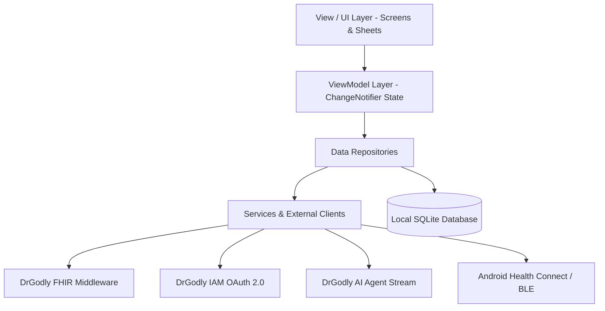
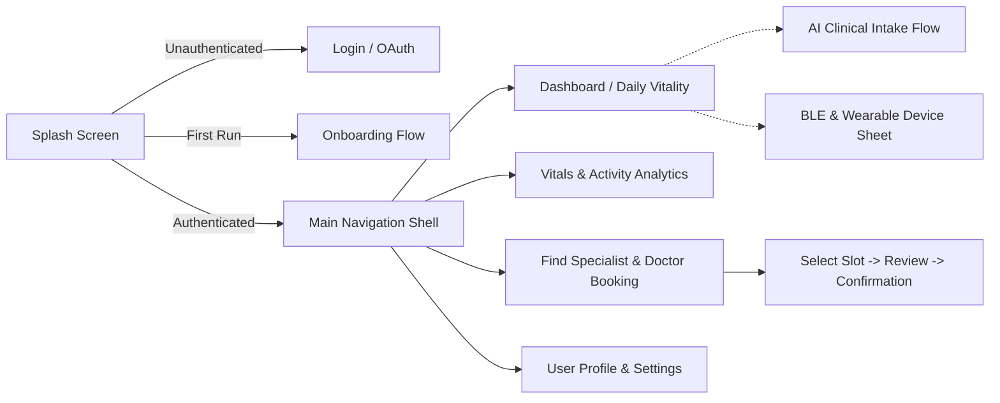
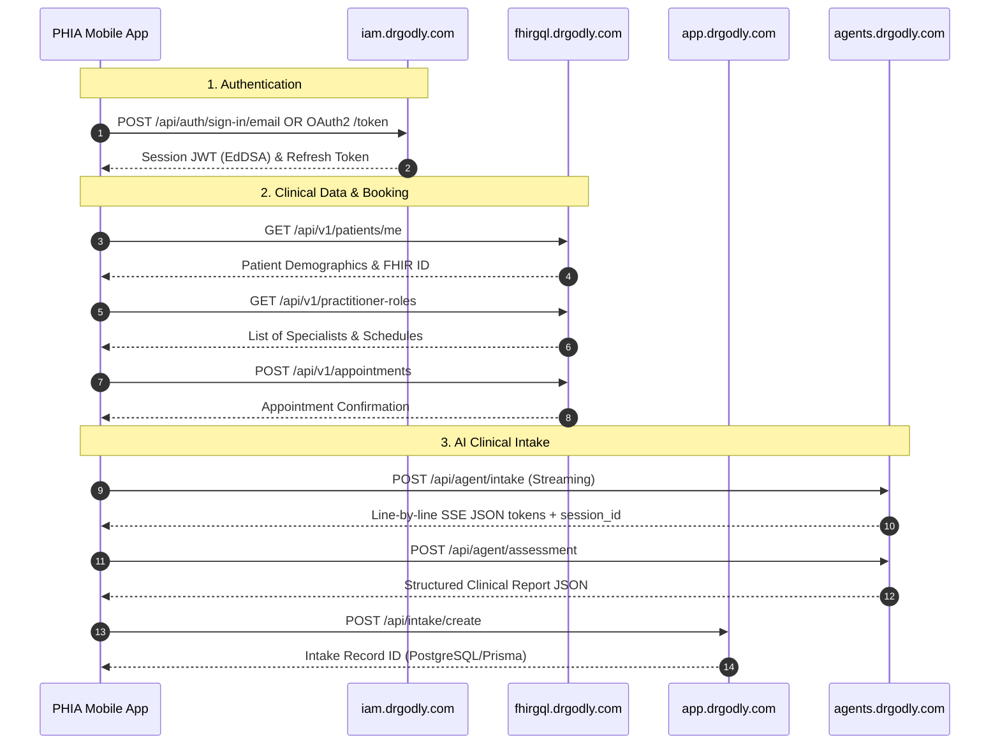

# 00. Architecture & Codebase Discovery

## Plain-Language Summary
This document provides a comprehensive architectural scan and technical inventory of the **PHIA (DrGodly Mobile)** application. PHIA is a cross-platform mobile health management application built using Google Flutter and Dart for Android (min SDK 26, target SDK 34/35). The app bridges wearable sensors and on-device health aggregators (Bluetooth LE Heart Rate monitors, Android Health Connect) with cloud-based clinical systems (DrGodly FHIR middleware, DrGodly IAM OAuth 2.0 authentication, and Python AI Agents for pre-visit clinical intake). This document establishes the factual technical baseline and acts as the master index for subsequent documentation sections.

---

## 1. Project Structure & Environment Specifications

### Plain-Language Summary
The application is structured following Clean Architecture principles with separation between UI presentation, state management (ViewModels), domain entities, and data access layers.

### Technical Detail
- **Primary Framework**: Flutter `3.44.0` (Dart `3.12.0` / SDK constraint `>=3.5.0 <4.0.0`)
- **Primary Language**: Dart (with Kotlin for Android platform integration)
- **Minimum Android SDK**: API 26 (Android 8.0 Oreo)
- **Target Android SDK**: API 34/35 (Android 14/15)
- **Java Compatibility**: Java 17 (`JavaVersion.VERSION_17`, core library desugaring enabled)
- **Application Package / Namespace**: `com.example.phia_flutter`
- **Application Version**: `0.0.1+1` (Release v0.0)

```
lib
├── core
│   ├── auth                    # PKCE generation and crypto helpers
│   ├── constants               # Base URLs, API endpoints, tenant IDs
│   ├── theme                   # Colors, typography, dot matrix UI styling
│   ├── utils                   # Internationalization and language helpers
│   └── widgets                 # Reusable UI widgets and notifications
├── data
│   ├── database                # SQLite database management (Sqflite)
│   ├── repository              # Domain repositories (Auth, Booking, Health, Profile, Vitals)
│   └── service                 # External API clients, BLE, Health Connect, WorkManager
├── domain
│   └── model                   # Data contracts, FHIR JSON models, OAuth models
├── main.dart                   # Application entrypoint & multi-provider DI root
├── view
│   ├── auth                    # Login & OAuth WebView Screens
│   ├── booking                 # Doctor search, slot picker, booking review & confirmation
│   ├── dashboard               # Daily Vitality, vitals tracking, and navigation shell
│   ├── devices                 # BLE and wearable sensor manager bottom sheet
│   ├── intake                  # Live streaming AI clinical intake chat & completion
│   ├── onboarding              # Initial user onboarding and health goal flow
│   ├── profile                 # User profile, appointment history, units & thresholds
│   └── splash                  # App splash & auto-login verification
└── viewmodel                   # ChangeNotifier ViewModels (MVVM pattern)
```



**Evidence:**
- [`pubspec.yaml`](file:///home/mi/Desktop/AI_projects/phia_flutter/pubspec.yaml#L1-L6) (Package name, version, SDK constraints)
- [`android/app/build.gradle.kts`](file:///home/mi/Desktop/AI_projects/phia_flutter/android/app/build.gradle.kts#L8-L27) (compileSdk, minSdk 26, targetSdk, Java 17 desugaring)
- [`lib/main.dart`](file:///home/mi/Desktop/AI_projects/phia_flutter/lib/main.dart#L1-L85) (Provider registration and app initialization)

---

## 2. Dependencies & Runtime Packages

### Plain-Language Summary
Every software library bundled into the mobile app has been audited to confirm its operational purpose in the system.

### Technical Detail

| Package Name | Declared Version | Category | Technical Purpose & Implemented Usage |
|---|---|---|---|
| `flutter` | SDK | Core | Core Flutter widget and graphics rendering engine |
| `provider` | `^6.1.2` | State Management | Dependency injection and reactive MVVM UI state management (`ChangeNotifierProvider`) |
| `dio` | `^5.7.0` | Network | Production HTTP client used for FHIR REST calls, token exchange, and SSE stream parsing |
| `sqflite` | `^2.3.0` | Local Database | Embedded SQLite database for offline caching of vitals, appointments, and doctors |
| `path` | `^1.9.0` | Storage Utility | Cross-platform file path resolution for SQLite database files |
| `flutter_secure_storage` | `^11.2.0` | Security | Encrypted storage backed by Android KeyStore for refresh tokens and credentials |
| `crypto` | `^3.0.6` | Security / Auth | Cryptographic SHA-256 hashing and Base64URL encoding for RFC 7636 PKCE challenges |
| `flutter_web_auth_2` | `^4.1.0` | Authentication | External ASWebAuthenticationSession / Chrome Custom Tabs OAuth 2.0 PKCE authentication |
| `webview_flutter` | `^4.14.1` | Authentication | In-app secure WebView fallback for DrGodly OAuth authentication flows |
| `health` | `^13.3.2` | Health Data | Direct integration with Android Health Connect API for steps, heart rate, and sleep metrics |
| `flutter_blue_plus` | `^1.34.5` | Hardware Sensors | Bluetooth Low Energy (BLE) scanning and GATT characteristic streaming (Heart Rate 0x180D) |
| `flutter_foreground_task` | `^11.0.3` | Background Exec | Foreground service with ongoing system notification for live sensor streaming |
| `workmanager` | `^0.10.10` | Background Exec | Android WorkManager wrapper for scheduled periodic background health data synchronization |
| `flutter_local_notifications` | `^17.2.2` | Notifications | Local push alerts and scheduled medication/vitals reminder alarms |
| `timezone` | `^0.9.4` | System Utility | Timezone calculations for accurate medication reminders across locales |
| `flutter_timezone` | `^3.0.1` | System Utility | Detects active device timezone from the underlying Android OS |
| `image_picker` | `^1.1.2` | Media / Profile | Camera and gallery picker for user profile avatar selection |
| `google_fonts` | `^6.2.1` | UI Typography | Runtime typography typography loading (Plus Jakarta Sans) |
| `intl` | `^0.20.2` | Internationalization | Date formatting, slot presentation, and clinical metric localization |
| `permission_handler` | `^12.0.2` | Android Permissions | Runtime permission dialog management (Bluetooth, Health Connect, Notifications) |
| `flutter_test` | SDK (dev) | Testing | Unit and widget test framework |
| `flutter_lints` | `^5.0.0` (dev) | Code Quality | Official Dart and Flutter static analysis lint rules |
| `flutter_launcher_icons` | `^0.13.1` (dev) | Build Asset | Automated app launcher icon generation for Android and iOS |

**Evidence:**
- [`pubspec.yaml`](file:///home/mi/Desktop/AI_projects/phia_flutter/pubspec.yaml#L8-L35) (Complete dependencies specification)

---

## 3. Modules, Features & Screen Inventory

### Plain-Language Summary
The application is organized into 8 functional modules covering the entire user journey: authentication, initial onboarding, daily health dashboard, doctor appointment booking, AI clinical intake, BLE device pairing, profile settings, and background services.

### Technical Detail



### Complete Screen & Feature Catalog:

#### A. Authentication & Splash Module
- `SplashScreen` ([`lib/view/splash/splash_screen.dart`](file:///home/mi/Desktop/AI_projects/phia_flutter/lib/view/splash/splash_screen.dart)): Cold-start coordinator. Performs auto-login check, evaluates stored tokens, and routes to Main Shell, Onboarding, or Login.
- `LoginScreen` ([`lib/view/auth/login_screen.dart`](file:///home/mi/Desktop/AI_projects/phia_flutter/lib/view/auth/login_screen.dart)): Direct email/password login, demo mode bypass, and OAuth 2.0 PKCE trigger.
- `OAuthWebViewScreen` ([`lib/view/auth/oauth_webview_screen.dart`](file:///home/mi/Desktop/AI_projects/phia_flutter/lib/view/auth/oauth_webview_screen.dart)): In-app browser handling redirection to `https://iam.drgodly.com` for authorization code retrieval and session cookie extraction.

#### B. Onboarding Module
- `WelcomeScreen` ([`lib/view/onboarding/welcome_screen.dart`](file:///home/mi/Desktop/AI_projects/phia_flutter/lib/view/onboarding/welcome_screen.dart)): Initial product overview carousel.
- `ProfileSetupScreen` ([`lib/view/onboarding/profile_setup_screen.dart`](file:///home/mi/Desktop/AI_projects/phia_flutter/lib/view/onboarding/profile_setup_screen.dart)): Initial demographics capture (Age, Gender, Height, Weight).
- `GoalsScreen` ([`lib/view/onboarding/goals_screen.dart`](file:///home/mi/Desktop/AI_projects/phia_flutter/lib/view/onboarding/goals_screen.dart)): Daily targets setup (Step goal, active minutes, calorie targets).
- `CompleteScreen` ([`lib/view/onboarding/complete_screen.dart`](file:///home/mi/Desktop/AI_projects/phia_flutter/lib/view/onboarding/complete_screen.dart)): Final confirmation saving baseline to SQLite and routing to Dashboard.

#### C. Dashboard & Vitality Module
- `MainNavigationShell` ([`lib/view/dashboard/main_navigation_shell.dart`](file:///home/mi/Desktop/AI_projects/phia_flutter/lib/view/dashboard/main_navigation_shell.dart)): 4-tab bottom navigation shell (Overview, Activity, Doctors, Profile).
- `DashboardScreen` ([`lib/view/dashboard/dashboard_screen.dart`](file:///home/mi/Desktop/AI_projects/phia_flutter/lib/view/dashboard/dashboard_screen.dart)): Displays Daily Vitality ring score, steps, calories, active time, heart rate cards, upcoming consultation alert, and DrGodly Pre-Visit Intake card.
- `ActivityTrackingScreen` ([`lib/view/dashboard/activity_tracking_screen.dart`](file:///home/mi/Desktop/AI_projects/phia_flutter/lib/view/dashboard/activity_tracking_screen.dart)): Detailed step history and calorie metrics.

#### D. Consultation & Doctor Booking Module
- `SelectSpecialistScreen` ([`lib/view/booking/select_specialist_screen.dart`](file:///home/mi/Desktop/AI_projects/phia_flutter/lib/view/booking/select_specialist_screen.dart)): Searchable directory of verified medical specialists categorized by department (Dermatology, Endocrinology, General Practice, Cardiology, etc.).
- `SelectDateTimeScreen` ([`lib/view/booking/select_date_time_screen.dart`](file:///home/mi/Desktop/AI_projects/phia_flutter/lib/view/booking/select_date_time_screen.dart)): Horizontal calendar date picker and available time slot selector fetched from FHIR schedule endpoints.
- `ReviewBookingScreen` ([`lib/view/booking/review_booking_screen.dart`](file:///home/mi/Desktop/AI_projects/phia_flutter/lib/view/booking/review_booking_screen.dart)): Booking summary review, patient notes input, and consultation fee breakdown.
- `BookingConfirmedScreen` ([`lib/view/booking/booking_confirmed_screen.dart`](file:///home/mi/Desktop/AI_projects/phia_flutter/lib/view/booking/booking_confirmed_screen.dart)): Success receipt displaying FHIR Appointment ID and direct navigation back to home.

#### E. AI Clinical Intake Module
- `IntakeChatScreen` ([`lib/view/intake/intake_chat_screen.dart`](file:///home/mi/Desktop/AI_projects/phia_flutter/lib/view/intake/intake_chat_screen.dart)): Real-time typewriter streaming chat assistant powered by Python AI agent. Captures patient symptoms before consultation.
- `IntakeCompletionScreen` ([`lib/view/intake/intake_completion_screen.dart`](file:///home/mi/Desktop/AI_projects/phia_flutter/lib/view/intake/intake_completion_screen.dart)): Clinical summary view showing chief complaint, severity, timeline, and FHIR clinical report sync status.

#### F. Hardware Devices & Sensor Management Module
- `DeviceManagerSheet` ([`lib/view/devices/device_manager_sheet.dart`](file:///home/mi/Desktop/AI_projects/phia_flutter/lib/view/devices/device_manager_sheet.dart)): Bottom sheet controller for scanning and connecting Bluetooth LE heart rate straps and toggling Android Health Connect data pipelines.

#### G. Profile, Settings & Appointments Module
- `ProfileScreen` ([`lib/view/profile/profile_screen.dart`](file:///home/mi/Desktop/AI_projects/phia_flutter/lib/view/profile/profile_screen.dart)): Account details, patient FHIR ID display, quick link to past appointments, and logout.
- `AppointmentHistoryScreen` ([`lib/view/profile/appointment_history_screen.dart`](file:///home/mi/Desktop/AI_projects/phia_flutter/lib/view/profile/appointment_history_screen.dart)): Two-tab appointment list (Upcoming vs Past Consultations) sorted strictly chronologically.
- `GeneralSettingsScreen` ([`lib/view/profile/general_settings_screen.dart`](file:///home/mi/Desktop/AI_projects/phia_flutter/lib/view/profile/general_settings_screen.dart)): Language selection and notification preferences.
- `ClinicalUnitsScreen` ([`lib/view/profile/clinical_units_screen.dart`](file:///home/mi/Desktop/AI_projects/phia_flutter/lib/view/profile/clinical_units_screen.dart)): Imperial vs Metric unit toggles (kg/lbs, cm/in, mg/dL / mmol/L).
- `VitalsThresholdsScreen` ([`lib/view/profile/vitals_thresholds_screen.dart`](file:///home/mi/Desktop/AI_projects/phia_flutter/lib/view/profile/vitals_thresholds_screen.dart)): Custom high/low heart rate warning limits.
- `VitalsRemindersScreen` ([`lib/view/profile/vitals_reminders_screen.dart`](file:///home/mi/Desktop/AI_projects/phia_flutter/lib/view/profile/vitals_reminders_screen.dart)): Scheduled local alarm configurations.

**Evidence:**
- Listed screen files in [`lib/view/`](file:///home/mi/Desktop/AI_projects/phia_flutter/lib/view/)

---

## 4. Discovered API Endpoints & Configuration Matrix

### Plain-Language Summary
The application connects to four distinct backend server environments: DrGodly Identity & Access Management (IAM), DrGodly FHIR Middleware, DrGodly Web App Backend, and the Python AI Clinical Agents.

### Technical Detail



### Complete Endpoints Inventory:

| Environment | Base URL | Exact Route / Path | HTTP Method | Technical Function | Code Location |
|---|---|---|---|---|---|
| **IAM** | `https://iam.drgodly.com` | `/api/auth/oauth2/authorize` | `GET` | Initiates OAuth 2.0 PKCE browser authorization | [`auth_repository.dart:14`](file:///home/mi/Desktop/AI_projects/phia_flutter/lib/data/repository/auth_repository.dart#L14) |
| **IAM** | `https://iam.drgodly.com` | `/api/auth/oauth2/token` | `POST` | Exchanges auth code or refresh token for Bearer access token | [`auth_repository.dart:94`](file:///home/mi/Desktop/AI_projects/phia_flutter/lib/data/repository/auth_repository.dart#L94) |
| **IAM** | `https://iam.drgodly.com` | `/api/auth/sign-in/email` | `POST` | Direct email/password authentication | [`auth_repository.dart:181`](file:///home/mi/Desktop/AI_projects/phia_flutter/lib/data/repository/auth_repository.dart#L181) |
| **IAM** | `https://iam.drgodly.com` | `/api/auth/get-session` | `GET` | Validates active Better-Auth session and retrieves user object | [`auth_repository.dart:219`](file:///home/mi/Desktop/AI_projects/phia_flutter/lib/data/repository/auth_repository.dart#L219) |
| **IAM** | `https://iam.drgodly.com` | `/api/auth/oauth2/end-session` | `GET`/`POST` | Logs out session and revokes access | [`auth_repository.dart:265`](file:///home/mi/Desktop/AI_projects/phia_flutter/lib/data/repository/auth_repository.dart#L265) |
| **FHIR Middleware** | `https://fhirgql.drgodly.com` | `/api/v1/patients/me` | `GET` | Fetches authenticated patient's FHIR profile, identifiers, and demographics | [`profile_repository.dart:67`](file:///home/mi/Desktop/AI_projects/phia_flutter/lib/data/repository/profile_repository.dart#L67) |
| **FHIR Middleware** | `https://fhirgql.drgodly.com` | `/api/v1/patients/full` | `POST` | Registers complete patient FHIR resource before first booking | [`profile_repository.dart:123`](file:///home/mi/Desktop/AI_projects/phia_flutter/lib/data/repository/profile_repository.dart#L123) |
| **FHIR Middleware** | `https://fhirgql.drgodly.com` | `/api/v1/practitioner-roles` | `GET` | Retrieves doctors and clinical specialists directory | [`booking_repository.dart:61`](file:///home/mi/Desktop/AI_projects/phia_flutter/lib/data/repository/booking_repository.dart#L61) |
| **FHIR Middleware** | `https://fhirgql.drgodly.com` | `/api/v1/appointments` | `GET` | Retrieves booked/occupied appointment slots | [`booking_repository.dart:124`](file:///home/mi/Desktop/AI_projects/phia_flutter/lib/data/repository/booking_repository.dart#L124) |
| **FHIR Middleware** | `https://fhirgql.drgodly.com` | `/api/v1/appointments` | `POST` | Creates a new FHIR Appointment booking | [`booking_repository.dart:238`](file:///home/mi/Desktop/AI_projects/phia_flutter/lib/data/repository/booking_repository.dart#L238) |
| **FHIR Middleware** | `https://fhirgql.drgodly.com` | `/api/v1/vitals/bundle` | `POST` | Ingests batched HL7 FHIR Observation bundles (steps, HR, sleep) | [`vitals_repository.dart:58`](file:///home/mi/Desktop/AI_projects/phia_flutter/lib/data/repository/vitals_repository.dart#L58) |
| **FHIR Middleware** | `https://fhirgql.drgodly.com` | `/api/v1/health` | `GET` | Server liveness and readiness probe | [`fhir_api_client.dart:34`](file:///home/mi/Desktop/AI_projects/phia_flutter/lib/data/service/fhir_api_client.dart#L34) |
| **Python AI Agents** | `https://agents.drgodly.com` | `/api/agent/intake` | `POST` | Line-by-line SSE streaming multi-turn clinical chat | [`intake_service.dart:74`](file:///home/mi/Desktop/AI_projects/phia_flutter/lib/data/service/intake_service.dart#L74) |
| **Python AI Agents** | `https://agents.drgodly.com` | `/api/agent/assessment` | `POST` | Compiles raw chat into structured clinical SOAP summary JSON | [`intake_service.dart:181`](file:///home/mi/Desktop/AI_projects/phia_flutter/lib/data/service/intake_service.dart#L181) |
| **DrGodly App** | `https://app.drgodly.com` | `/api/intake/create` | `POST` | Persists intake record and clinical summary to relational DB | [`intake_service.dart:251`](file:///home/mi/Desktop/AI_projects/phia_flutter/lib/data/service/intake_service.dart#L251) |
| **DrGodly App** | `https://app.drgodly.com` | `/api/intake/link` | `POST` | Links an intake record ID to an appointment ID | [`intake_service.dart:338`](file:///home/mi/Desktop/AI_projects/phia_flutter/lib/data/service/intake_service.dart#L338) |
| **DrGodly App** | `https://app.drgodly.com` | `/api/consultation/create`| `POST` | Provisions live video/telehealth consultation room | [`booking_repository.dart:210`](file:///home/mi/Desktop/AI_projects/phia_flutter/lib/data/repository/booking_repository.dart#L210) |

### Configuration Files Found:
- [`lib/core/constants/api_constants.dart`](file:///home/mi/Desktop/AI_projects/phia_flutter/lib/core/constants/api_constants.dart): Central server endpoint configuration.
- `android/local.properties`: Android SDK path and Flutter SDK root.
- `android/gradle.properties`: JVM arguments and AndroidX flags.
- `android/app/proguard-rules.pro`: Code shrinking and obfuscation rules for SQLite, Dio, and Coroutines.

### Build Flavors Found:
- **Build Flavors Configured**: `NOT FOUND IN CODE`. The repository currently relies on standard build types (`debug`, `profile`, `release`) without custom Gradle product flavors (e.g., `dev`, `staging`, `prod` are not configured in `build.gradle.kts`).

**Evidence:**
- [`lib/core/constants/api_constants.dart`](file:///home/mi/Desktop/AI_projects/phia_flutter/lib/core/constants/api_constants.dart#L1-L26)
- [`android/app/build.gradle.kts`](file:///home/mi/Desktop/AI_projects/phia_flutter/android/app/build.gradle.kts#L29-L42)

---

## 5. Third-Party SDKs & Wearable Ecosystem Status

### Plain-Language Summary
The app directly interfaces with Bluetooth hardware and Android Health Connect on the physical phone. An architecture service exists for the Open-Wearables ecosystem.

### Technical Detail

#### A. Implemented Third-Party SDKs
1. **Google Health Connect SDK (`package:health`)**:
   - Implemented in [`lib/data/service/open_wearables_service.dart`](file:///home/mi/Desktop/AI_projects/phia_flutter/lib/data/service/open_wearables_service.dart#L258) and [`lib/data/repository/health_repository.dart`](file:///home/mi/Desktop/AI_projects/phia_flutter/lib/data/repository/health_repository.dart).
   - Reads STEPS, HEART_RATE, SLEEP_SESSION, ACTIVE_ENERGY_BURNED, and DISTANCE_DELTA.
2. **Bluetooth Low Energy GATT SDK (`package:flutter_blue_plus`)**:
   - Implemented in [`lib/data/service/ble_heart_rate_service.dart`](file:///home/mi/Desktop/AI_projects/phia_flutter/lib/data/service/ble_heart_rate_service.dart).
   - Scans and connects to standard Bluetooth SIG Heart Rate Service (`0x180D`), decoding live BPM values from characteristic `0x2A37`.
3. **Android WorkManager SDK (`package:workmanager`)**:
   - Implemented in [`lib/data/service/background_sync_service.dart`](file:///home/mi/Desktop/AI_projects/phia_flutter/lib/data/service/background_sync_service.dart).
   - Dispatches periodic background synchronization jobs every 15 minutes to aggregate and flush health observations.
4. **Android Foreground Service (`package:flutter_foreground_task`)**:
   - Implemented in [`lib/data/service/vitals_foreground_service.dart`](file:///home/mi/Desktop/AI_projects/phia_flutter/lib/data/service/vitals_foreground_service.dart).
   - Keeps continuous BLE sensor connections alive during active workout/monitoring sessions.

#### B. The Momentum SDK / Open-Wearables Status
- **Momentum Native SDK (`momentum-sdk` / `@the-momentum/sdk`)**: `NOT FOUND IN CODE`.
- **Finding**: There is no direct binary or pub package named "Momentum SDK" in `pubspec.yaml` or `android/`. 
- **Implemented Equivalent**: The codebase implements an internal client service named `OpenWearablesService` located at [`lib/data/service/open_wearables_service.dart`](file:///home/mi/Desktop/AI_projects/phia_flutter/lib/data/service/open_wearables_service.dart). This service is architected to communicate with the Open-Wearables cloud aggregator API (`https://api.openwearables.io`), supporting provider types: `garmin`, `whoop`, `oura`, `fitbit`, `health_connect`, and `apple`.

**Evidence:**
- [`lib/data/service/open_wearables_service.dart`](file:///home/mi/Desktop/AI_projects/phia_flutter/lib/data/service/open_wearables_service.dart#L8-L64)
- [`lib/data/service/ble_heart_rate_service.dart`](file:///home/mi/Desktop/AI_projects/phia_flutter/lib/data/service/ble_heart_rate_service.dart#L1-L40)

---

## 6. Open Questions / Assumptions / Items to Verify

1. **Build Flavors**: No development vs. production flavor targets are defined in `android/app/build.gradle.kts`. Currently, production URLs are hardcoded in `ApiConstants`. Verify if environment-based flavors (`.env` or `--dart-define`) should be established.
2. **Open-Wearables Cloud Authentication**: `OpenWearablesService` points to `https://api.openwearables.io`, but the current active user flow primarily syncs via local Android Health Connect. Verify whether cloud-based Garmin/WHOOP OAuth syncing is expected to be live or remains a future roadmap feature.
3. **iOS Platform Support**: While the Flutter codebase is cross-platform, current foreground background services and manifests are heavily tuned for Android (`workmanager_android`, Android Health Connect permissions). Verify whether Apple HealthKit and iOS background capabilities are within immediate release scope.
