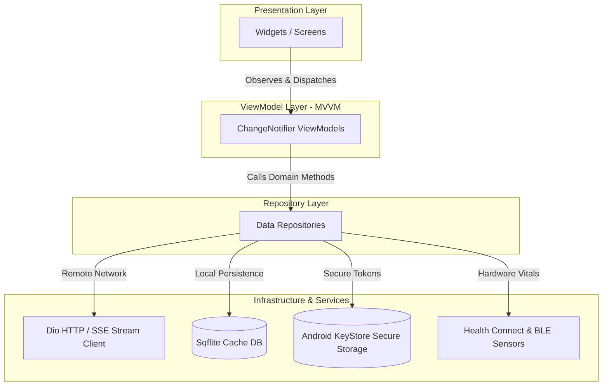
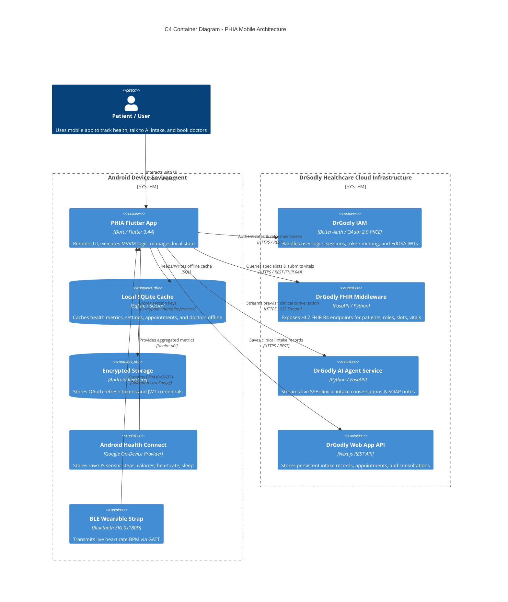
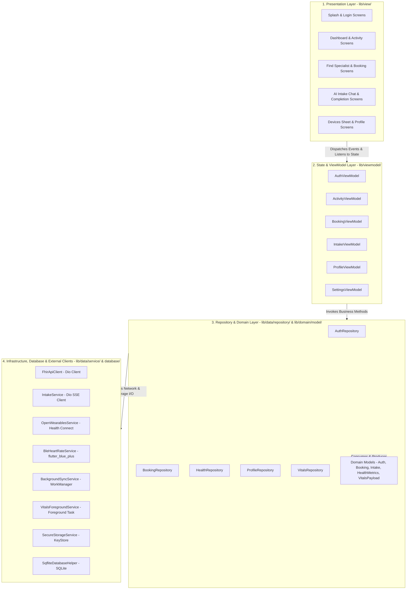

# 01. System Architecture & Technical Specifications

## Plain-Language Summary
This section documents the end-to-end software architecture of the PHIA application. The app is designed with a reactive Model-View-ViewModel (MVVM) Clean Architecture pattern. User interface screens do not communicate directly with databases or network servers; instead, they observe state via ViewModels. ViewModels delegate operations to Repositories, which decide whether to fetch data from the local encrypted SQLite cache or call external REST/streaming endpoints using Dio. Background services periodically extract biometric data from Android Health Connect and Bluetooth devices without draining the battery.

---

## 1. Architectural Pattern & Design Philosophy

### Plain-Language Summary
The app uses a 4-layer Clean MVVM architecture. The layers separate presentation, application business logic, domain data structures, and external data sources.

### Technical Detail
- **Presentation Layer (`lib/view/`)**: Stateless and Stateful Flutter Widgets rendering the Material 3 UI. Widgets bind to ViewModels using Provider's `context.watch()` and dispatch user actions via `context.read()`.
- **ViewModel Layer (`lib/viewmodel/`)**: Classes extending `ChangeNotifier`. They hold observable UI state, handle business logic, manage loading/error states, and notify listeners upon mutations.
- **Repository Layer (`lib/data/repository/`)**: Mediators between local persistence and remote backends. They handle offline-first caching strategies, fallback logic, and data conversion into domain entities.
- **Service & Infrastructure Layer (`lib/data/service/`, `lib/data/database/`)**: Concrete external integrations (Dio network clients, SQLite helper, Health Connect API, Bluetooth GATT client, WorkManager background task, KeyStore secure storage).
- **Domain Entities Layer (`lib/domain/model/`)**: Pure Dart data classes and JSON serialization schemas without framework dependencies.



**Evidence:**
- [`lib/viewmodel/intake_viewmodel.dart`](file:///home/mi/Desktop/AI_projects/phia_flutter/lib/viewmodel/intake_viewmodel.dart#L17-L44) (`IntakeViewModel extends ChangeNotifier`)
- [`lib/data/repository/booking_repository.dart`](file:///home/mi/Desktop/AI_projects/phia_flutter/lib/data/repository/booking_repository.dart#L15-L35) (`BookingRepository` coordinating SQLite and FHIR client)
- [`lib/domain/model/booking_models.dart`](file:///home/mi/Desktop/AI_projects/phia_flutter/lib/domain/model/booking_models.dart#L1-L50) (Domain models)

---

## 2. C4-Style Container & System Context Diagram

### Plain-Language Summary
The mobile application acts as a central hub on the user's phone, bridging personal hardware sensors with enterprise healthcare cloud servers.

### Technical Detail



**Evidence:**
- [`lib/core/constants/api_constants.dart`](file:///home/mi/Desktop/AI_projects/phia_flutter/lib/core/constants/api_constants.dart#L1-L26) (Cloud container definitions)
- [`lib/data/service/open_wearables_service.dart`](file:///home/mi/Desktop/AI_projects/phia_flutter/lib/data/service/open_wearables_service.dart#L258-L310) (Health Connect integration)
- [`lib/data/service/ble_heart_rate_service.dart`](file:///home/mi/Desktop/AI_projects/phia_flutter/lib/data/service/ble_heart_rate_service.dart#L15-L80) (BLE GATT integration)

---

## 3. Layer Architecture Diagram

### Plain-Language Summary
The application code is divided into four distinct vertical layers to ensure modularity, testability, and separation of concerns.

### Technical Detail



**Evidence:**
- [`lib/main.dart`](file:///home/mi/Desktop/AI_projects/phia_flutter/lib/main.dart#L63-L101) (`MultiProvider` wiring presentation to ViewModels and Repositories)
- [`lib/data/database/sqflite_database.dart`](file:///home/mi/Desktop/AI_projects/phia_flutter/lib/data/database/sqflite_database.dart#L4-L26) (`SqfliteDatabaseHelper`)

---

## 4. State Management, Dependency Injection & Navigation

### Plain-Language Summary
State management is handled by Flutter's official `provider` package. Dependency injection is managed at the root of the application, and navigation uses static named routes combined with declarative bottom shell switching.

### Technical Detail

#### A. State Management: Provider & ChangeNotifier
- All ViewModels extend `ChangeNotifier`.
- UI widgets bind to state reactively using `Consumer<T>`, `context.watch<T>()` for rebuild triggers, or `context.read<T>()` for event callbacks.
- Granular state updates are triggered via `notifyListeners()`, preventing unnecessary rebuilds.

#### B. Dependency Injection (DI)
- Implemented as top-down constructor injection configured inside `MultiProvider` at [`lib/main.dart`](file:///home/mi/Desktop/AI_projects/phia_flutter/lib/main.dart#L63-L101).
- Singletons are used selectively for low-level infrastructure services requiring global lifecycle management:
  - `SqfliteDatabaseHelper.instance`
  - `NotificationService.instance`
  - `FhirApiClient._instance`
  - `OpenWearablesService._instance`
- Repositories are instantiated and injected into ViewModels during `create` callbacks in `main.dart`.

#### C. Navigation
- **Root Routing**: Static named routes defined in `MaterialApp.routes` in [`lib/main.dart:149-170`](file:///home/mi/Desktop/AI_projects/phia_flutter/lib/main.dart#L149-L170).
  - Routes: `/splash`, `/login`, `/welcome`, `/profile_setup`, `/goals`, `/complete`, `/dashboard`, `/profile`, `/activity_tracking`, `/booking_specialist`, `/booking_date_time`, `/booking_review`, `/booking_confirmed`, `/clinical_units`, `/vitals_reminders`, `/vitals_thresholds`, `/general_settings`, `/appointment_history`, `/intake`, `/intake_completion`.
- **In-App Shell Navigation**: Managed within `MainNavigationShell` ([`lib/view/dashboard/main_navigation_shell.dart`](file:///home/mi/Desktop/AI_projects/phia_flutter/lib/view/dashboard/main_navigation_shell.dart)) via an `IndexedStack` preserving state across bottom navigation tabs:
  - Tab 0: Overview (Dashboard)
  - Tab 1: Activity
  - Tab 2: Doctors (Specialist Directory)
  - Tab 3: Profile

**Evidence:**
- [`lib/main.dart`](file:///home/mi/Desktop/AI_projects/phia_flutter/lib/main.dart#L63-L172) (MultiProvider DI and route table)
- [`lib/view/dashboard/main_navigation_shell.dart`](file:///home/mi/Desktop/AI_projects/phia_flutter/lib/view/dashboard/main_navigation_shell.dart#L15-L75) (Bottom navigation IndexedStack)

---

## 5. Networking & Local Storage Architecture

### Plain-Language Summary
Network requests are unified on the high-performance `dio` package, handling standard REST JSON calls, token headers, and streaming AI responses. Local storage uses encrypted storage for credentials and SQLite for structured health data.

### Technical Detail

#### A. Networking Engine: Dio Client
- **FHIR REST Client (`FhirApiClient`)**: Configured with 30-second connect/receive timeouts, bearer token injection, and an offline/mock interceptor (`_isLiveMode`).
- **AI Streaming Client (`IntakeService`)**: Employs `ResponseBody` stream decoding:
  ```dart
  responseBody.stream
    .cast<List<int>>()
    .transform(utf8.decoder)
    .transform(const LineSplitter())
  ```
  Parses Server-Sent Events (SSE) and raw newline-delimited JSON chunks (`text_delta`, `agent_end`, `status_end`).
- **Authentication Client (`AuthRepository`)**: Manages OAuth 2.0 PKCE requests with RFC 7636 SHA-256 challenges and direct email/password session calls.

#### B. Local Storage Architecture
1. **Encrypted Storage (`SecureStorageService` / `FlutterSecureStorage`)**:
   - Backed by Android KeyStore and EncryptedSharedPreferences.
   - Stores: OAuth refresh tokens, temporary authorization codes, and session secrets.
2. **Relational Database (`SqfliteDatabaseHelper` / `phia_cache.db`)**:
   - Current schema version: `5`.
   - **Tables**:
     - `health_metrics`: Primary key `id`, `type`, `value`, `timestamp`, `is_synced` (0/1).
     - `workout_route_points`: GPS coordinates, speed, and workout trail tracking.
     - `app_settings`: Key-value storage for settings (active tokens, tenant org IDs, sync state).
     - `reminders`: Vitals and medication reminder configurations.
     - `specialists_cache`: Local offline cache for practitioner roles and doctor bios.
     - `appointments_cache`: Cached upcoming and past appointments.

**Evidence:**
- [`lib/data/service/fhir_api_client.dart`](file:///home/mi/Desktop/AI_projects/phia_flutter/lib/data/service/fhir_api_client.dart#L10-L40) (Dio configuration)
- [`lib/data/service/intake_service.dart`](file:///home/mi/Desktop/AI_projects/phia_flutter/lib/data/service/intake_service.dart#L72-L115) (Dio streaming implementation)
- [`lib/data/database/sqflite_database.dart`](file:///home/mi/Desktop/AI_projects/phia_flutter/lib/data/database/sqflite_database.dart#L28-L150) (SQLite table schemas)
- [`lib/data/service/secure_storage_service.dart`](file:///home/mi/Desktop/AI_projects/phia_flutter/lib/data/service/secure_storage_service.dart#L1-L35) (KeyStore implementation)

---

## 6. Build Flavors & CI/CD Pipeline Status

### Plain-Language Summary
The current repository build system is configured for single-environment production release builds. No automated cloud CI/CD pipelines are currently checked into the repository.

### Technical Detail

#### A. Build Flavors
- **Implemented**: `NOT FOUND IN CODE`.
- **Finding**: `android/app/build.gradle.kts` defines standard Gradle build types (`debug`, `release`) with R8 minification, but contains zero `flavorDimensions` or `productFlavors` (e.g., `dev`, `staging`, `prod` are not configured). Environment base URLs are hardcoded inside `ApiConstants`.

#### B. CI/CD Pipeline
- **Implemented**: `NOT FOUND IN CODE`.
- **Finding**: There is no `.github/workflows/`, `.gitlab-ci.yml`, Bitbucket pipeline, or Fastfile checked into the repository root. Builds are currently performed manually via the Flutter CLI (`flutter build apk --release`).

#### Recommended (Not Implemented):
1. **Flavors**: Introduce `dev`, `staging`, and `prod` product flavors using `--dart-define` or `flutter_flavorizr` to switch API URLs without code edits.
2. **CI/CD**: Add a GitHub Actions workflow (`.github/workflows/ci.yml`) to automatically run `flutter test` and compile release APK artifacts on pull requests.

**Evidence:**
- [`android/app/build.gradle.kts`](file:///home/mi/Desktop/AI_projects/phia_flutter/android/app/build.gradle.kts#L29-L42) (Absence of `flavorDimensions`)
- Repository root file scan (Absence of `.github/workflows/`)

---

## 7. Open Questions / Assumptions / Items to Verify

1. **Environment Configuration**: Currently, changing backend targets (e.g. from live production `https://fhirgql.drgodly.com` to local staging `http://10.0.2.2:8000`) requires editing `ApiConstants.dart` or triggering developer debug bypasses. Verify if a compile-time configuration system (`--dart-define` or `.env`) is preferred.
2. **CI/CD Automation**: Verify whether GitHub Actions or an alternative CI service (e.g., CodeMagic, Bitrise) should be configured for automated APK compilation.
3. **Route Arguments**: Navigation currently relies on static routes (`Navigator.pushNamed`). Complex parameters (e.g. selected doctor role) are shared via ViewModels. Verify if declarative routing (e.g., `go_router`) is planned for deep-linking.
