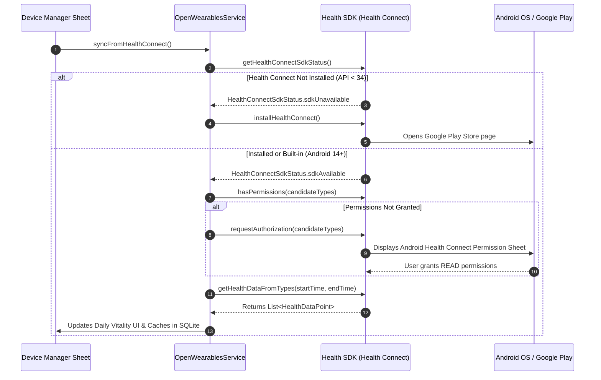
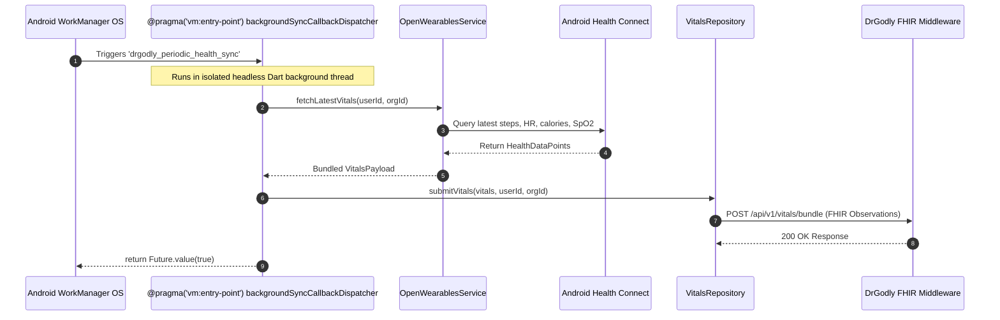

# 03. Wearable Integration & Health Connect Architecture

## Plain-Language Summary
This section documents how the PHIA application reads and syncs physical health data from consumer wearables and smartphones. The app utilizes Google's Android Health Connect API to read historical steps, calories, heart rate, blood oxygen (SpO2), and sleep sessions without draining battery life. It also supports direct Bluetooth Low Energy (BLE) pairing with standard heart rate monitors. In the background, Android WorkManager wakes up the app periodically to upload biometric summaries to the DrGodly FHIR server.

Regarding the **Momentum SDK**: The actual native Momentum binary library is **NOT FOUND IN CODE**; instead, the codebase implements an internal service called `OpenWearablesService` that communicates with the open-source Open-Wearables ecosystem (`api.openwearables.io`).

---

## 1. Dependencies & Manifest Permissions

### Plain-Language Summary
To access sensitive health and hardware sensors on modern Android devices, the application requires explicit declared permissions in the Android Manifest and requests runtime approval from the patient.

### Technical Detail
- **Core Health Library**: `health: ^13.3.2`
- **BLE Library**: `flutter_blue_plus: ^1.34.5`
- **Background Scheduler**: `workmanager: ^0.10.10`
- **Foreground Service**: `flutter_foreground_task: ^11.0.3`

#### Android Manifest Declared Permissions:
In [`android/app/src/main/AndroidManifest.xml`](file:///home/mi/Desktop/AI_projects/phia_flutter/android/app/src/main/AndroidManifest.xml#L11-L34):
- **Bluetooth Permissions**:
  - `android.permission.BLUETOOTH` (maxSdkVersion 30)
  - `android.permission.BLUETOOTH_ADMIN` (maxSdkVersion 30)
  - `android.permission.BLUETOOTH_SCAN` (`usesPermissionFlags="neverForLocation"`)
  - `android.permission.BLUETOOTH_CONNECT`
- **Health Connect Read Permissions**:
  - `android.permission.health.READ_STEPS`
  - `android.permission.health.READ_HEART_RATE`
  - `android.permission.health.READ_RESTING_HEART_RATE`
  - `android.permission.health.READ_ACTIVE_CALORIES_BURNED`
  - `android.permission.health.READ_TOTAL_CALORIES_BURNED`
  - `android.permission.health.READ_BASAL_METABOLIC_RATE`
  - `android.permission.health.READ_EXERCISE`
  - `android.permission.health.READ_DISTANCE`
  - `android.permission.health.READ_SLEEP`
  - `android.permission.health.READ_HEART_RATE_VARIABILITY`
  - `android.permission.health.READ_OXYGEN_SATURATION`
  - `android.permission.health.READ_HEALTH_DATA_IN_BACKGROUND`
- **Service Declarations**:
  - `android.permission.FOREGROUND_SERVICE`
  - `android.permission.FOREGROUND_SERVICE_HEALTH`
  - `android.permission.FOREGROUND_SERVICE_DATA_SYNC`

**Evidence:**
- [`android/app/src/main/AndroidManifest.xml`](file:///home/mi/Desktop/AI_projects/phia_flutter/android/app/src/main/AndroidManifest.xml#L11-L34)

---

## 2. Health Connect Permission Request & Availability Flow

### Plain-Language Summary
Before reading health data, the app checks if Health Connect is installed on the user's Android phone. If installed, it presents the system permission dialog. If missing, it directs the user to install Health Connect from Google Play.

### Technical Detail

**Evidence:**
- [`lib/data/service/open_wearables_service.dart`](file:///home/mi/Desktop/AI_projects/phia_flutter/lib/data/service/open_wearables_service.dart#L170-L245) (`_syncHealthConnectOnDevice()`)

---

## 3. Supported Record Types (Read vs. Write)

### Plain-Language Summary
The application is strictly a **consumer** of health data. It reads activity, vitals, and sleep records from Health Connect, but does **not write** mock records back to the OS.

### Technical Detail

| Health Metric Category | Exact HealthDataType | Read Status | Write Status | Time Window Queried |
|---|---|---|---|---|
| **Activity / Steps** | `HealthDataType.STEPS` | **Implemented** | `NOT FOUND IN CODE` | Past 48 hours (binned daily) |
| **Heart Rate** | `HealthDataType.HEART_RATE` | **Implemented** | `NOT FOUND IN CODE` | Past 48 hours (latest reading) |
| **Resting Heart Rate**| `HealthDataType.RESTING_HEART_RATE` | **Implemented** | `NOT FOUND IN CODE` | Past 48 hours |
| **Active Energy** | `HealthDataType.ACTIVE_ENERGY_BURNED` | **Implemented** | `NOT FOUND IN CODE` | Past 48 hours |
| **Total Energy** | `HealthDataType.TOTAL_CALORIES_BURNED` | **Implemented** | `NOT FOUND IN CODE` | Past 48 hours |
| **Basal Energy** | `HealthDataType.BASAL_ENERGY_BURNED` | **Implemented** | `NOT FOUND IN CODE` | Past 48 hours |
| **Distance** | `HealthDataType.DISTANCE_DELTA` | **Implemented** | `NOT FOUND IN CODE` | Past 48 hours |
| **Blood Oxygen (SpO2)**| `HealthDataType.BLOOD_OXYGEN` | **Implemented** | `NOT FOUND IN CODE` | 48 hours with 7-day fallback |
| **Sleep Duration** | `HealthDataType.SLEEP_SESSION` | **Implemented** | `NOT FOUND IN CODE` | Past 48 hours |
| **Sleep Stages** | `SLEEP_LIGHT`, `SLEEP_DEEP`, `SLEEP_REM` | **Implemented** | `NOT FOUND IN CODE` | Past 48 hours |
| **Body Baseline** | `HealthDataType.HEIGHT`, `WEIGHT` | **Implemented** | `NOT FOUND IN CODE` | Latest recorded value |

**Evidence:**
- [`lib/data/service/open_wearables_service.dart`](file:///home/mi/Desktop/AI_projects/phia_flutter/lib/data/service/open_wearables_service.dart#L190-L215) (`candidateTypes` array)

---

## 4. Background & Periodic Sync Architecture (WorkManager)

### Plain-Language Summary
To keep the doctor updated with current patient vitals without requiring the user to open the app every day, Android WorkManager schedules an automatic background job that runs every 15 minutes.

### Technical Detail

1. **Initialization**: Configured in `main.dart` calling `BackgroundSyncService.initialize()` and `BackgroundSyncService.schedulePeriodicSync()`.
2. **Execution Parameters**:
   - `frequency: Duration(minutes: 15)`
   - `initialDelay: Duration(seconds: 30)`
   - `existingWorkPolicy: ExistingPeriodicWorkPolicy.keep`
   - `constraints: Constraints(networkType: NetworkType.connected)`

**Evidence:**
- [`lib/data/service/background_sync_service.dart`](file:///home/mi/Desktop/AI_projects/phia_flutter/lib/data/service/background_sync_service.dart#L11-L47) (`backgroundSyncCallbackDispatcher`)
- [`lib/data/service/background_sync_service.dart`](file:///home/mi/Desktop/AI_projects/phia_flutter/lib/data/service/background_sync_service.dart#L71-L86) (`schedulePeriodicSync()`)

---

## 5. The Momentum SDK vs. OpenWearablesService

### Plain-Language Summary
A key architectural question is the presence and usage of the **Momentum SDK**. We audited the entire codebase for Momentum native packages.

### Technical Detail

#### Status in Codebase:
- **Momentum Native SDK Package**: `NOT FOUND IN CODE`.
- **Finding**: There is no pub package, gradle binary, or native library named "Momentum SDK" in `pubspec.yaml` or `android/app/build.gradle.kts`.

#### How It Is Architected in PHIA (`OpenWearablesService`):
The repository implements an internal singleton called `OpenWearablesService` located at [`lib/data/service/open_wearables_service.dart`](file:///home/mi/Desktop/AI_projects/phia_flutter/lib/data/service/open_wearables_service.dart).

1. **Configuration & Cloud Aggregation**:
   - Default Host: `https://api.openwearables.io`
   - Purpose: Designed to connect with Open-Wearables cloud aggregators for providers that lack direct on-device APIs on Android (e.g., Garmin Connect, WHOOP 4.0, Oura Ring, Fitbit).
2. **Relationship to Health Connect**:
   - **Local Providers**: For Android devices, `OpenWearablesService` directly invokes Google Health Connect locally on the phone.
   - **Cloud Providers**: For proprietary wearables (WHOOP/Garmin), `OpenWearablesService` acts as an HTTP client fetching normalized JSON metrics from `https://api.openwearables.io/v1/users/{userId}/vitals/latest`.
   - **Data Normalization**: Both streams (Health Connect and Cloud Wearables) are normalized into the unified `VitalsPayload` domain model before being dispatched to SQLite or the FHIR middleware.

**Evidence:**
- [`lib/data/service/open_wearables_service.dart`](file:///home/mi/Desktop/AI_projects/phia_flutter/lib/data/service/open_wearables_service.dart#L80-L135)
- [`lib/domain/model/vitals_payload.dart`](file:///home/mi/Desktop/AI_projects/phia_flutter/lib/domain/model/vitals_payload.dart#L1-L75)

---

## 6. Failure Handling & Edge Cases

### Plain-Language Summary
Health reading is resilient against missing permissions, uncalibrated hardware, and budget smartwatch quirks.

### Technical Detail
1. **Per-Type Query Fallback**: If `Health Connect` batch query fails or is throttled, `_syncHealthConnectOnDevice()` catches the error and queries each vital type individually.
2. **7-Day SpO2 Fallback**: Budget smartwatches (such as boAt, Noise, Fire-Boltt) do not record continuous SpO2; they only record on-demand tests. If no SpO2 is found in the 48-hour batch, the query extends 7 days back to retrieve the most recent baseline.
3. **BLE Reconnect & Dropout**: `BleHeartRateService` listens to the connection state stream (`device.connectionState`). If the Bluetooth connection is severed, the service automatically cleans up GATT subscriptions and notifies the UI that the sensor is disconnected.
4. **Offline SQLite Caching**: When network is unavailable during WorkManager execution, metric sync flags remain `is_synced = 0` in SQLite until connectivity is restored.

**Evidence:**
- [`lib/data/service/open_wearables_service.dart`](file:///home/mi/Desktop/AI_projects/phia_flutter/lib/data/service/open_wearables_service.dart#L245-L270)
- [`lib/data/service/ble_heart_rate_service.dart`](file:///home/mi/Desktop/AI_projects/phia_flutter/lib/data/service/ble_heart_rate_service.dart#L145-L180)

---

## 7. Open Questions / Assumptions / Items to Verify

1. **Cloud Aggregator Activation**: Currently, `https://api.openwearables.io` is configured, but active user data flows primarily through local Android Health Connect. Verify whether cloud OAuth for Garmin/WHOOP is expected to be enabled.
2. **Native Momentum SDK Integration**: Verify if there was an intention to replace `OpenWearablesService` with a proprietary Momentum Flutter SDK when released.
