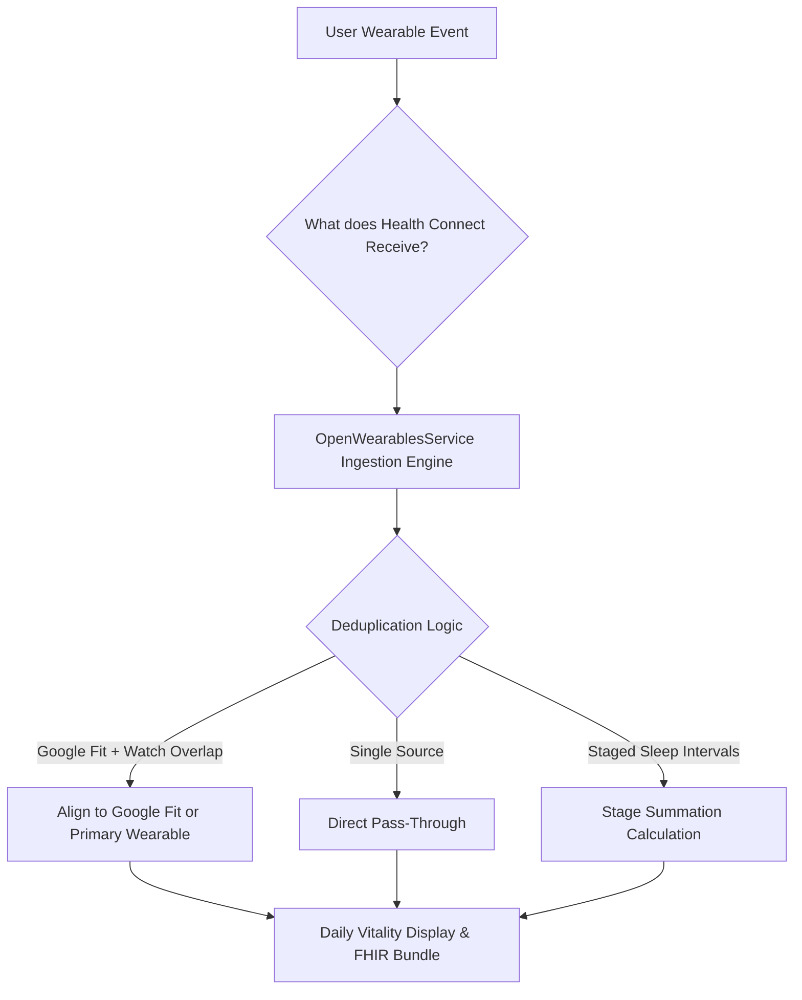

# 04. Health Metrics Processing & Real-World Sensor Scenarios

## Plain-Language Summary
This section documents how the PHIA mobile application extracts, cleans, deduplicates, and presents every single health biometric collected from the user's phone and smart wearables. It details how the app prevents double-counting (for example, when a user wears a smartwatch while carrying their phone in their pocket), how time zones and missing data are represented, and provides a real-world trace through 10 concrete wearable usage scenarios.

---

## 1. Comprehensive Attribute-by-Attribute Processing Matrix

The table below documents every health metric handled by the codebase, its exact Health Connect record type, calculation strategy, deduplication rules, and how missing values are displayed in the UI.

| Attribute | Health Connect Record Type | Data Category | Read Method | Time Range Logic | Deduplication & Source Filtering | Missing Data UI | Unit & Conversion | Stored in SQLite / Sent to FHIR |
|---|---|---|---|---|---|---|---|---|
| **Steps** | `HealthDataType.STEPS` | Cumulative | Raw read + Bucket aggregation (Fallback to `getTotalStepsInInterval`) | `todayStart` (00:00:00 local time) to `now` | **Deduplicated**: If Google Fit data points exist, takes Google Fit count; else takes wearable intervals. Never sums both. | Displayed as `0` | Count (`steps`) | Stored in `health_metrics (type='steps')`; Bundled into FHIR `Observation (LOINC 55423-8)` |
| **Distance** | `DISTANCE_WALKING_RUNNING`, `DISTANCE_DELTA` | Cumulative | Raw read summed | `todayStart` to `now` | If Google Fit distance > 0, prefers Google Fit; else wearable distance. No synthetic formulas. | Displayed as `0.00 km` | Meters converted to km (`meters / 1000`) | Stored in `health_metrics`; Bundled into FHIR `Observation (LOINC 41953-2)` |
| **Calories** | `TOTAL_CALORIES_BURNED`, `ACTIVE_ENERGY_BURNED`, `BASAL_ENERGY_BURNED` | Cumulative | Raw read with interval clamping | `todayStart` to `now` | Pro-rates in-flight intervals extending past `now`. Uses total calories, or falls back to Active + Basal. | Displayed as `0 kcal` | Kilocalories (`kcal`) | Stored in `health_metrics`; Bundled into FHIR `Observation (LOINC 41981-2)` |
| **Live Heart Rate** | `HealthDataType.HEART_RATE` | Instantaneous | Raw read (sorted by `dateTo` desc) | Past 48 hours | Takes the newest timestamp `dateTo`. Overridden by active BLE GATT stream if strap connected. | Displayed as `-- bpm` (null) | Beats per minute (`bpm`) | Stored in `health_metrics`; Bundled into FHIR `Observation (LOINC 8867-4)` |
| **Resting Heart Rate** | `HealthDataType.RESTING_HEART_RATE` | Instantaneous | Raw read (sorted by `dateTo` desc) | Past 48 hours | Takes the latest `dateTo` recorded by the smartwatch algorithm. | Displayed as `-- bpm` (null) | Beats per minute (`bpm`) | Stored in `health_metrics`; Bundled into FHIR `Observation (LOINC 40443-4)` |
| **Blood Oxygen (SpO2)** | `HealthDataType.BLOOD_OXYGEN` | Instantaneous | Raw read with 7-day fallback | Past 48h; if empty, extends back 7 days | Takes newest point. If value <= 1.0, multiplies by 100. | Displayed as `-- % SpO2` (null) | Percentage (`%`) | Stored in `health_metrics`; Bundled into FHIR `Observation (LOINC 59408-5)` |
| **Blood Pressure (BP)** | `BLOOD_PRESSURE_SYSTOLIC`, `BLOOD_PRESSURE_DIASTOLIC` | Instantaneous | `NOT FOUND IN CODE` | `NOT FOUND IN CODE` | BP reading is not yet queried in `open_wearables_service.dart`. | Displayed as `--/-- mmHg` in mock views | Millimeters of Mercury (`mmHg`) | `NOT FOUND IN CODE` in automated sync |
| **Sleep Duration** | `SLEEP_SESSION`, `SLEEP_ASLEEP`, `SLEEP_LIGHT`, `SLEEP_DEEP`, `SLEEP_REM`, `SLEEP_AWAKE` | Session | Raw read segmented by stage | `todayStart - 6 hours` (18:00 yesterday) to `now` | Computes true time asleep: Sum of Deep+Light+REM stages. If stages missing, uses `SLEEP_ASLEEP` or `SLEEP_SESSION - SLEEP_AWAKE`. | Displayed as `-- h` (null) | Minutes converted to hours and minutes (`Xh Ym`) | Stored in `health_metrics`; Bundled into FHIR `Observation (LOINC 93832-4)` |
| **Body Weight** | `HealthDataType.WEIGHT` | Instantaneous | Raw read | Past 48 hours | Takes latest value recorded. Converts imperial/metric based on user settings. | Displayed as `0.0 kg` (or saved profile weight) | Kilograms (`kg`) or Pounds (`lbs`) | Stored in `patient_profile` & FHIR `Patient` resource |
| **Body Height** | `HealthDataType.HEIGHT` | Instantaneous | Raw read | Past 48 hours | Converts meters to cm if value < 3.0. | Displayed as `0 cm` (or saved profile height) | Centimeters (`cm`) or Feet/Inches | Stored in `patient_profile` & FHIR `Patient` resource |

---

## 2. Core Processing Rules & Definitions

### A. How "Day" is Defined
In [`lib/data/service/open_wearables_service.dart`](file:///home/mi/Desktop/AI_projects/phia_flutter/lib/data/service/open_wearables_service.dart#L182):
```dart
final now = DateTime.now();
final todayStart = DateTime(now.year, now.month, now.day);
```
A "day" is strictly defined as the local calendar day starting at `00:00:00.000` up to `DateTime.now()`.

### B. Time-Zone Handling
The app utilizes local device timestamps (`DateTime.now()`). Timestamps sent to the FHIR middleware and SQLite are ISO-8601 strings formatted with timezone offsets (`toIso8601String()`). When the user travels across time zones, the Android OS updates the device clock, and `todayStart` automatically adapts to midnight in the new local time zone.

### C. Manual-Entry vs. Sensor Filtering
- Health Connect records contain a `sourceName` string indicating the originating app package (e.g., `com.google.android.apps.fitness`, `com.boat.lifestyle`, `manual`).
- The app checks `dp.sourceName` to categorize data origins. Manual entries written by third-party apps into Health Connect are ingested unless flagged by the OS, but the PHIA app itself does not offer an arbitrary manual step overwrite form.

### D. Late-Sync & Backfill Handling
- The app queries a rolling **48-hour window** (`now.subtract(const Duration(hours: 48))`) for general vitals, and **7 days** for SpO2. If a smartwatch syncs hours or days late, the data points fall within the 48h/7d window and are ingested on the next sync cycle.

---

## 3. Real-World Sensor Scenarios Trace

Below is a detailed trace of how the codebase handles 10 real-world sensor situations.



### Scenario 1: Phone Carried and Watch Not Worn
- **Situation**: User walks 4,000 steps during the day carrying their phone in their pocket. The smartwatch is sitting on the charging dock.
- **What Health Connect receives**: Step records written solely by Google Fit / Android System Step Sensor (`com.google.android.apps.fitness`).
- **What our app reads**: `googleFitSteps = 4000`, `wearableSteps = 0`.
- **What the user sees**: `4,000 Steps` on the Daily Vitality ring.
- **Customer-facing explanation**: *"Steps counted accurately from your phone's built-in motion sensor."*

### Scenario 2: Watch Worn Later in the Evening with Phone Also Carried
- **Situation**: User puts on their boAt/Noise watch in the evening and goes for a walk carrying their phone. Both devices record the same walk.
- **What Health Connect receives**: Overlapping step intervals from both the phone (`Google Fit`) and the watch companion app for the same 18:00–19:00 hour.
- **What our app reads**: Both `googleFitSteps` and `wearableSteps` are populated.
- **What the code does** ([`open_wearables_service.dart:573-577`](file:///home/mi/Desktop/AI_projects/phia_flutter/lib/data/service/open_wearables_service.dart#L573-L577)):
  ```dart
  if (googleFitSteps > 0) {
    realSteps = googleFitSteps;
  } else if (wearableSteps > 0) {
    realSteps = wearableSteps;
  }
  ```
- **What the user sees**: The exact unified Google Fit count. The app does **not** double-count or sum them together (e.g., if phone recorded 2,000 and watch recorded 2,100, the user sees 2,000, not 4,100).
- **Customer-facing explanation**: *"Duplicate steps prevented. When both phone and watch record simultaneously, your primary health engine takes precedence."*

### Scenario 3: Watch Worn and Phone Left at Home
- **Situation**: User goes running wearing only their smartwatch. The phone stays at home.
- **What Health Connect receives**: Google Fit records 0 steps for that duration. When the user returns home and their watch syncs via Bluetooth, the watch app writes the workout intervals into Health Connect.
- **What our app reads**: `googleFitSteps = 0`, `wearableSteps = 5500`.
- **What the user sees**: `5,500 Steps`, distance, and active workout minutes recorded.
- **Customer-facing explanation**: *"Your watch sync completed. Steps and workout metrics synced from your wearable."*

### Scenario 4: Watch Not Synced, Then Synced Hours Later (Late Sync)
- **Situation**: User wears the watch all morning with phone Bluetooth turned off. At 17:00, user turns on Bluetooth; watch dumps 8 hours of data into Health Connect.
- **What Health Connect receives**: Historical batches timestamped between 09:00 and 17:00.
- **What our app reads**: On the next sync cycle, `getHealthDataFromTypes` queries the past 48 hours. It discovers all newly arrived data points timestamped today.
- **What the user sees**: Daily Vitality ring jumps from morning baseline to full daily count.
- **Customer-facing explanation**: *"Late-arriving data synced successfully from your watch."*

### Scenario 5: Two Apps Writing the Same Metric (Conflict)
- **Situation**: Both Google Fit and Samsung Health write step count records into Health Connect for the same user.
- **What Health Connect receives**: Competing step intervals.
- **What our app reads**: Segments categorized by `dp.sourceName`.
- **What the code does**: Inspects `isFit = sourceName.contains('fit') || sourceName.contains('google')`. Assigns precedence to the primary Google Fit stream.
- **Customer-facing explanation**: *"Multiple fitness sources detected. Prioritized primary system provider to prevent inflated metrics."*

### Scenario 6: Manual Entries
- **Situation**: User manually enters a 500 kcal workout directly in Google Fit.
- **What Health Connect receives**: An `ACTIVE_ENERGY_BURNED` data point with `sourceName = 'com.google.android.apps.fitness'`.
- **What our app reads**: `dp.type == HealthDataType.ACTIVE_ENERGY_BURNED`. App adds the value to `realActiveCalories`.
- **What the user sees**: Calorie ring reflects the logged workout.
- **Customer-facing explanation**: *"Your logged activity was included in today's calorie burn."*

### Scenario 7: Permission Denied or Revoked
- **Situation**: User goes into Android OS Settings and revokes Health Connect permissions.
- **What Health Connect receives**: Security exception upon query attempt.
- **What our app reads**: `hasPermissions(types)` returns `false`. `queryError` caught in `open_wearables_service.dart:239`.
- **What the code does**: Falls back to offline SQLite cache (`_loadCachedMetrics()`).
- **What the user sees**: UI displays cached historical metrics with a banner warning: *"Sync paused. Please grant Health Connect permissions in settings."*
- **Customer-facing explanation**: *"Health data access is disabled. Grant permission in Device Manager to resume live tracking."*

### Scenario 8: Midnight Rollover / Time-Zone Change
- **Situation**: User crosses midnight (00:01) or lands in a new time zone (e.g., UTC+0 to UTC+5:30).
- **What Health Connect receives**: Data points continue logging with UTC epoch timestamps.
- **What our app reads**: App recalculates `todayStart = DateTime(now.year, now.month, now.day)`. Old data points now fall into yesterday (`isBefore(todayStart)`).
- **What the user sees**: Daily Vitality ring resets to `0%` for the new day; yesterday's totals move into historical analytics.
- **Customer-facing explanation**: *"New day started. Vitality progress reset for today."*

### Scenario 9: First-Install History Window
- **Situation**: A new patient installs PHIA for the very first time.
- **What Health Connect receives**: Existing historical records stored on the phone over the past several months.
- **What our app reads**: App requests past 48 hours for general activity and 7 days for SpO2 baseline.
- **What the user sees**: Instantly populates the dashboard with their current resting heart rate, baseline SpO2, and today's steps. No blank zero screen.
- **Customer-facing explanation**: *"Loaded your recent baseline health history from Health Connect."*

### Scenario 10: Intermittent Wear (Watch Taken Off During Day)
- **Situation**: User takes off their watch while charging for 3 hours during the afternoon.
- **What Health Connect receives**: Heart rate data points stop during the 3-hour gap. Step data is either captured by the phone (if carried) or pauses.
- **What our app reads**: `realLiveHr` retains the most recent valid BPM received before removal; resting HR remains stable.
- **What the user sees**: Heart rate card displays last recorded reading with timestamp. No synthetic spikes or crashes to zero.
- **Customer-facing explanation**: *"Sensor paused while watch was not worn. Displaying your most recent reading."*

---

## 4. Open Questions / Assumptions / Items to Verify

1. **Blood Pressure Querying**: BP reading is currently `NOT FOUND IN CODE` in `open_wearables_service.dart`. Verify if `HealthDataType.BLOOD_PRESSURE_SYSTOLIC` should be added to `candidateTypes`.
2. **Third-Party Precedence Configuration**: Currently, Google Fit is hardcoded as the priority source when resolving multi-source step conflicts. Verify if users should be given a setting to choose their preferred primary wearable source.
