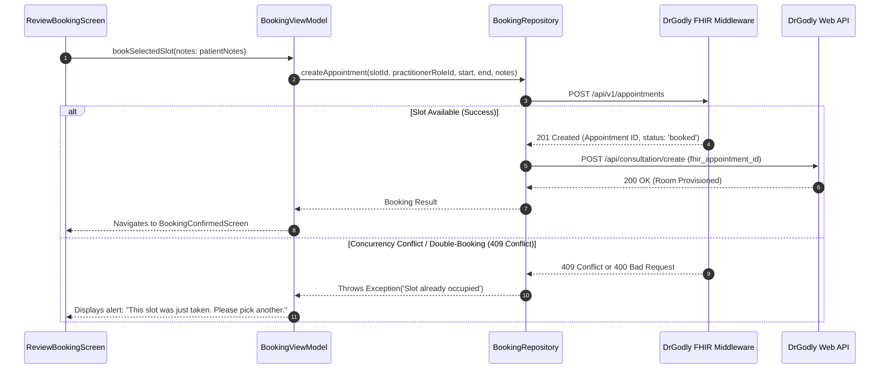
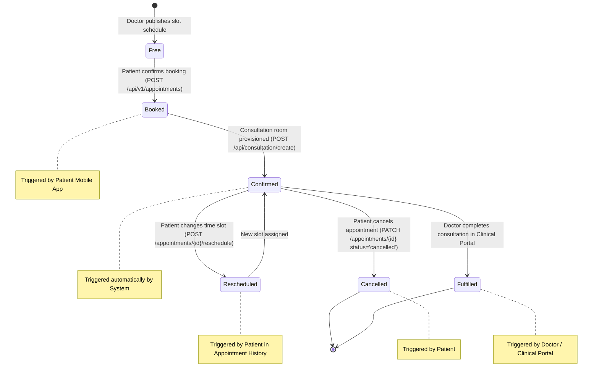

# 05. Clinical Intake, Specialist Discovery & Appointment Lifecycle

## Plain-Language Summary
This section documents the end-to-end clinical care workflow in PHIA: from discovering medical specialists, selecting available time slots, executing the AI pre-visit clinical intake conversation, generating a structured medical report, creating the FHIR appointment booking, to tracking the appointment's full operational lifecycle.

---

## 1. Specialist Discovery & Profile Retrieval

### Plain-Language Summary
Patients can search for doctors by medical specialty, view their credentials, consultation fees, and profile pictures. Doctor profiles are retrieved from the DrGodly FHIR server and cached in SQLite to guarantee instant offline loading on cold app restarts.

### Technical Detail
- **API Endpoint**: `GET https://fhirgql.drgodly.com/api/v1/practitioner-roles/booking` (with fallback to `/api/v1/practitioner-roles`)
- **Query Filters**: `active: 'true'`, `limit: 50`, `org_id: orgId`
- **Pagination**: Implemented via `limit` (defaults to 50); cursor-based pagination is `NOT FOUND IN CODE`.
- **Local Caching**: Handled in [`lib/viewmodel/booking_viewmodel.dart`](file:///home/mi/Desktop/AI_projects/phia_flutter/lib/viewmodel/booking_viewmodel.dart#L104-L125). Responses are serialized into SQLite table `specialists_cache`. If a server query returns empty or encounters a network error, the ViewModel automatically loads the cached directory from SQLite without wiping the UI.
- **Doctor Profile Model (`PractitionerRoleBooking`)**:
  - `id`: Practitioner role identifier
  - `practitionerName`: Doctor full name with honorific
  - `specialties`: List of medical specialties (e.g., Cardiology, Dermatology, Endocrinology)
  - `photoUrl`: Remote photo URL with local asset fallbacks (`assets/doctors/doctor_X.png`)
  - `consultationFee`: Display fee (e.g., ₹500, ₹800)
  - `rating`: Clinical review score (default 4.9, 120+ reviews)
  - `availableToday`: Boolean status flag

**Evidence:**
- [`lib/data/repository/booking_repository.dart`](file:///home/mi/Desktop/AI_projects/phia_flutter/lib/data/repository/booking_repository.dart#L37-L74)
- [`lib/domain/model/booking_models.dart`](file:///home/mi/Desktop/AI_projects/phia_flutter/lib/domain/model/booking_models.dart#L110-L165)

---

## 2. Slot Retrieval & Concurrency Booking Architecture

### Plain-Language Summary
Available consultation slots are queried in real time for a selected doctor and date. When a patient confirms their booking, the app submits the slot, provisions a digital consultation room, and handles network or double-booking conflicts.

### Technical Detail



- **Slot Retrieval Endpoint**: `GET https://fhirgql.drgodly.com/api/v1/slots/`
  - Parameters: `practitioner_role_id`, `date` (`YYYY-MM-DD`), `status: 'free'`, `limit: 100`
- **Appointment Creation Endpoint**: `POST https://fhirgql.drgodly.com/api/v1/appointments`
  - Body:
    ```json
    {
      "status": "booked",
      "slot_id": 1042,
      "practitioner_role_id": 12,
      "patient_id": 401,
      "user_id": "usr_...",
      "org_id": "0fb41e50-...",
      "start": "2026-10-10T10:00:00Z",
      "end": "2026-10-10T10:30:00Z",
      "patient_instruction": "Severe headache for 3 days",
      "description": "DrGodly Telehealth Consultation"
    }
    ```
- **Concurrency & Double-Booking**: FHIR enforces slot exclusivity on the server. If two patients attempt to book the same slot simultaneously, the second call receives a 400/409 error. The app catches this failure, surfaces a descriptive message, and prompts the patient to select a different slot.

**Evidence:**
- [`lib/data/repository/booking_repository.dart`](file:///home/mi/Desktop/AI_projects/phia_flutter/lib/data/repository/booking_repository.dart#L78-L203)

---

## 3. AI Pre-Visit Clinical Intake Conversation & Summary Generation

### Plain-Language Summary
Before the consultation, an AI Clinical Assistant conducts an interactive interview to collect symptoms and medical history. The chat streams responses token-by-token. Upon completion, a structured clinical summary is generated and attached to the doctor's record.

### Technical Detail

#### A. Intake Form & Chat Collection
- **Fields Collected**: Chief Complaint, Primary Symptoms, Severity (0–10 scale), Duration / Onset, Associated Symptoms (Fever, Nausea, Body aches), Current Medications, Allergies.
- **Validation**:
  - Empty text input is blocked.
  - Streaming in-flight prevents concurrent send actions (`isBusy == true`).
  - Session ID is maintained across turns to prevent conversation amnesia.
- **Endpoint**: `POST https://agents.drgodly.com/api/agent/intake` (Server-Sent Events streaming).

#### B. Intake Summary Generation
- **Trigger**: Patient taps *"End Chat"* OR the AI agent emits `"type": "status_end"`.
- **Generation Endpoint**: `POST https://agents.drgodly.com/api/agent/assessment`
- **Inputs Sent**:
  - Full conversation array: `[{"role": "user", "content": "..."}, {"role": "assistant", "content": "..."}]`
  - Patient demographics: Age, Gender, Height, Weight from `ProfileViewModel`.
- **Outputs Received (SOAP Clinical JSON)**:
  - `chief_complaint`: Concise primary issue (e.g., *"Persistent migraine with low-grade fever"*)
  - `hpi` (History of Present Illness): Narrative summary of onset, duration, and pain character.
  - `triage_level`: Clinical priority category (`Routine`, `Urgent`, `Emergency`).
  - `suggested_specialty`: Recommended clinical department (e.g., *Neurology*).
- **Storage**:
  - Persisted to DrGodly relational DB via `POST https://app.drgodly.com/api/intake/create`.
  - Linked to appointment via `POST https://app.drgodly.com/api/intake/link`.

**Evidence:**
- [`lib/data/service/intake_service.dart`](file:///home/mi/Desktop/AI_projects/phia_flutter/lib/data/service/intake_service.dart#L164-L260)
- [`lib/viewmodel/intake_viewmodel.dart`](file:///home/mi/Desktop/AI_projects/phia_flutter/lib/viewmodel/intake_viewmodel.dart#L168-L245)

---

## 4. Appointment Status Lifecycle

### Plain-Language Summary
An appointment progresses through specific states: from free slot, to booked, to confirmed, and finally to completed or cancelled.

### Technical Detail



### State Definitions & Transition Matrix:

| Status Code | Description | Transition Trigger | Triggering Actor | API Endpoint Used |
|---|---|---|---|---|
| `free` | Available calendar slot | Doctor sets weekly schedule | Doctor / Admin | `POST /api/v1/slots` |
| `booked` | Slot claimed by patient | Patient taps "Confirm Booking" | Patient Mobile App | `POST /api/v1/appointments` |
| `confirmed` | Telehealth room active | Appointment created successfully | System Backend | `POST /api/consultation/create` |
| `rescheduled` | Booking moved to new slot | Patient selects alternate date/time | Patient Mobile App | `POST /api/v1/appointments/{id}/reschedule` |
| `cancelled` | Appointment cancelled | Patient taps "Cancel Consultation" | Patient Mobile App | `PATCH /api/v1/appointments/{id}` |
| `fulfilled` | Consultation completed | Doctor finishes telehealth call | Doctor Web Portal | `PATCH /api/v1/appointments/{id}` |

**Evidence:**
- [`lib/data/repository/booking_repository.dart`](file:///home/mi/Desktop/AI_projects/phia_flutter/lib/data/repository/booking_repository.dart#L227-L355)

---

## 5. Cancellation, Rescheduling & Notifications

### Plain-Language Summary
Patients can cancel or reschedule upcoming appointments directly from their Appointment History screen. Scheduled notifications alert the patient before their consultation.

### Technical Detail
1. **Rescheduling**:
   - Endpoint: `POST https://fhirgql.drgodly.com/api/v1/appointments/{id}/reschedule`
   - Body: `{"new_slot_id": 2045}`
   - The server atomically releases the previous slot and binds the new slot ID.
2. **Cancellation**:
   - Endpoint: `PATCH https://fhirgql.drgodly.com/api/v1/appointments/{id}`
   - Body: `{"status": "cancelled"}`
   - Releases the slot back to the doctor's free calendar.
3. **Local Push Notifications**:
   - Handled via `NotificationService` ([`lib/data/service/notification_service.dart`](file:///home/mi/Desktop/AI_projects/phia_flutter/lib/data/service/notification_service.dart)).
   - When an appointment is booked, a local notification is scheduled for **1 hour** and **15 minutes** before the appointment `start` time.

---

## 6. Open Questions / Assumptions / Items to Verify

1. **Refunds on Cancellation**: Cancellation sets status to `'cancelled'`, but payment gateway refund processing is `NOT FOUND IN CODE` (fees are currently recorded as fixed platform values).
2. **Video Room Token Delivery**: The app provisions the room via `/api/consultation/create`, but in-app WebRTC video rendering is currently handled via external links or future web portal integration.
