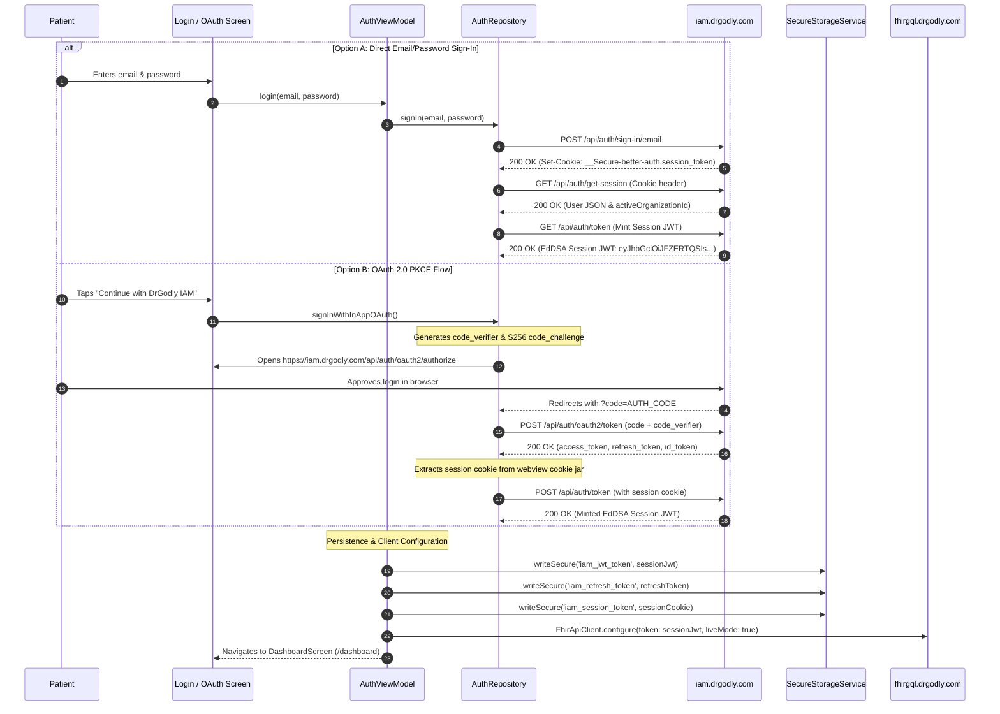
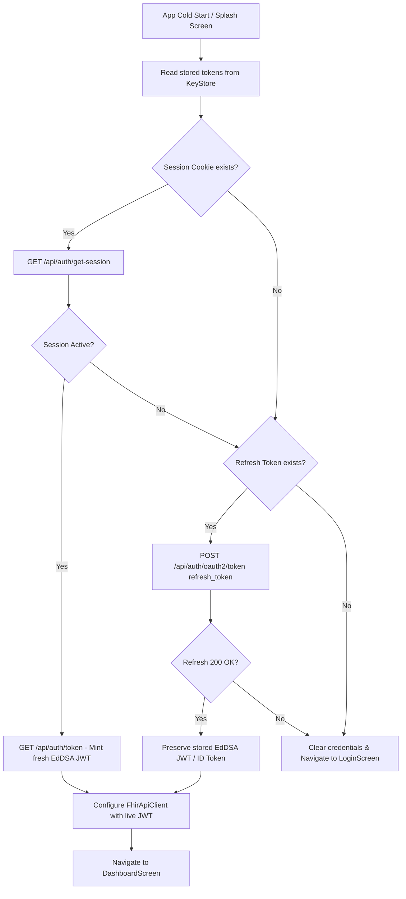

# 07. Authentication, Token Handling & Session Lifecycle

## Plain-Language Summary
This section documents the end-to-end authentication flow of the PHIA mobile application. The app connects to **DrGodly IAM** (`https://iam.drgodly.com`) using two distinct authentication pathways: a direct email/password credential sign-in and a browser-based OAuth 2.0 PKCE flow. It explains how tokens (Session Cookies, EdDSA Session JWTs, and OAuth Refresh Tokens) are stored in encrypted hardware keystores, how automatic silent refresh keeps the user logged in across cold app restarts, and how logout revokes active credentials.

---

## 1. Authentication Methods Supported

The table below catalogs every authentication mechanism evaluated in the codebase, its implementation status, and its technical mechanics.

| Authentication Method | Implemented Status | Code Location | Technical Mechanism |
|---|---|---|---|
| **Direct Email & Password** | **Implemented** | [`lib/data/repository/auth_repository.dart:181`](file:///home/mi/Desktop/AI_projects/phia_flutter/lib/data/repository/auth_repository.dart#L181) | POST `https://iam.drgodly.com/api/auth/sign-in/email`. Returns Better-Auth session cookie `__Secure-better-auth.session_token`. |
| **OAuth 2.0 PKCE (SSO)** | **Implemented** | [`lib/core/auth/pkce_helper.dart`](file:///home/mi/Desktop/AI_projects/phia_flutter/lib/core/auth/pkce_helper.dart) & [`auth_repository.dart:135`](file:///home/mi/Desktop/AI_projects/phia_flutter/lib/data/repository/auth_repository.dart#L135) | RFC 7636 Authorization Code grant with SHA-256 (`S256`) code challenge. Executes in In-App WebView or Custom Tab. |
| **Biometric Authentication (Fingerprint/FaceID)**| **Missing** | `NOT FOUND IN CODE` | No `local_auth` or biometric prompt plugin is integrated. Silent auto-login relies on encrypted keystore token storage. |
| **SMS / Email OTP Sign-In** | **Missing** | `NOT FOUND IN CODE` | Direct OTP verification endpoints are not implemented in the mobile client. |
| **Account Recovery / Forgot Password** | **Partial** | Handled externally | The app redirects the user to the DrGodly IAM web portal (`https://iam.drgodly.com`) for password reset. |

**Evidence:**
- [`lib/data/repository/auth_repository.dart`](file:///home/mi/Desktop/AI_projects/phia_flutter/lib/data/repository/auth_repository.dart#L14-L210)
- [`lib/core/auth/pkce_helper.dart`](file:///home/mi/Desktop/AI_projects/phia_flutter/lib/core/auth/pkce_helper.dart#L1-L45)

---

## 2. End-to-End Authentication Sequence Diagram



**Evidence:**
- [`lib/data/repository/auth_repository.dart`](file:///home/mi/Desktop/AI_projects/phia_flutter/lib/data/repository/auth_repository.dart#L30-L245)
- [`lib/viewmodel/auth_viewmodel.dart`](file:///home/mi/Desktop/AI_projects/phia_flutter/lib/viewmodel/auth_viewmodel.dart#L124-L255)

---

## 3. Token Hierarchy, Format & Secure Storage

### Plain-Language Summary
The application manages three distinct types of credentials. Each serves a specific purpose across different backend servers.

### Technical Detail

| Token Type | Alg / Format | Originating Issuer | Where Used | Storage Mechanism | Lifetime / Expiry |
|---|---|---|---|---|---|
| **Session Cookie** | Opaque Token (`__Secure-better-auth.session_token`) | `https://iam.drgodly.com` | IAM session queries & JWT minting | `FlutterSecureStorage` + SQLite `app_settings` | ~30 days sliding window |
| **Session JWT** | **EdDSA Signed JWT** (`eyJhbGciOiJFZERTQSIs...`) | `https://iam.drgodly.com/api/auth/token` | **FHIR Middleware** & **AI Clinical Agents** | `FlutterSecureStorage` + SQLite `app_settings` | ~1 hour |
| **OAuth Access Token** | Opaque Token (`cfRg...`) | `https://iam.drgodly.com/api/auth/oauth2/token` | IAM user info endpoints | In-memory `_jwtToken` fallback | ~1 hour |
| **OAuth Refresh Token**| Opaque High-Entropy Token | `https://iam.drgodly.com/api/auth/oauth2/token` | IAM token refresh endpoint | `FlutterSecureStorage` (Android KeyStore) | Extended / Persistent |

#### Storage Location:
- Implemented via `SecureStorageService` ([`lib/data/service/secure_storage_service.dart`](file:///home/mi/Desktop/AI_projects/phia_flutter/lib/data/service/secure_storage_service.dart)).
- Backed by Android KeyStore hardware-backed encryption (`EncryptedSharedPreferences`).

---

## 4. Cold-Start Auto-Login & Silent Token Refresh

### Plain-Language Summary
When a patient opens the app from a cold restart, the app silently validates their stored credentials in the background. If the token is still valid, the user is immediately taken to their health dashboard without ever seeing a login screen.

### Technical Detail
Handled in [`lib/viewmodel/auth_viewmodel.dart:330-465`](file:///home/mi/Desktop/AI_projects/phia_flutter/lib/viewmodel/auth_viewmodel.dart#L330-L465) (`checkAutoLogin()`):



### Critical Architecture Note (Session JWT Preservation):
The FHIR middleware and AI intake agent strictly validate EdDSA cryptographic signatures. A standard OAuth 2.0 refresh grant returns an opaque access token (`cfRg...`). The auto-login flow in `AuthViewModel` specifically **preserves the stored EdDSA Session JWT** rather than overwriting it with the opaque OAuth token, preventing 401 Unauthorized errors on cold app restarts.

**Evidence:**
- [`lib/viewmodel/auth_viewmodel.dart`](file:///home/mi/Desktop/AI_projects/phia_flutter/lib/viewmodel/auth_viewmodel.dart#L425-L434)

---

## 5. Logout & Multi-Device Session Handling

### Plain-Language Summary
Logging out completely revokes the user's session on the server and purges all personal biometric data from the phone's memory and database.

### Technical Detail
1. **Server-Side Session Revocation**:
   - Executes `POST https://iam.drgodly.com/api/auth/oauth2/end-session` (or `/api/auth/sign-out`).
   - Invalidates the session cookie on the DrGodly IAM server cluster.
2. **Local Client Purge**:
   - Calls `clearAll()` in `SecureStorageService` to wipe the Android KeyStore.
   - Clears SQLite database tables:
     ```dart
     await healthRepository.clearMetrics();
     await healthRepository.clearLocalAppointments();
     await healthRepository.clearProfile();
     ```
   - Resets `FhirApiClient` to mock/offline mode.
   - Navigates immediately to `/login` using `Navigator.pushNamedAndRemoveUntil`.
3. **Multi-Device Handling**:
   - Better-Auth sessions support multiple active devices per user account.
   - If a session is revoked remotely on another device, the local app catches the next `401 Unauthorized` in `FhirApiClient` or `AuthViewModel`, triggering a transparent refresh attempt. If refresh fails, it redirects the user to the login screen.

**Evidence:**
- [`lib/viewmodel/auth_viewmodel.dart`](file:///home/mi/Desktop/AI_projects/phia_flutter/lib/viewmodel/auth_viewmodel.dart#L265-L310)
- [`lib/data/repository/auth_repository.dart`](file:///home/mi/Desktop/AI_projects/phia_flutter/lib/data/repository/auth_repository.dart#L265-L295)

---

## 6. Failure, Lockout & Account Recovery Handling

### Plain-Language Summary
The application gracefully manages invalid credentials and network outages during sign-in.

### Technical Detail
1. **Invalid Credentials / Rate Limiting**:
   - Caught via Dio `DioException` handling.
   - The app extracts the server's descriptive JSON message (`{"message": "Invalid email or password"}` or `{"detail": "Too many attempts"}`) and surfaces it in the UI error banner.
2. **Account Lockout**:
   - Server-side rate limiting and account lockout are enforced by Better-Auth on the IAM server. The mobile app does not maintain an internal failed-attempt lockout counter; it renders the server's lockout error message directly.
3. **Account Recovery**:
   - Handled via web redirects to the DrGodly IAM self-service portal (`https://iam.drgodly.com/forgot-password`).

---

## 7. Open Questions / Assumptions / Items to Verify

1. **Biometric Unlock**: Biometric local authentication (FaceID/Fingerprint via `local_auth`) is currently `NOT FOUND IN CODE`. Verify if quick biometric app unlocking should be added to the roadmap.
2. **SMS OTP Sign-In**: Phone number login via SMS OTP is currently `NOT FOUND IN CODE`. Verify whether phone-based OTP sign-in will be added to the DrGodly IAM service.
